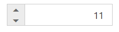

# RTL Support

NumericTextBox provides RTL (Right-To-Left) support. The alignment of NumericTextBox can be changed from Left-To-Right into Right-To-Left.

## Enable RTL

In the View page add the below code and configure the EnableRTL property.



    <ej-numeric-text-box id="numeric" value="11" enable-rtl="true"/>



Output of NumericTextBox when EnableRTL is “true” is as follows. 

NumericTextBox with enableRTL
{:.caption}