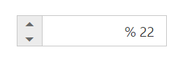

# RTL Support

PercentageTextBox provides RTL (Right-To-Left) support. The alignment of PercentageTextBox can be changed from Left-To-Right into Right-To-Left.

## Enable RTL

In the View page add the below code and configure the EnableRTL property.



    <ej-percentage-text-box id="percent" value="22" enable-rtl="true"/>



Output of PercentageTextBox when EnableRTL is “true” is as follows. 

