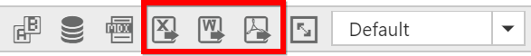

# Exporting

The pivot chart and pivot grid in the pivot client widget can be exported to Microsoft Excel, Microsoft Word, and PDF documents by clicking the respective toolbar icons.

Exporting feature provides an option that allows you to export either the pivot chart or pivot grid or both by using the `client-export-mode` property.

The `client-export-mode` property takes any one of the following values:

* **ChartAndGrid**: Exports both pivot chart and pivot grid controls. This is the default mode.
* **ChartOnly**: Exports pivot chart control alone.
* **GridOnly**: Exports pivot grid control alone.

Make use of export with the client side JSON data. The control can be exported by invoking the `before-export` event with an appropriate export option as a parameter.



<ej-pivot-client id="PivotClient1" before-export="Export">
//..
</ej-pivot-client>



### Customize the export document name

The document name to be exported can be customized. Following code sample illustrates this process:



<ej-pivot-client id="PivotClient1" before-export="Export">
//..
</ej-pivot-client>



## Pivot chart - exporting format

I> This option is applicable only for the pivot chart specifically when exported to an Excel document.

You can set an option to export the pivot chart to an Excel document, and you can export it as either an image or pivot chart format itself by setting the Boolean property 'exportChartAsImage' in the `before-export` event.

N> By default the pivot chart will be exported in image format to an Excel document.



<ej-pivot-client id="PivotClient1" before-export="Export" client-export-mode="ChartOnly">
//..
</ej-pivot-client>



The following screenshot shows the control, which is exported to an Excel document showing its own format (pivoting chart).

## Exporting customization

You can add the title and description to the exporting document by using the title and description properties respectively obtained in the `before-export` event. Similarly, you can enable or disable the styling on the exported document by using the `exportWithStyle` property.



<ej-pivot-client id="PivotClient1" before-export="Export">
//..
</ej-pivot-client>



### Exporting complete data on paging

When paging is enabled, you can export the complete data by enabling the `enable-complete-data-export` property. It is supported for all kinds of exporting formats available in the pivot client.



<ej-pivot-client id="PivotClient1" enable-complete-data-export="true">
//..
</ej-pivot-client>



The following screenshot shows the pivot grid and pivot chart controls exported to an Excel document:

The following screenshot shows the pivot grid and pivot chart controls exported to a Word document:

The following screenshot shows the pivot grid and pivot chart controls exported to a PDF document:

