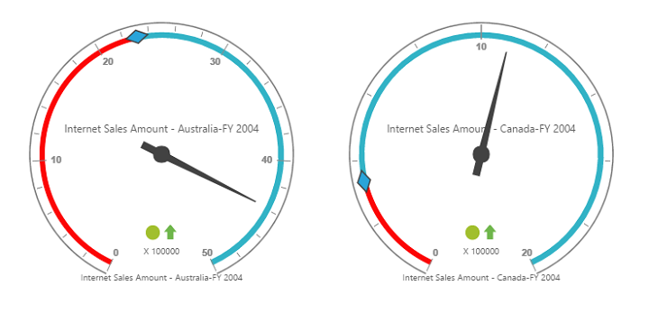

# Getting started

>**Important**
Starting with v16.2.0.x, if you refer to Syncfusion assemblies from trial setup or from the NuGet feed, include a license key in your projects. Refer to this [link](https://help.syncfusion.com/common/essential-studio/licensing/license-key) to learn about registering Syncfusion license key in your ASP.NET Core application to use our components.

Refer the [Getting Started](/aspnet-core/getting-started) page of the introduction part to know more about the basic system requirements and the steps to configure the Syncfusion components in an ASP.NET Core application.

Ensure whether all the necessary dependency packages are included within the *bower.json* file as mentioned [here](/aspnet-core/getting-started#configure-syncfusion-components-in-aspnet-core-application), so that the required scripts and CSS to render the pivot gauge control will be installed and loaded into the mentioned location (**wwwroot -> lib**) within your project.

Also, check whether the assembly dependency package **Syncfusion.EJ.Pivot** is added within the *project.json* file.

Now, refer to the necessary scripts and CSS files in your *_Layout.cshtml* page from the **wwwroot -> lib -> syncfusion-javascript** folder.



<html>
<head>
    <environment names="Development">
        <link rel="stylesheet" href="~/lib/bootstrap/dist/css/bootstrap.css" />
        <link rel="stylesheet" href="~/css/site.css" />
        <link href="~/lib/syncfusion-javascript/Content/ej/web/default-theme/ej.web.all.min.css" rel="stylesheet" />
        <link href="~/lib/syncfusion-javascript/Content/ej/web/responsive-css/ej.responsive.css" rel="stylesheet" />
    </environment>
</head>
<body>

    <environment names="Development">
        
        
        
        
        
    </environment>

</body>
</html>



It is necessary to define the following namespace within the *_viewImports.cshtml* page to make use of the pivot gauge control with the tag helper support.
 

 
@using Syncfusion.JavaScript
@addTagHelper "*, Syncfusion.EJ"
@addTagHelper "*, Syncfusion.EJ.Pivot"
    


N> Script manager should be defined at the bottom of the *_Layout.cshtml* page.

## Relational

This section covers the information required to populate a simple pivot gauge with the relational data source.

### Initialize pivot gauge

Before initializing the pivot gauge, empty the contents of Index.cshtml file under Views > Home folder and add the following codes:



<ej-pivot-gauge id="PivotGauge1"></ej-pivot-gauge>



### Populate pivot gauge with data

This section illustrates how to populate the pivot gauge control by using a sample JSON data as shown below:



<ej-pivot-gauge id="PivotGauge1" load="onload"></ej-pivot-gauge>

    


The JSON data is set to the **"data"** property present in the **"e-data-source"** object. The **"e-data-source"** object allows you to set both datasource and fields that should be displayed in the row, column, value, and filter section of the pivot gauge control.
  

  
<ej-pivot-gauge id="PivotGauge1" background-color="transparent" load="onload">
    <e-data-source>
        <e-pivot-rows>
            <e-row-field field-name="Country" field-caption="Country"></e-row-field>
        </e-pivot-rows>
        <e-pivot-columns>
            <e-column-field field-name="Product" field-caption="Product"></e-column-field>
        </e-pivot-columns>
        <e-pivot-values>
            <e-value-field field-name="Amount" field-caption="Amount"></e-value-field>
        </e-pivot-values>
    </e-data-source>
    <e-scales>
        <e-circular-scales show-ranges="true" radius="150" show-scale-bar="true" size="1" show-indicators="true" show-labels="true">
            <e-border width="0.5"></e-border>
            <e-pointer-collections>
                <e-pointers show-back-needle="true" back-needle-length="20" length="125" width="7"></e-pointers>
                <e-pointers type="Marker" marker-type="Diamond" distance-from-scale="5" placement="Center" background-color="#29A4D9" length="25" width="15"></e-pointers>
            </e-pointer-collections>
            <e-tick-collections>
                <e-ticks type="Major" distance-from-scale="2" height="16" width="1" color="#8c8c8c"></e-ticks>
                <e-ticks type="Minor" height="6" width="1" distance-from-scale="2" color="#8c8c8c"></e-ticks>
            </e-tick-collections>
            <e-circular-range-collections>
                <e-circular-ranges distance-from-scale="-5" background-color="#fc0606">
                    <e-border color="#fc0606"></e-border>
                </e-circular-ranges>
                <e-circular-ranges distance-from-scale="-5"></e-circular-ranges>
            </e-circular-range-collections>
            <e-custom-label-collections>
                <e-circular-custom-labels color="#666666">
                    <e-custom-position x="180" y="290"></e-custom-position>
                    <e-custom-font size="10px" font-family="Segoe U" font-style="Normal"></e-custom-font>
                </e-circular-custom-labels>
                <e-circular-custom-labels color="#666666">
                    <e-custom-position x="180" y="320"></e-custom-position>
                    <e-custom-font size="10px" font-family="Segoe U" font-style="Normal"></e-custom-font>
                </e-circular-custom-labels>
                <e-circular-custom-labels color="#666666">
                    <e-custom-position x="180" y="150"></e-custom-position>
                    <e-custom-font size="10px" font-family="Segoe U" font-style="Normal"></e-custom-font>
                </e-circular-custom-labels>
            </e-custom-label-collections>
        </e-circular-scales>
    </e-scales>
    <e-label-format-settings decimal-places="2"></e-label-format-settings>
</ej-pivot-gauge>



The above code will generate a simple pivot gauge as shown in the following screenshot:

## OLAP

This section covers the information required to populate a simple pivot gauge with OLAP data source.

### Initialize pivot gauge

Before initializing the pivot gauge, empty the contents of Index.cshtml file under Views > Home folder and add the following codes:



<ej-pivot-gauge id="PivotGauge1"></ej-pivot-gauge>



### Populate pivot gauge with data source

Initializes the OLAP data source for the pivot gauge control as shown below:



<ej-pivot-gauge id="PivotGauge1" background-color="transparent" load="onLoad">
    <e-data-source catalog="Adventure Works DW 2008 SE" cube="Adventure Works" data="//bi.syncfusion.com/olap/msmdpump.dll">
        <e-pivot-rows>
            <e-row-field field-name="[Date].[Fiscal]"></e-row-field>
        </e-pivot-rows>
        <e-pivot-columns>
            <e-column-field field-name="[Customer].[Customer Geography]"></e-column-field>
        </e-pivot-columns>
        <e-pivot-values>
            <e-value-field axis="Column">
                <e-measures>
                    <e-measure-items field-name="[Measures].[Internet Sales Amount]"></e-measure-items>
                </e-measures>
            </e-value-field>
        </e-pivot-values>
    </e-data-source>
    <e-scales>
        <e-circular-scales show-ranges="true" radius="150" show-ticks="true" show-pointers="true" show-scale-bar="true" size="1" show-indicators="true" show-labels="true">
            <e-border width="0.5"></e-border>
            <e-pointer-collections>
                <e-pointers show-back-needle="true" back-needle-length="20" length="125" width="7"></e-pointers>
                <e-pointers type="Marker" marker-type="Diamond" distance-from-scale="5" placement="Center" background-color="#29A4D9" length="25" width="15"></e-pointers>
            </e-pointer-collections>
            <e-tick-collections>
                <e-ticks type="Major" distance-from-scale="2" height="16" width="1" color="#8c8c8c"></e-ticks>
                <e-ticks type="Minor" height="6" width="1" distance-from-scale="2" color="#8c8c8c"></e-ticks>
            </e-tick-collections>
            <e-circular-range-collections>
                <e-circular-ranges distance-from-scale="-5" background-color="#fc0606">
                    <e-border color="#fc0606"></e-border>
                </e-circular-ranges>
                <e-circular-ranges distance-from-scale="-5"></e-circular-ranges>
            </e-circular-range-collections>
            <e-custom-label-collections>
                <e-circular-custom-labels color="#666666">
                    <e-custom-position x="180" y="290"></e-custom-position>
                    <e-custom-font size="10px" font-family="Segoe U" font-style="Normal"></e-custom-font>
                </e-circular-custom-labels>
                <e-circular-custom-labels color="#666666">
                    <e-custom-position x="180" y="320"></e-custom-position>
                    <e-custom-font size="10px" font-family="Segoe U" font-style="Normal"></e-custom-font>
                </e-circular-custom-labels>
                <e-circular-custom-labels color="#666666">
                    <e-custom-position x="180" y="150"></e-custom-position>
                    <e-custom-font size="10px" font-family="Segoe U" font-style="Normal"></e-custom-font>
                </e-circular-custom-labels>
            </e-custom-label-collections>
        </e-circular-scales>
    </e-scales>
    <e-label-format-settings decimal-places="2"></e-label-format-settings>
</ej-pivot-gauge>



The above code will generate a simple pivot gauge as shown in the following screenshot:

