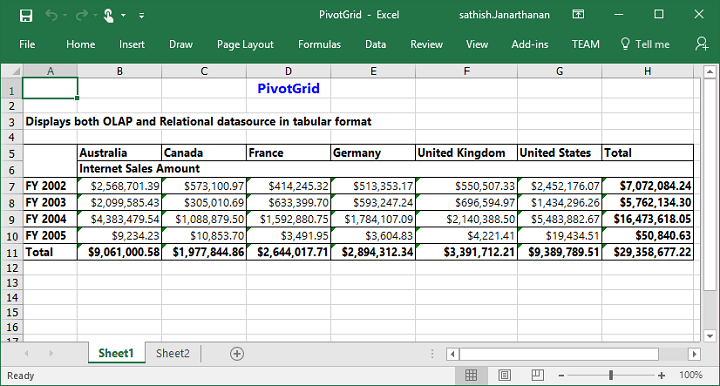

# Exporting

The pivot grid control can be exported to the following file formats:

* Microsoft Excel
* Microsoft Word
* PDF

To perform the exporting operation, the **"Syncfusion.EJ.Export"** dependency library should be referred in the application.

The  control can be exported with the help of **“exportPivotGrid”** method by passing the method name and file name as parameters. Refer to the following code snippet:



    <ej-pivot-grid id="PivotGrid1" is-responsive="true" load="Load">
        <e-data-source>
            <e-pivot-rows>
                <e-row-field field-name="Country" field-caption="Country"></e-row-field>
            </e-pivot-rows>
            <e-pivot-columns>
                <e-column-field field-name="Date" field-caption="Date"></e-column-field>
            </e-pivot-columns>
            <e-pivot-values>
                <e-value-field field-name="Amount" field-caption="Amount"></e-value-field>
            </e-pivot-values>
        </e-data-source>
    </ej-pivot-grid>

    <ej-button id="ExportBtn" width="100px" height="30px" type="Button" text="Export" click="exportButtonClick" />

    



The **"Syncfusion.EJ.Export"** namespace should be imported and the following method should be added in the MVC controller file of the application:



//...
using Syncfusion.EJ.Export;

private IHttpContextAccessor _contextAccessor;

public PivotGridController(IHttpContextAccessor contextAccessor)
{
    _contextAccessor = contextAccessor;
}

public ActionResult ExcelExport()
{
    PivotGridExcelExport pGrid = new PivotGridExcelExport();
    var context = _contextAccessor.HttpContext;
    var args = context.Request.Form.ElementAt(0).Value;
    string fileName = "Sample";
    return pGrid.ExportToExcel(fileName, args, context.Response);
}



## Excel export

The pivot grid allows you to export its content to Excel document for future archival, references, and analysis purposes. This can be achieved with the help of **"ExportToExcel"** method by passing the file name as parameter.



    



The following method should be added in the MVC controller file of the application:



public ActionResult ExcelExport()
{
    PivotGridExcelExport pGrid = new PivotGridExcelExport();
    var context = _contextAccessor.HttpContext;
    var args = context.Request.Form.ElementAt(0).Value;
    string fileName = "Sample";
    return pGrid.ExportToExcel(fileName, args, context.Response);
}



## Word export

The pivot grid allows you to export its content to Word document for future archival, references, and analysis purposes. This can be achieved with the help of **"ExportToWord"** method by passing the file name as parameter.



    



The following method should be added in the MVC controller file of the application:



        public ActionResult WordExport()
        {
            PivotGridWordExport pGrid = new PivotGridWordExport();
            var context = _contextAccessor.HttpContext;
            var args = context.Request.Form.ElementAt(0).Value;
            string fileName = "Sample";
            return pGrid.ExportToWord(fileName, args, context.Response);
        }



## PDF export

The pivot grid allows you to export its content to PDF document for future archival, references, and analysis purposes. This can be achieved with the help of **"ExportToPDF"** method by passing the file name as parameter.



    



The following method should be added in the MVC controller file of the application:



public ActionResult PDFExport()
{
    PivotGridPDFExport pGrid = new PivotGridPDFExport();
    var context = _contextAccessor.HttpContext;
    var args = context.Request.Form.ElementAt(0).Value;
    string fileName = "Sample";
    return pGrid.ExportToPDF(fileName, args, context.Response);
}



The following screenshot shows the pivot grid control exported to an Excel document:

The following screenshot shows the pivot grid control exported to a Word document:

The following screenshot shows the pivot grid control exported to a PDF document:

N> Grand total and sub-totals can be hidden while exporting the document.