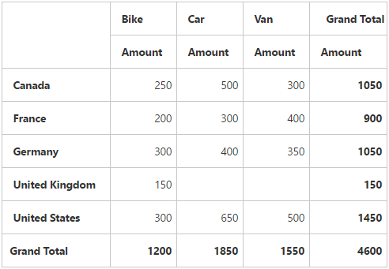
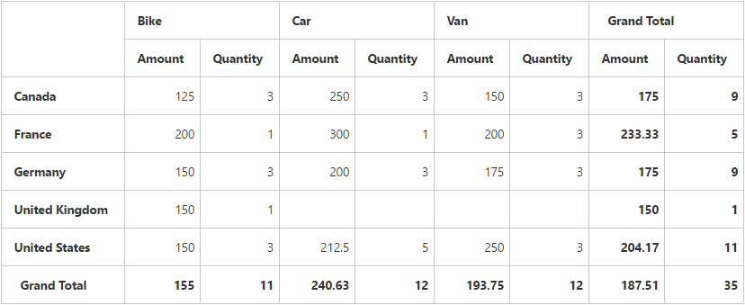

# Getting started

>**Important**
Starting with v16.2.0.x, if you refer to Syncfusion assemblies from trial setup or from the NuGet feed, include a license key in your projects. Refer to this [link](https://help.syncfusion.com/common/essential-studio/licensing/license-key) to learn about registering Syncfusion license key in your ASP.NET Core application to use our components.

Refer the [Getting Started](/aspnet-core/getting-started) page of the introduction part to know more about the basic system requirements and the steps to configure the Syncfusion components in an ASP.NET Core application.

Ensure whether all the necessary dependency packages are included within the *bower.json* file as mentioned [here](/aspnet-core/getting-started#configure-syncfusion-components-in-aspnet-core-application), so that the required scripts and CSS to render the pivot grid control will be installed and loaded into the mentioned location (**wwwroot -> lib**) within your project.

Also, check whether the assembly dependency package **Syncfusion.EJ.Pivot**  is added within the *project.json* file.

Now, refer to the necessary scripts and CSS files in your *_Layout.cshtml* page from the **wwwroot -> lib -> syncfusion-javascript** folder.



<html>
<head>
    <environment names="Development">
        <link rel="stylesheet" href="~/lib/bootstrap/dist/css/bootstrap.css" />
        <link rel="stylesheet" href="~/css/site.css" />
        <link href="~/lib/syncfusion-javascript/Content/ej/web/default-theme/ej.web.all.min.css" rel="stylesheet" />
        <link href="~/lib/syncfusion-javascript/Content/ej/web/responsive-css/ej.responsive.css" rel="stylesheet" />
    </environment>
</head>
<body>

    <environment names="Development">
        
        
        
        
        
    </environment>

</body>
</html>



It is necessary to define the following namespace within the *_viewImports.cshtml* page to make use of the pivot grid control with the tag helper support.



@using Syncfusion.JavaScript
@addTagHelper "*, Syncfusion.EJ"
@addTagHelper "*, Syncfusion.EJ.Pivot"



N> Script manager should be defined at the bottom of the *_Layout.cshtml* page.

## Relational

This section covers the information required to populate a simple pivot grid with the relational data source.

### Initialize pivot grid

Before initializing the pivot grid, empty the contents of the Index.cshtml file under Views > Home folder and add the following codes:



<ej-pivot-grid id="PivotGrid1"></ej-pivot-grid>



### Populate pivot grid with data

This section illustrates how to populate the pivot grid control by using a sample JSON data as shown below:



<ej-pivot-grid id="PivotGrid1" load="onload"></ej-pivot-grid>



The JSON data is set to the **"data"** property present in the **"e-data-source"** object. The **"e-data-source"** object allows you to set both data source and fields that should be displayed in the row, column, value, and filter section of the pivot grid control.



<ej-pivot-grid id="PivotGrid1" load="onload">
    <e-data-source>
        <e-pivot-rows>
            <e-row-field field-name="Country" field-caption="Country"></e-row-field>
        </e-pivot-rows>
        <e-pivot-columns>
            <e-column-field field-name="Product" field-caption="Product"></e-column-field>
        </e-pivot-columns>
        <e-pivot-values>
            <e-value-field field-name="Amount" field-caption="Amount"></e-value-field>
        </e-pivot-values>
    </e-data-source>
</ej-pivot-grid>



The above code will generate a simple pivot grid with "Country" field in the row, "Product" field in column, and "Amount" field in the value section.

### Apply sorting

You can sort a field to an ascending or descending order by using the `sort-order` property. Sorting is applicable only for row and column fields. By default, fields are arranged in the ascending order.



<ej-pivot-grid id="PivotGrid1" load="onload">
    <e-data-source>
        <e-pivot-rows>
            <e-row-field field-name="Country" field-caption="Country" sort-order="Descending"></e-row-field>
        </e-pivot-rows>
        <e-pivot-columns>
            <e-column-field field-name="Product" field-caption="Product"></e-column-field>
        </e-pivot-columns>
        <e-pivot-values>
            <e-value-field field-name="Amount" field-caption="Amount"></e-value-field>
        </e-pivot-values>
    </e-data-source>
</ej-pivot-grid>



### Sort row/column by date

You can sort a field in ascending or descending order according to date type by using the **sort-order** property. Sorting is applicable only for the row and column fields. By default, fields are arranged in the ascending order.

N> To apply sorting by date, you need to specify the `format` and `format-string` in the field.



<ej-pivot-grid id="PivotGrid1" load="onload">
    <e-data-source>
        <e-pivot-rows>
            <e-row-field field-name="Date" field-caption="Date" format="date" format-string="dd-MM-yyy" sort-order="Descending"></e-row-field>
        </e-pivot-rows>
        <e-pivot-columns>
            <e-column-field field-name="Day" field-caption="Day" format="date" format-string="ddd" sort-order="Ascending"></e-column-field>
        </e-pivot-columns>
        <e-pivot-values>
            <e-value-field field-name="Amount" field-caption="Amount"></e-value-field>
        </e-pivot-values>
    </e-data-source>
</ej-pivot-grid>



### Apply summary types

Allow you to specify the required summary type to be used in summary cells of the pivot grid. **"Sum"** is the default summary type. Following are the summary types that are supported:

* Sum
* Average
* Count
* Min
* Max



<ej-pivot-grid id="PivotGrid1" is-responsive="true" load="onload">
    <e-data-source>
        <e-pivot-rows>
            <e-row-field field-name="Country" field-caption="Country"></e-row-field>
        </e-pivot-rows>
        <e-pivot-columns>
            <e-column-field field-name="Product" field-caption="Product"></e-column-field>
        </e-pivot-columns>
        <e-pivot-values>
            <e-value-field field-name="Amount" field-caption="Amount" summary-type="Average"></e-value-field>
            <e-value-field field-name="Quantity" field-caption="Quantity" summary-type="Count"></e-value-field>
        </e-pivot-values>
    </e-data-source>
</ej-pivot-grid>



## OLAP

This section covers the information required to populate a simple pivot grid with the OLAP data source.

### Initialize pivot grid

Before initializing the pivot grid, empty the contents of Index.cshtml file under Views > Home folder and add the following codes:



<ej-pivot-grid id="PivotGrid1"></ej-pivot-grid>



### Populate pivot grid with data source

Initializes the OLAP data source for pivot grid control as shown below:



<ej-pivot-grid id="PivotGrid1">
    <e-data-source catalog="Adventure Works DW 2008 SE" cube="Adventure Works" data="//bi.syncfusion.com/olap/msmdpump.dll">
        <e-pivot-rows>
            <e-row-field field-name="[Date].[Fiscal]"></e-row-field>
        </e-pivot-rows>
        <e-pivot-columns>
            <e-column-field field-name="[Customer].[Customer Geography]"></e-column-field>
        </e-pivot-columns>
        <e-pivot-values>
            <e-value-field axis="Column">
                <e-measures>
                    <e-measure-items field-name="[Measures].[Internet Sales Amount]"></e-measure-items>
                </e-measures>
            </e-value-field>
        </e-pivot-values>
    </e-data-source>
</ej-pivot-grid>



The above code will generate a simple pivot grid with "Fiscal" field in the row, "Customer Geography" field in the column, and "Internet Sales Amount" field in the value section.

