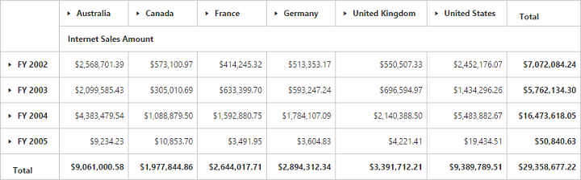
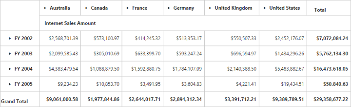

# Grid layout

## Normal layout

A layout in summary cells, are positioned at the bottom of each parent member and their child members appear next to them. Normal layout is the default layout in the pivot grid control. The `layout` enumeration property should be set to **"Normal"** to view the pivot grid in normal layout.



<ej-pivot-grid id="PivotGrid1" layout="Normal"></ej-pivot-grid>



## Excel-like layout

A layout in summary cells, which are positioned besides each parent member and their child members appear next to them. The `layout` enumeration property should be set to **"ExcelLikeLayout"** to view the pivot grid in excel-like layout.



<ej-pivot-grid id="PivotGrid1" layout="ExcelLikeLayout"></ej-pivot-grid>



