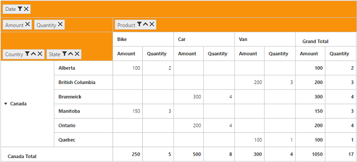
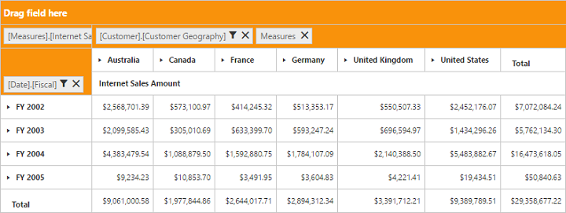
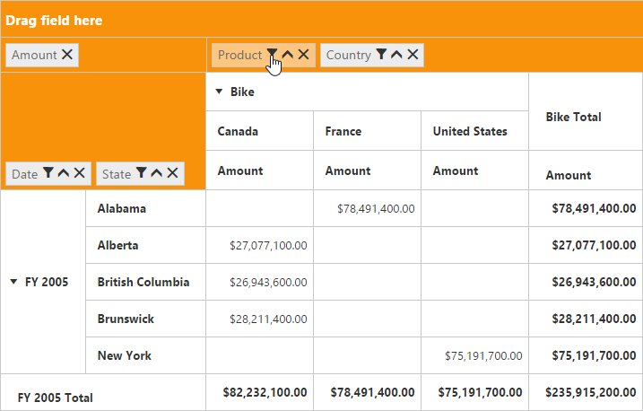
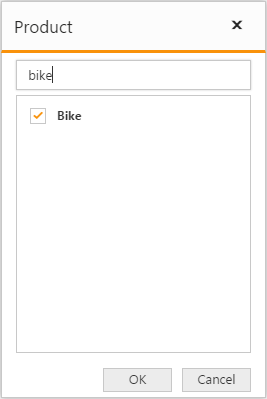
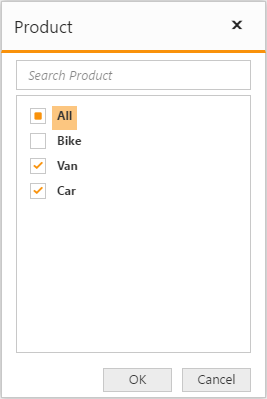
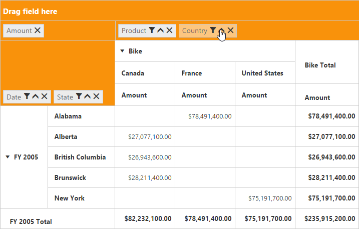
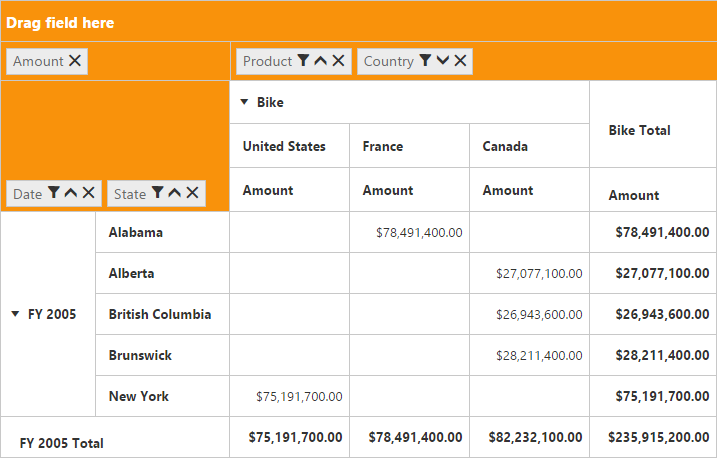
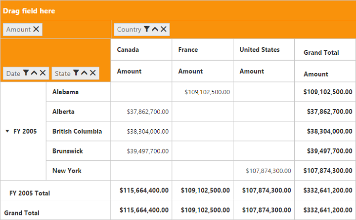

# Grouping bar

## Initialization
Grouping bar allows you to dynamically alter the report by filter, sort, and remove operations in the pivot grid control. Based on the relational data source and report bound to the pivot grid control, the grouping bar will be automatically populated. You can enable this option in the pivot grid by setting the `enable-grouping-bar` property to true.

### Relational



<ej-pivot-grid id="PivotGrid1" enable-grouping-bar="true" load="onload">
    <e-data-source>
        <e-pivot-rows>
            <e-row-field field-name="Country" field-caption="Country"></e-row-field>
            <e-row-field field-name="State" field-caption="State"></e-row-field>
        </e-pivot-rows>
        <e-pivot-columns>
            <e-column-field field-name="Product" field-caption="Product"></e-column-field>
        </e-pivot-columns>
        <e-pivot-values>
            <e-value-field field-name="Amount" field-caption="Amount"></e-value-field>
            <e-value-field field-name="Quantity" field-caption="Quantity"></e-value-field>
        </e-pivot-values>
        <e-pivot-filters>
            <e-filter-field field-name="Date" field-caption="Date"></e-filter-field>
        </e-pivot-filters>
    </e-data-source>
</ej-pivot-grid>



### OLAP



<ej-pivot-grid id="PivotGrid1" enable-grouping-bar="true">
    <e-data-source catalog="Adventure Works DW 2008 SE" cube="Adventure Works" data="//bi.syncfusion.com/olap/msmdpump.dll">
        <e-pivot-rows>
            <e-row-field field-name="[Date].[Fiscal]"></e-row-field>
        </e-pivot-rows>
        <e-pivot-columns>
            <e-column-field field-name="[Customer].[Customer Geography]"></e-column-field>
        </e-pivot-columns>
        <e-pivot-values>
            <e-value-field axis="Column">
                <e-measures>
                    <e-measure-items field-name="[Measures].[Internet Sales Amount]"></e-measure-items>
                </e-measures>
            </e-value-field>
        </e-pivot-values>
    </e-data-source>
</ej-pivot-grid>



## Searching values
The search option available in the grouping bar allows you to search a specific value that should be filtered from the list of values in the filter pop-up window.

## Filtering values

The filtering option available in the grouping bar allows you to select a specific set of values that should be displayed in the pivot grid control. At least, one value should be present in checked state while filtering, otherwise the OK button will be disabled.

## Sorting values

The sorting option available in grouping bar allows you to arrange headers in the ascending or descending order. This option is applicable only for fields in the row and column region. By default, headers are sorted in the ascending order. In the sorting indicator, up arrow denotes the ascending order and a down arrow denotes the descending order.

N> Sorting option is available for only the relational data source.

## Removing field

The remove option available in the grouping bar allows you to completely remove a specific field from the pivot grid control. The remove operation can be achieved by clicking the remove icon available in each field or by dragging and dropping the field out of the grouping bar region.

