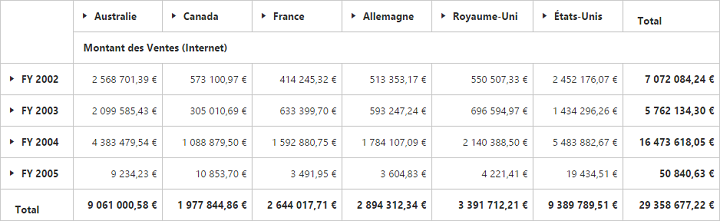
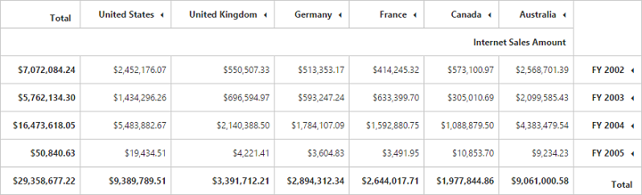

# Localization and globalization

## Localization in pivot grid
You can localize the pivot grid controls text with a collection of localized strings by using the **"ej.PivotGrid.Locale"** for different cultures. By default, the pivot grid control is localized in **"en-US"** culture.



<ej-pivot-grid id="PivotGrid1" locale="fr-FR" pivot-table-field-list-id="PivotSchemaDesigner1"></ej-pivot-grid>

<ej-pivot-schema-designer locale="fr-FR" id="PivotSchemaDesigner1"></ej-pivot-schema-designer>

< script type = "text/javascript" >
    function OnAfterServiceInvoke(args) {
        if (args.action == "initialize")
            $("#PivotSchemaDesigner1").ejPivotSchemaDesigner({
                pivotControl: this,
                layout: ej.PivotSchemaDesigner.Layouts.Excel,
                locale: "fr-FR"
            });
    }
  ej.PivotSchemaDesigner.Locale["fr-FR"] = {
        ClearFilter: "Effacer le filtre",
        SelectField:"sélectionnez Champ",
        Measures: "Mesures",
        Warning: "Avertissement",
        ....
        ....
    };

  ej.PivotGrid.Locale["fr-FR"] = {
       Sort:"Tri",
       SelectField: "sélectionnez Champ",
       LabelFilterLabel:"Afficher les éléments pour lesquels l'étiquette",
       ValueFilterLabel:"Afficher les éléments pour lesquels",
       ...
       ...
    };
< /script>



The following table lists the default keywords in French culture for the pivot grid:
<table>
<tr>
<th>
Keyword
</th>
<th>
Values
</th>
</tr>
<tr>
<td>
Sort
</td>
<td>
Tri
</td>
</tr>
<tr>
<td>
SelectField
</td>
<td>
sélectionnez Champ
</td>
</tr>
<tr>
<td>
LabelFilterLabel
</td>
<td>
Afficher les éléments pour lesquels l'étiquette
</td>
</tr>
<tr>
<td>
ValueFilterLabel
</td>
<td>
Afficher les éléments pour lesquels
</td>
</tr>
<tr>
<td>
LabelFilters
</td>
<td>
Filtres d'étiquetage
</td>
</tr>
<tr>
<td>
BeginsWith
</td>
<td>
Commence par
</td>
</tr>
<tr>
<td>
NotBeginsWith
</td>
<td>
Non Commence pa
</td>
</tr>
<tr>
<td>
EndsWith
</td>
<td>
se termine par
</td>
</tr>
<tr>
<td>
NotEndsWith
</td>
<td>
Non termine avec
</td>
</tr>
<tr>
<td>
Contains
</td>
<td>
Contient
</td>
</tr>
<tr>
<td>
NotContains
</td>
<td>
Ne contient pas
</td>
</tr>
<tr>
<td>
ValueFilters
</td>
<td>
Filtres de valeur
</td>
</tr>
<tr>
<td>
ClearFilter
</td>
<td>
Clear Filter
</td>
</tr>
<tr>
<td>
Equals
</td>
<td>
Equals
</td>
</tr>
<tr>
<td>
NotEquals
</td>
<td>
Not Equals
</td>
</tr>
<tr>
<td>
GreaterThan
</td>
<td>
Supérieur
</td>
</tr>
<tr>
<td>
GreaterThanOrEqualTo
</td>
<td>
supérieur ou égal à
</td>
</tr>
<tr>
<td>
LessThan
</td>
<td>
Less Than
</td>
</tr>
<tr>
<td>
LessThanOrEqualTo
</td>
<td>
Moins ou égal à
</td>
</tr>
<tr>
<td>
Between
</td>
<td>
Entre
</td>
</tr>
<tr>
<td>
NotBetween
</td>
<td>
Non Entre
</td>
</tr>
<tr>
<td>
AddToFilter
</td>
<td>
Ajouter à filtre
</td>
</tr>
<tr>
<td>
AddToRow
</td>
<td>
Ajouter à la rangée
</td>
</tr><tr>
<td>
AddToColumn
</td>
<td>
Ajouter à la colonne
</td>
</tr><tr>
<td>
AddToValues
</td>
<td>
Ajouter aux valeurs
</td>
</tr><tr>
<td>
Warning
</td>
<td>
Avertissement
</td>
</tr><tr>
<td>
Error
</td>
<td>
Error
</td>
</tr><tr>
<td>
GroupingBarAlertMsg
</td>
<td>
Le champ que vous déplacez ne peut pas être placé dans cette zone du rapport
</td>
</tr><tr>
<td>
Measures
</td>
<td>
Mesures
</td>
</tr><tr>
<td>
Expand
</td>
<td>
Développer
</td>
</tr><tr>
<td>
Collapse
</td>
<td>
Réduire
</td>
</tr><tr>
<td>
ToolTipRow
</td>
<td>
Row
</td>
</tr><tr>
<td>
ToolTipColumn
</td>
<td>
Colonne
</td>
</tr><tr>
<td>
ToolTipValue
</td>
<td>
Value
</td>
</tr><tr>
<td>
NoValue
</td>
<td>
Pas de valeu
</td>
</tr><tr>
<td>
SeriesPage
</td>
<td>
Series Page
</td>
</tr><tr>
<td>
CategoricalPage
</td>
<td>
Catégorique page
</td>
</tr><tr>
<td>
DragFieldHere
</td>
<td>
champ de glisser ic
</td>
</tr><tr>
<td>
ColumnArea
</td>
<td>
Drop colonne ici
</td>
</tr><tr>
<td>
RowArea
</td>
<td>
Drop ligne ic
</td>
</tr><tr>
<td>
ValueArea
</td>
<td>
Lâche valeurs ici
</td>
</tr><tr>
<td>
Close
</td>
<td>
Fermer
</td>
</tr><tr>
<td>
OK
</td>
<td>
OK
</td>
</tr><tr>
<td>
Cancel
</td>
<td>
Annuler
</td>
</tr><tr>
<td>
Remove
</td>
<td>
Supprimer
</td>
</tr><tr>
<td>
Goal
</td>
<td>
Goal
</td>
</tr><tr>
<td>
Status
</td>
<td>
Status
</td>
</tr><tr>
<td>
Trend
</td>
<td>
Trend
</td>
</tr><tr>
<td>
Value
</td>
<td>
value
</td>
</tr><tr>
<td>
ConditionalFormattingErrorMsg
</td>
<td>
La valeur donnée ne correspond pas
</td>
</tr><tr>
<td>
ConditionalFormattingConformMsg
</td>
<td>
Etes-vous sûr de vouloir supprimer le format sélectionné?
</td>
</tr><tr>
<td>
EnterOperand1
</td>
<td>
Entrez Opérande1
</td>
</tr><tr>
<td>
EnterOperand2
</td>
<td>
Entrez Opérande2
</td>
</tr><tr>
<td>
ConditionalFormatting
</td>
<td>
Mise en forme conditionnelle
</td>
</tr><tr>
<td>
Condition
</td>
<td>
Type conditionnel
</td>
</tr><tr>
<td>
Value1
</td>
<td>
Value1
</td>
</tr><tr>
<td>
Value2
</td>
<td>
Value2
</td>
</tr><tr>
<td>
Editcondition
</td>
<td>
Modifier Condition
</td>
</tr><tr>
<td>
AddNew
</td>
<td>
Ajouter
</td>
</tr><tr>
<td>
Format
</td>
<td>
Format
</td>
</tr><tr>
<td>
Backcolor
</td>
<td>
Back Color
</td>
</tr><tr>
<td>
Borderrange
</td>
<td>
Border Range
</td>
</tr><tr>
<td>
Borderstyle
</td>
<td>
Border Style
</td>
</tr><tr>
<td>
Fontsize
</td>
<td>
Font Size
</td>
</tr><tr>
<td>
Fontstyle
</td>
<td>
aille de la police
</td>
</tr><tr>
<td>
Bordercolor
</td>
<td>
Couleur Bordure
</td>
</tr><tr>
<td>
AliceBlue
</td>
<td>
AliceBlue
</td>
</tr><tr>
<td>
Black
</td>
<td>
Noir
</td>
</tr><tr>
<td>
Blue
</td>
<td>
Bleu
</td>
</tr><tr>
<td>
Brown
</td>
<td>
Brown
</td>
</tr><tr>
<td>
Gold
</td>
<td>
Gold
</td>
</tr><tr>
<td>
Green
</td>
<td>
Green
</td>
</tr><tr>
<td>
Lime
</td>
<td>
Lime
</td>
</tr>
<tr>
<td>
Maroon
</td>
<td>
Bordeaux
</td>
</tr><tr>
<td>
Orange
</td>
<td>
Orange
</td>
</tr><tr>
<td>
Pink
</td>
<td>
Pink
</td>
</tr><tr>
<td>
Red
</td>
<td>
rouge
</td>
</tr><tr>
<td>
Violet
</td>
<td>
Violet
</td>
</tr><tr>
<td>
White
</td>
<td>
Blanc
</td>
</tr><tr>
<td>
Yellow
</td>
<td>
Jaune
</td>
</tr><tr>
<td>
Solid
</td>
<td>
Solid
</td>
</tr><tr>
<td>
Dashed
</td>
<td>
pointillée
</td>
</tr><tr>
<td>
Dotted
</td>
<td>
Dotted
</td>
</tr><tr>
<td>
Double
</td>
<td>
Double
</td>
</tr><tr>
<td>
Groove
</td>
<td>
Groove
</td>
</tr><tr>
<td>
Inset
</td>
<td>
Encart
</td>
</tr><tr>
<td>
Outset
</td>
<td>
Outset
</td>
</tr><tr>
<td>
Ridge
</td>
<td>
Ridge
</td>
</tr><tr>
<td>
None
</td>
<td>
Aucun
</td>
</tr><tr>
<td>
Algerian
</td>
<td>
Algérie
</td>
</tr><tr>
<td>
Arial
</td>
<td>
Arial
</td>
</tr><tr>
<td>
BodoniMT
</td>
<td>
Bodoni MT
</td>
</tr><tr>
<td>
BritannicBold
</td>
<td>
Britannic Bold
</td>
</tr><tr>
<td>
Cambria
</td>
<td>
Cambria
</td>
</tr><tr>
<td>
Calibri
</td>
<td>
Calibri
</td>
</tr><tr>
<td>
CourierNew
</td>
<td>
Courier New
</td>
</tr><tr>
<td>
DejaVuSans
</td>
<td>
DejaVu Sans
</td>
</tr><tr>
<td>
Forte
</td>
<td>
Forte
</td>
</tr><tr>
<td>
Gerogia
</td>
<td>
Gerogia
</td>
</tr><tr>
<td>
Impact
</td>
<td>
Impact
</td>
</tr><tr>
<td>
SegoeUI
</td>
<td>
Segoe UI
</td>
</tr><tr>
<td>
Tahoma
</td>
<td>
Tahoma
</td>
</tr><tr>
<td>
TimesNewRoman
</td>
<td>
Times New Roman
</td>
</tr><tr>
<td>
Verdana
</td>
<td>
Verdana
</td>
</tr><tr>
<td>
CubeDimensionBrowser
</td>
<td>
Navigateur Dimension Cube
</td>
</tr><tr>
<td>
SelectHierarchy
</td>
<td>
Sélectionnez Hiérarchie
</td>
</tr><tr>
<td>
CalculatedField
</td>
<td>
Champ calculé
</td>
</tr><tr>
<td>
Name
</td>
<td>
nom
</td>
</tr><tr>
<td>
Add:
</td>
<td>
Ajouter:
</td>
</tr><tr>
<td>
Formula
</td>
<td>
Formule:
</td>
</tr><tr>
<td>
Delete
</td>
<td>
Supprimer
</td>
</tr><tr>
<td>
Fields
</td>
<td>
Champs
</td>
</tr><tr>
<td>
CalculatedFieldNameNotFound
</td>
<td>
Prénom CalculatedField est introuvable
</td>
</tr><tr>
<td>
InsertField
</td>
<td>
Insérer un champ
</td>
</tr><tr>
<td>
EmptyField
</td>
<td>
S'il vous plaît entrez le nom de champ calculé ou la formule
</td>
</tr><tr>
<td>
NotValid
</td>
<td>
formule donnée est pas valide
</td>
</tr><tr>
<td>
NotPresent
</td>
<td>
champ Valeur utilisée dans toute la formule de champ calculé est pas présent dans le PivotGrid
</td>
</tr><tr>
<td>
Confirm
</td>
<td>
champ calculé avec le même nom existe déjà en raison de vouloir remplacer.?
</td>
</tr><tr>
<td>
CalcValue
</td>
<td>
Champ calculé peut être inséré que dans le champ de la zone de valeur
</td>
</tr>
</table>

The following table lists the default keywords in French culture for the pivot table field list:

<table>
<tr>
<th>
Keywords</th>
<th>Values</th>
</tr>
<tr>
<td>
PivotTableFieldList</td>
<td>Liste de champs de tableau croisé dynamique</td>
</tr>
<tr>
<td>ChooseFieldsToAddToReport</td>
<td>Choisissez champs à ajouter à Signaler"</td>
</tr>
<tr>
<td>DragFieldBetweenAreasBelow</td>
<td>Faites glisser terrain entre les zones ci-dessous</td>
</tr>
<tr>
<td>ReportFilter</td>
<td>Rapport Filtre</td>
</tr>
<tr>
<td>ColumnLabel</td>
<td>colonne Étiquette</td>
</tr>
<tr>
<td>RowLabel</td>
<td>Label Row</td>
</tr>
<tr>
<td>Values</td>
<td>Valeurs</td>
</tr>
<tr>
<td>ClearFilter</td>
<td>Effacer le filtre</td>
</tr>
<tr>
<td>SelectField</td>
<td>sélectionnez Champ</td>
</tr>
<tr>
<td>Measures</td>
<td>Mesures</td>
</tr>
<tr>
<td>Warning</td>
<td>Avertissement</td>
</tr>
<tr>
<td>AlertMsg</td>
<td>Le champ que vous déplacez ne peut pas être placé dans cette zone du rapport</td>
</tr>
<tr>
<td>Goal</td>
<td>Goal</td>
</tr>
<tr>
<td>Status</td>
<td>Status</td>
</tr>
<tr>
<td>Trend</td>
<td>Trend</td>
</tr>
<tr>
<td>AddToFilter</td>
<td>Ajouter à filtrer</td>
</tr>
<tr>
<td>AddToRow</td>
<td>Ajouter à la rangée</td>
</tr>
<tr>
<td>AddToColumn</td>
<td>Ajouter à la colonne</td>
</tr>
<tr>
<td>AddToValues</td>
<td>Ajouter à la valeur</td>
</tr>
<tr>
<td>DeferLayoutUpdate</td>
<td>Différer Mise à jour</td>
</tr>
<tr>
<td>Update</td>
<td>Mettre à jour</td>
</tr>
<tr>
<td>OK</td>
<td>OK</td>
</tr>
<tr>
<td>Cancel</td>
<td>Annuler</td>
</tr>
<tr>
<td>Close</td>
<td>Fermer</td>
</tr>
</table>

The following table lists the default keywords in French culture for the pivot pager:

<table>
<tr>
<th>Keywords</th>
<th>Values</th>
</tr>
<tr>
<td>SeriesPage</td>
<td>Série Page</td>
</tr>
<tr>
<td>CategoricalPage</td>
<td>Catégorique Page</td>
</tr>
</table>

## Localization and globalization of cube info (OLAP)

The content displayed within the pivot grid control is obtained from the OLAP cube.

* To get localized data from OLAP cube, set the **"Locale Identifier"** in the connection string to a specific culture in the **"data"** property present in the **"DataSource"**.
* To bind globalized content in the pivot grid control, set the **"Locale"** property to a specific culture, and refer the specific culture file in the sample.

N> Culture files are present under **"[installed drive]:\Users\[user name]\AppData\Local\Syncfusion\EssentialStudio\X.X.X.X\MVC\Samples\web\Scripts\cultures".**



//1036 refers to "fr-FR" culture.
<ej-pivot-grid id="PivotGrid1" locale="fr-FR" >
    <e-data-source catalog="Adventure Works DW 2008 SE" cube="Adventure Works" data="//bi.syncfusion.com/olap/msmdpump.dll;Locale Identifier=1036">
        <e-pivot-rows>
            <e-row-field field-name="[Date].[Fiscal]"></e-row-field>
        </e-pivot-rows>
        <e-pivot-columns>
            <e-column-field field-name="[Customer].[Customer Geography]"></e-column-field>
        </e-pivot-columns>
        <e-pivot-values>
            <e-value-field axis="Column">
                <e-measures>
                    <e-measure-items field-name="[Measures].[Internet Sales Amount]"></e-measure-items>
                </e-measures>
            </e-value-field>
        </e-pivot-values>
    </e-data-source>
</ej-pivot-grid>



## Localization and globalization of relational info (relational)
The content displayed within the pivot grid control is obtained from the relational data source.

* To get localized content, the relational data source must have localized headers, which will be directly applied to the pivot grid.
* To globalize values that appear in the pivot grid, set the **"Format"** and **"Locale"** properties to a specific culture, and refer to the specific culture file in the sample.

N> Culture files are present under **"[installed drive]:\Users\[user name]\AppData\Local\Syncfusion\EssentialStudio\X.X.X.X\MVC\Samples\web\Scripts\cultures".**



<ej-pivot-grid id="PivotGrid1" locale="fr-FR" load="onload">
    <e-data-source>
        <e-pivot-rows>
            <e-row-field field-name="Country" field-caption="Country"></e-row-field>
        </e-pivot-rows>
        <e-pivot-columns>
            <e-column-field field-name="Product" field-caption="Product"></e-column-field>
        </e-pivot-columns>
        <e-pivot-values>
            <e-value-field field-name="Amount" field-caption="Amount" format="currency"></e-value-field>
        </e-pivot-values>
    </e-data-source>
</ej-pivot-grid>



## RTL

You can render the pivot grid control from right to left by setting the `enable-rtl` property to true.



<ej-pivot-grid id="PivotGrid1" enable-rtl="true"></ej-pivot-grid>



