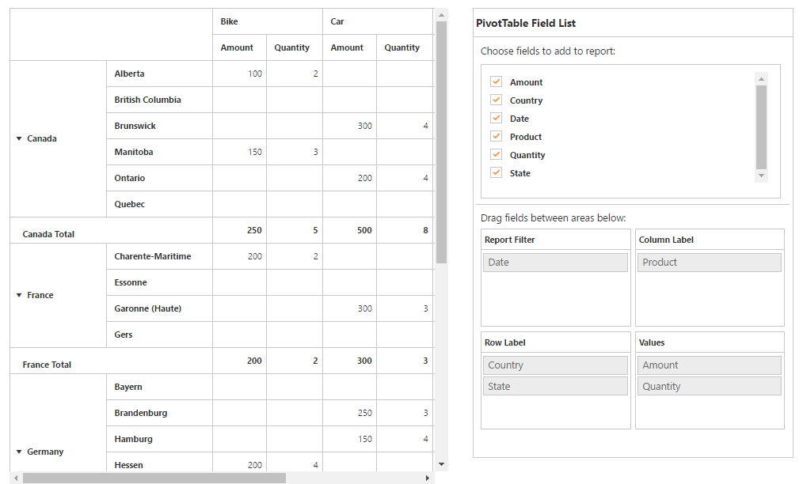
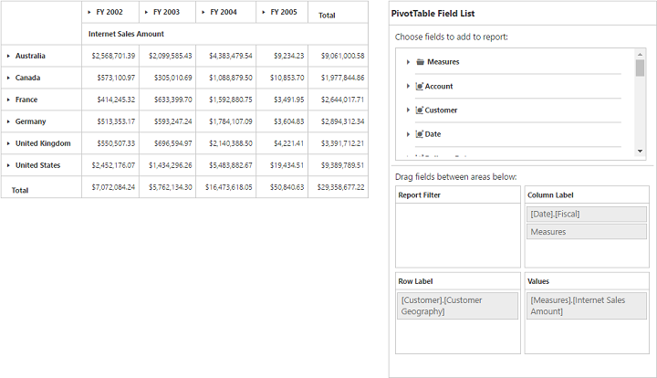
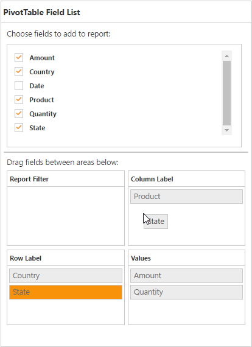
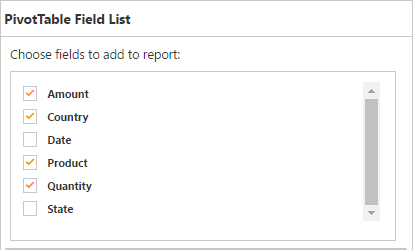
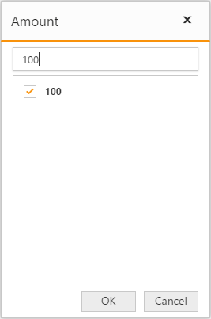
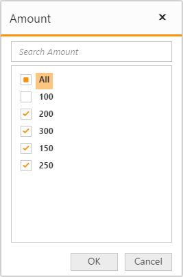

# Pivot table field list

## Initialization

The field list, also known as pivot schema designer, allows you to add, rearrange, filter, and remove fields to show data in the pivot grid exactly the way you desire.

Based on the data source and relational binding to the pivot grid control, the list will be automatically populated with cube information or field names. This list provides an Excel like appearance and behavior.

To initialize the pivot table field list, define a “div” tag with an appropriate “id” attribute which acts as a container for the control. Then, use the **"ej-pivot-schema-designer"** method to render the pivot table field list in that container.

### Relational



<ej-pivot-grid id="PivotGrid1" load="onload" pivot-table-field-list-id="PivotSchemaDesigner1">
        <e-data-source>
            <e-pivot-rows>
                <e-row-field field-name="Country" field-caption="Country"></e-row-field>
                <e-row-field field-name="State" field-caption="State"></e-row-field>
            </e-pivot-rows>
            <e-pivot-columns>
                <e-column-field field-name="Product" field-caption="Product"></e-column-field>
            </e-pivot-columns>
            <e-pivot-values>
                <e-value-field field-name="Amount" field-caption="Amount"></e-value-field>
                <e-value-field field-name="Quantity" field-caption="Quantity"></e-value-field>
            </e-pivot-values>
        </e-data-source>
</ej-pivot-grid>
<ej-pivot-schema-designer id="PivotSchemaDesigner1"></ej-pivot-schema-designer>



### OLAP



<ej-pivot-grid id="PivotGrid1" pivot-table-field-list-id="PivotSchemaDesigner1">
    <e-data-source catalog="Adventure Works DW 2008 SE" cube="Adventure Works" data="//bi.syncfusion.com/olap/msmdpump.dll">
        <e-pivot-rows>
            <e-row-field field-name="[Customer].[Customer Geography]"></e-row-field>
        </e-pivot-rows>
        <e-pivot-columns>
            <e-column-field field-name="[Date].[Fiscal]"></e-column-field>
        </e-pivot-columns>
        <e-pivot-values>
            <e-value-field axis="Column">
                <e-measures>
                    <e-measure-items field-name="[Measures].[Internet Sales Amount]"></e-measure-items>
                </e-measures>
            </e-value-field>
        </e-pivot-values>
    </e-data-source>
</ej-pivot-grid>
<ej-pivot-schema-designer id="PivotSchemaDesigner1"></ej-pivot-schema-designer>



## Layout

The top portion of the layout shows field or cube items in a categorized way. They can dynamically be added to the report by drag and drop option or through simple check box selection.

Item(s) selected will be placed in the row section by default, except numeric based item(s) or measures, which will be placed in the value section, by default.

The bottom portion of the layout is segregated as follows:

* Report filter: Filters item(s) placed in a particular position of the layout.
* Value section: The value label usually displays the numeric value item(s) present in the report.
* Column section: Displays the item(s) as column header and values in the pivot grid control.
* Row section: Displays the item(s) as row header and values in the pivot grid control.

## UI interactions
You can alter the report on fly through the drag and drop operation. You can drag any item from the field list and drop it in the column, row, value, or filter section available at the bottom of the field list.

You can also alter the report on fly through check and uncheck option as an alternate. By default, fields will be added to the row label when checked.

## Searching values
The search option available in the field list allows you to search a specific value that should be filtered from the list of values in the filter pop-up window.

## Filtering
Values can be filtered by checking/unchecking the check box beside them, inside the filter pop-up window. At least, one value should present in checked state while filtering, or else the OK button will be disabled.

