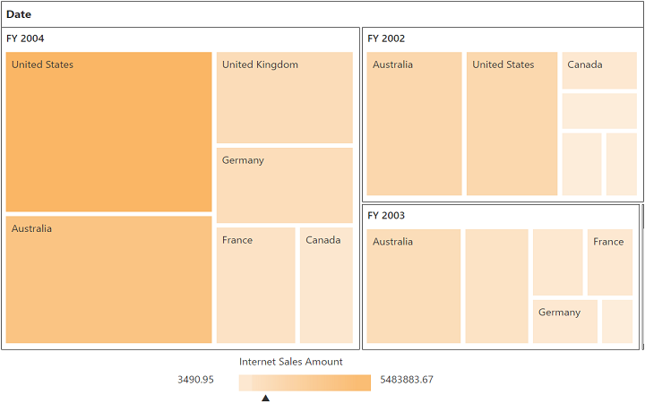

# Getting started

>**Important**
Starting with v16.2.0.x, if you refer to Syncfusion assemblies from trial setup or from the NuGet feed, include a license key in your projects. Refer to this [link](https://help.syncfusion.com/common/essential-studio/licensing/license-key) to learn about registering Syncfusion license key in your ASP.NET Core application to use our components.

Refer the [getting started](/aspnet-core/getting-started) page of the introduction part to know more about the basic system requirements and the steps to configure the Syncfusion components in an ASP.NET Core application.

Ensure whether all the necessary dependency packages are included within the *bower.json* file as mentioned [here](/aspnet-core/getting-started#configure-syncfusion-components-in-aspnet-core-application), so that the required scripts and CSS to render the pivot tree map control will be installed and loaded into the mentioned location (**wwwroot -> lib**) within your project.

Also, check whether the assembly dependency package **Syncfusion.EJ.Pivot** is added within the *project.json* file.

Now, refer to the necessary scripts and CSS files in your *_Layout.cshtml* page from the **wwwroot -> lib -> syncfusion-javascript** folder.



<html>
<head>
    <environment names="Development">
        <link rel="stylesheet" href="~/lib/bootstrap/dist/css/bootstrap.css" />
        <link rel="stylesheet" href="~/css/site.css" />
        <link href="~/lib/syncfusion-javascript/Content/ej/web/default-theme/ej.web.all.min.css" rel="stylesheet" />
        <link href="~/lib/syncfusion-javascript/Content/ej/web/responsive-css/ej.responsive.css" rel="stylesheet" />
    </environment>
</head>
<body>

    <environment names="Development">
        
        
        
        
        
    </environment>

</body>
</html>



It is necessary to define the following namespace within the *_viewImports.cshtml* page to make use of the pivot tree map control with the tag helper support.
 

 
@using Syncfusion.JavaScript
@addTagHelper "*, Syncfusion.EJ"
@addTagHelper "*, Syncfusion.EJ.Pivot"
    


N> Script manager must be defined at the bottom of the *_Layout.cshtml* page.

### Initialize pivot tree map

Before initializing the pivot tree map, empty the contents of Index.cshtml file under Views > Home folder and add the following codes.



<ej-pivot-treemap id="PivotTreeMap1"></ej-pivot-treemap>



### Populate pivot tree map with data source

Initializes the OLAP data source for the pivot tree map control as shown below:



<ej-pivot-treemap id="PivotTreeMap1">
    <e-data-source catalog="Adventure Works DW 2008 SE" cube="Adventure Works" data="//bi.syncfusion.com/olap/msmdpump.dll">
        <e-pivot-rows>
            <e-row-field field-name="[Date].[Fiscal]"></e-row-field>
        </e-pivot-rows>
        <e-pivot-columns>
            <e-column-field field-name="[Customer].[Customer Geography]"></e-column-field>
        </e-pivot-columns>
        <e-pivot-values>
            <e-value-field axis="Column">
                <e-measures>
                    <e-measure-items field-name="[Measures].[Internet Sales Amount]"></e-measure-items>
                </e-measures>
            </e-value-field>
        </e-pivot-values>
    </e-data-source>
</ej-pivot-treemap>

<!--Tooltip labels can be localized here-->



The above code will generate a simple pivot tree map with internet sales amount over a period of fiscal years across different customer geographic locations.

