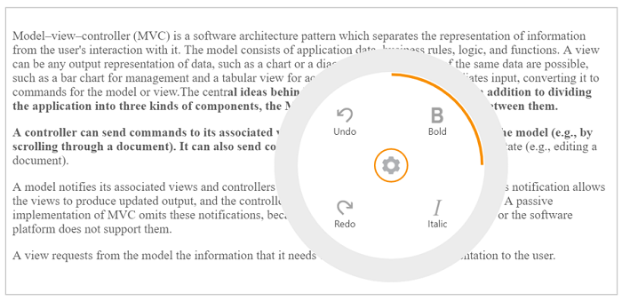

## Dimension

You can customize **Radial Menu** dimension by using **radius** and **position** properties.

### Radius

You can customize the **Radial Menu** size by using the **radius** property. By default, the **Radial Menu** Radius is set as 150px. Refer to the following code example.



    <ej-radial-menu id="defaultRadialMenu" image-class="imageclass" auto-open="true" radius="150">
            <e-radial-menu-items >
                   <e-radial-menu-item image-url="http://mvc.syncfusion.com/demos/web/Images/RadialMenu/font.png" text ="Bold" enabled="true">
                    </e-radial-menu-item>
                <e-radial-menu-item image-url="http://mvc.syncfusion.com/demos/web/Images/RadialMenu/f1.png" text="Italic" >
                   </e-radial-menu-item>
                <e-radial-menu-item image-url="http://mvc.syncfusion.com/demos/web/Images/RadialMenu/redo.png" text="Redo">
                   </e-radial-menu-item>
                <e-radial-menu-item image-url="http://mvc.syncfusion.com/demos/web/Images/RadialMenu/undo.png" text="Undo" >
                </e-radial-menu-item>
            </e-radial-menu-items>
        </ej-radial-menu>



Add the following script in your code.



    



Add the following code in your style section,



    



The following screenshot illustrates the **Radial Menu** while clicking on the settings icon.

### Position 

To display the **Radial Menu** in the web page in a specific area, we can use the **position** property. By default, the **Radial Menu** Position is set as null. 

Refer to the following code example.



    <ej-radial-menu id="defaultRadialMenu" image-class="imageclass" auto-open="true">
            <e-radial-menu-items >
                   <e-radial-menu-item image-url="http://mvc.syncfusion.com/demos/web/Images/RadialMenu/font.png" text ="Bold" enabled="true">
                    </e-radial-menu-item>
                <e-radial-menu-item image-url="http://mvc.syncfusion.com/demos/web/Images/RadialMenu/f1.png" text="Italic">
                   </e-radial-menu-item>
                <e-radial-menu-item image-url="http://mvc.syncfusion.com/demos/web/Images/RadialMenu/redo.png" text="Redo" >
                   </e-radial-menu-item>
                <e-radial-menu-item image-url="http://mvc.syncfusion.com/demos/web/Images/RadialMenu/undo.png" text="Undo" >
                </e-radial-menu-item>
            </e-radial-menu-items>
        </ej-radial-menu>



Add the following script in your code.



    



Add the following code in your style section,



    



The following screenshot illustrates the output while selecting the text in the page.

