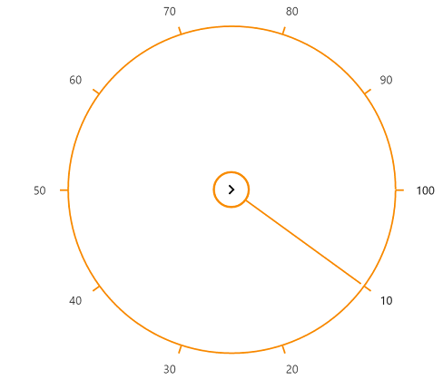

# Getting Started with ASP.NET Core RadialSlider

This section explains briefly about how to create a RadialSlider in ASP.NET Core application.

## Creating your first RadialSlider in ASP.NET Core application

1.	Refer the [Getting Started]( https://help.syncfusion.com/aspnet-core/gettingstarted/getting-started-1-1-0 ) page of the Introduction part to know more about the basic system requirements and the steps to configure the Syncfusion components in an ASP.NET Core application.
2.	Add following code to Render RadialSlider control in your ASP.NET Core.



        <ej-radial-slider id="radialslider" inner-circle-image-url="@Url.Content("~/images/radialslider/chevron-right.png")" />



Run the code and you will get below output.

