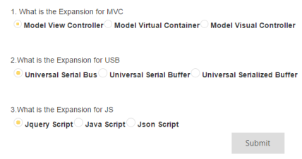
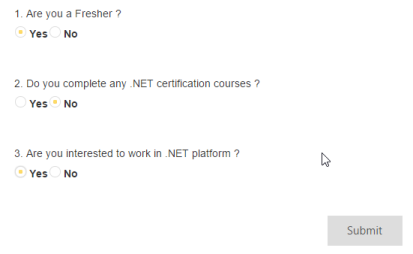

# Getting Started with ASP.NET Core RadioButton

This section briefly describes you on how to create a QuizApp and RegistrationApp using ASP.NET Core RadioButton control and use the features available in it.

## Create your first RadioButton in ASP.NET Core

ASP.NET Core RadioButton provides support to display the RadioButton within your web page, and allows you to pick your choice. Using the following guidelines, you can customize RadioButton for a real-time QuizApp and RegistrationApp scenarios. This allows you to select the corresponding choice for each question.

### Create your QuizApp

Essential Studio ASP.NET Core RadioButton widget has a built-in feature to select a single option from the QuizApp. You can create the RadioButton widget using the following steps.

1. Create a .NetCore Project with the help of the given [ASP.NET Core-Getting Started](https://help.syncfusion.com/aspnet-core/gettingstarted/getting-started-1-1-0) documentation.
2. Add the following code example to the corresponding view page to render RadioButton.



/*ej-Tag Helper code to render RadioButton*/

	

		

			 
		   1. What is the Expansion for MVC 
			<table>
				<tr>
					<td >
						<ej-radio-button id="Radio1" name="rad1" size="Small" checked="false" enabled="true" /><!--Creates a small Radio Button-->
						<label for="Radio1" class="clslab">
							Model View Controller
						</label>
					</td>
					<td  >
						<ej-radio-button id="Radio2" name="rad1" size="Small" checked="false" enabled="true" />
						<label for="Radio2" class="clslab">
							Model Virtual Container
						</label>
					</td>
					<td >
						<ej-radio-button id="Radio3" name="rad1" size="Small" checked="false" enabled="true" />
						<label for="Radio3" class="clslab">
							Model Visual Controller
						</label>
					</td>
				</tr>
			</table>
			 
			 
		   2.What is the Expansion for USB 
			<table>
				<tr>
					<td >
						<ej-radio-button id="Radio4" name="rad2" size="Medium" checked="false" enabled="true" /> <!--Creates a Medium size Radio Button-->
						<label for="Radio4" class="clslab">
							Universal Serial Bus
						</label>
					</td>
					<td >
						<ej-radio-button id="Radio5" name="rad2" size="Medium" checked="false" enabled="true" />
						<label for="Radio5" class="clslab">
							Universal Serial Buffer
						</label>
					</td>
					<td>
						<ej-radio-button id="Radio6" name="rad2" size="Medium" checked="false" enabled="true" />
						<label for="Radio6" class="clslab">
							Universal Serialized Buffer
						</label>
					</td>
				</tr>
			</table>
			 
			 
			3.What is the Expansion for JS 
			<table>
				<tr>
					<td >
						<ej-radio-button id="Radio7" name="rad3" size="Medium" checked="false" enabled="true" />
						<label for="Radio7" class="clslab">
							Jquery Script
						</label>
					</td>
					<td >
						<ej-radio-button id="Radio8" name="rad3" size="Medium" checked="false" enabled="true" />
						<label for="Radio8" class="clslab">
							Java Script
						</label>
					</td>
					<td>
					    <ej-radio-button id="Radio9" name="rad3" size="Medium" checked="false" enabled="true" />
						<label for="Radio9" class="clslab">
							Json Script
						</label>
					</td>
				</tr>
			</table>
			

			<table>
					<ej-button id="Submit" width="100px" size="Large" text="Submit" click="button">
			
 
			</table> 
			 
		

	





/*Razor code to render RadioButton*/

    

        

             

            1. What is the Expansion for MVC 

            <table>

                <tr>

                    <td>

                        @{Html.EJ().RadioButton("Radio1").Name("rad1").Size(RadioButtonSize.Small).Checked(false).Enabled(true).Render(); }

                        <label for="Radio1" class="clslab">

                            Model View Controller

                        </label>

                    </td>

                    <td>

                        @{Html.EJ().RadioButton("Radio2").Name("rad1").Size(RadioButtonSize.Small).Checked(false).Enabled(true).Render(); }

                        <label for="Radio2" class="clslab">

                            Model Virtual Container

                        </label>

                    </td>

                    <td>

                        @{Html.EJ().RadioButton("Radio3").Name("rad1").Size(RadioButtonSize.Small).Checked(false).Enabled(true).Render(); }

                        <label for="Radio3" class="clslab">

                            Model Visual Controller

                        </label>

                    </td>

                </tr>

            </table>

             

             

            2.What is the Expansion for USB 

            <table>

                <tr>

                    <td>

                        @{Html.EJ().RadioButton("Radio4").Name("rad2").Size(RadioButtonSize.Medium).Checked(false).Enabled(true).Render(); }

                        <label for="Radio4" class="clslab">

                            Universal Serial Bus

                        </label>

                    </td>

                    <td>

                        @{Html.EJ().RadioButton("Radio5").Name("rad2").Size(RadioButtonSize.Medium).Checked(false).Enabled(true).Render(); }

                        <label for="Radio5" class="clslab">

                            Universal Serial Buffer

                        </label>

                    </td>

                    <td>

                        @{Html.EJ().RadioButton("Radio6").Name("rad2").Size(RadioButtonSize.Medium).Checked(false).Enabled(true).Render(); }

                        <label for="Radio6" class="clslab">

                            Universal Serialized Buffer

                        </label>

                    </td>

                </tr>

            </table>

             

             

            3.What is the Expansion for JS 

            <table>

                <tr>

                    <td>

                        @{Html.EJ().RadioButton("Radio7").Name("rad3").Size(RadioButtonSize.Medium).Checked(false).Enabled(true).Render(); }

                        <label for="Radio7" class="clslab">

                            Jquery Script

                        </label>

                    </td>

                    <td>

                        @{Html.EJ().RadioButton("Radio8").Name("rad3").Size(RadioButtonSize.Medium).Checked(false).Enabled(true).Render(); }

                        <label for="Radio8" class="clslab">

                            Java Script

                        </label>

                    </td>

                    <td>

                        @{Html.EJ().RadioButton("Radio9").Name("rad3").Size(RadioButtonSize.Medium).Checked(false).Enabled(true).Render(); }

                        <label for="Radio9" class="clslab">

                            Json Script

                        </label>

                    </td>

                </tr>

            </table>

            

                <table>

            	@{Html.EJ().Button("Submit").Width("100px").Size(ButtonSize.Large).Text("Submit").ClientSideEvents(s => s.Click("button")).Render(); }

            

            </table>

            

        

    



N> To render the RadioButton Control you can use either Razor or Tag helper code as given in the above code snippet.

### Add Script





### Configure Style

Add the following code example in the index page.





 Execute the above code example to render the following output.

### Create RegistrationApp



/*ej-Tag Helper code to render RadioButton*/

	

		

			 

			1. Are you a Fresher ? 

			<table>

				<tr>

					<td >

						<ej-radio-button id="Radio1" name="rad1" size="Small" checked="false" enabled="true" /> <!--Creates a small Radio Button-->

						<label for="Radio1" class="clslab">

							Yes

						</label>

					</td>

					<td  >

						<ej-radio-button id="Radio2" name="rad1" size="Small" checked="false" enabled="true" />

						<label for="Radio2" class="clslab">

							No

						</label>

					</td>

				</tr>

			</table>

			 

			 

			2. Do you complete any .NET certification courses ? 

			<table>

				<tr>

					<td>

						<ej-radio-button id="Radio3" name="rad2" size="Small" checked="false" enabled="true" /> <!--Creates a small Radio Button-->

						<label for="Radio1" class="clslab">

							Yes

						</label>

					</td>

					<td>

						<ej-radio-button id="Radio4" name="rad2" size="Small" checked="false" enabled="true" />

						<label for="Radio2" class="clslab">

							No

						</label>

					</td>

				</tr>

			</table>

			 

			 

			3. Are you interested to work in .NET platform ? 

			<table>

				<tr>

					<td>

						<ej-radio-button id="Radio5" name="rad3" size="Small" checked="false" enabled="true" /> <!--Creates a small Radio Button-->

						<label for="Radio1" class="clslab">

							Yes

						</label>

					</td>

					<td>

						<ej-radio-button id="Radio6" name="rad3" size="Small" checked="false" enabled="true" />

						<label for="Radio2" class="clslab">

							No

						</label>

					</td>

				</tr>

			</table>

			 

			 

			

				<table>

					<ej-button id="Submit" width="100px" size="Large" text="Submit" click="button">

			
 

					</table> 

			 

		

	





/*Razor code to render RadioButton*/

    

        

             

            1. Are you a Fresher ? 

            <table>

                <tr>

                    <td>

                        @{Html.EJ().RadioButton("Radio1").Name("rad1").Size(RadioButtonSize.Small).Checked(false).Enabled(true).Render(); }

                        <label for="Radio1" class="clslab">

                            Yes

                        </label>

                    </td>

                    <td>

                        @{Html.EJ().RadioButton("Radio2").Name("rad1").Size(RadioButtonSize.Small).Checked(false).Enabled(true).Render(); }

                        <label for="Radio2" class="clslab">

                            No

                        </label>

                    </td>

                </tr>

            </table>

             

             

            2. Do you complete any .NET certification courses ? 

            <table>

                <tr>

                    <td>

                        @{Html.EJ().RadioButton("Radio3").Name("rad2").Size(RadioButtonSize.Small).Checked(false).Enabled(true).Render(); }

                        <label for="Radio1" class="clslab">

                            Yes

                        </label>

                    </td>

                    <td>

                        @{Html.EJ().RadioButton("Radio4").Name("rad2").Size(RadioButtonSize.Small).Checked(false).Enabled(true).Render(); }

                        <label for="Radio2" class="clslab">

                            No

                        </label>

                    </td>

                </tr>

            </table>

             

             

            3. Are you interested to work in .NET platform ? 

            <table>

                <tr>

                    <td>

                        @{Html.EJ().RadioButton("Radio5").Name("rad3").Size(RadioButtonSize.Small).Checked(false).Enabled(true).Render(); }

                        <label for="Radio1" class="clslab">

                            Yes

                        </label>

                    </td>

                    <td>

                        @{Html.EJ().RadioButton("Radio6").Name("rad3").Size(RadioButtonSize.Small).Checked(false).Enabled(true).Render(); }

                        <label for="Radio2" class="clslab">

                            No

                        </label>

                    </td>

                </tr>

            </table>

             

             

            

                <table>

                    @{Html.EJ().Button("Submit").Width("100px").Size(ButtonSize.Large).Text("Submit").ClientSideEvents(s => s.Click("button")).Render(); }

            

            </table>

             

        

    



### Add Script





### Add Style





Execute the above code example to render the following outputs.

The whole purpose of Radio Button is to enable you to make one selection, only one, from a list. When you want to make multiple selections, you do not require a Radio Button, you need to use a CheckBox.

You can make only one selection from the group of radio buttons. All radio buttons in that group need to share the same name. This tells the form handler, the name of the group, and the value of the selected Radio Button.

Radio Button is [mutually exclusive](http://en.wikipedia.org/wiki/Mutually_exclusive_events); that is, when you select a radio button, any previously selected radio buttons in the same group become deselected. 

For example, when you want to choose between a groups of colors, you can create Radio Buttons for each color. You can give all the radio buttons the same name, for example, "preferred_color", but you must give each radio button a different value, for example, "red".

1. All radio buttons within a group must share the same name. That is, the value of the name attribute has to be the same. For example, all three radio buttons in the "Preferred Color" group have the name "preferred_color".
2. All radio buttons within a group must have a different value for the value attribute. For example, when one radio button has value as "red", none of the others in that group can have a value of red, as this would defeat the purpose of having the extra radio button.
3. The label for each radio button is determined by the text next to the radio button and not by the value attribute. The value attribute is used by the form handler.

