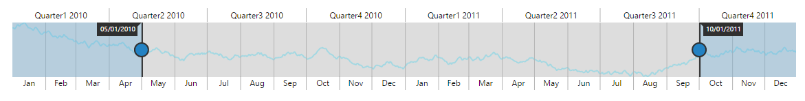

# Populate Data

When you provide data to RangeNavigator, it produces limited set of data. You can populate the RangeNavigator with data using the DataSource and Series properties.

## Add series to the RangeNavigator

The Series property provides access to a collection of all series that are defined explicitly within a RangeNavigator control. Each series is assigned with type and name. It contains collection of data point, each point contains x value and y values. You can add data points to the series through DataSource property by providing field name to get the values from the DataSource in `xName` and `yName` options.

Animation can be enabled by setting `Enable-Animation` property as true and the series color can be customized by using `Fill` property in series.


 

<ej-range-navigator id="range" load="loadingData">
	<e-chart-series>
		<e-series name="Product A" type="Line" enable-animation="false" fill="#69D2E7" opacity="0.5">
		</e-series>
	</e-chart-series>
	<e-selected-range-settings start="2010/5/1" end="2011/10/1"></e-selected-range-settings>
</ej-range-navigator>

   



The following screenshot illustrates the RangeNavigator that is populated with data using DataSource property in series.

