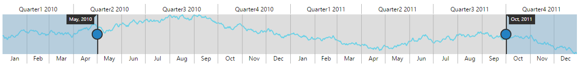
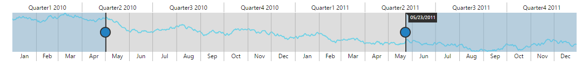

# Tooltip

RangeNavigator provides Tooltip support for sliders. Sliders are used to select data at particular range in the RangeNavigator control. Tooltips for sliders display the selected start and end DateTime values.

## Customization

RangeNavigator provides support for you to customize the text display in the tooltip and background using TooltipSettings property.



    <ej-range-navigator id="range">
        <e-range-tooltip-settings visible="true" background-color="Black"></e-range-tooltip-settings>
    </ej-range-navigator>



## Label Format

By default, the tooltip texts are automatically determined based on the data points.  To make it readable and understandable you can format the tooltip text. For DateTime data, all globalized format are supported. By default the LabelFormat is "MM/dd/yyyy".

Some of the LabelFormat for DateTime data are as follows:

* 'MMM, yyyy'
* 'dd, MMM'
* 'dd/MM/yyyy'
* 'dd, hh:mm'
* 'hh:mm:ss'

'hh:mm:ss:tt'


 

    <ej-range-navigator id="range" load="loadingdata">
        <e-chart-series>
            <e-series name="Product A" type="Line" fill="#69D2E7">
            </e-series>
        </e-chart-series>
        <e-selected-range-settings start="2010/5/1" end="2011/10/1"></e-selected-range-settings>
        <e-range-tooltip-settings label-format="MMM, yyyy"></e-range-tooltip-settings>
        </ej-range-navigator>



Tooltip display mode

By default the tooltip for RangeNavigator gets displayed. You can change this behavior using the TooltipDisplayMode property in the TooltipSettings and it takes the following values.

_Tooltip values_

<table>
<tr>
<th>
Value</th><th>
Description</th></tr>
<tr>
<td>
always</td><td>
Tooltip get displayed for RangeNavigator always.</td></tr>
<tr>
<td>
onDemand</td><td>
Tooltip get displayed only when we move the slider.</td></tr>
</table>



    <ej-range-navigator id="range" load="loadingdata">
        <e-chart-series>
            <e-series name="Product A" type="Line" fill="#69D2E7">
            </e-series>
        </e-chart-series>
        <e-selected-range-settings start="2010/5/1" end="2011/10/1"></e-selected-range-settings>
        <e-range-tooltip-settings tooltip-display-mode="onDemand"></e-range-tooltip-settings>
    </ej-range-navigator>



