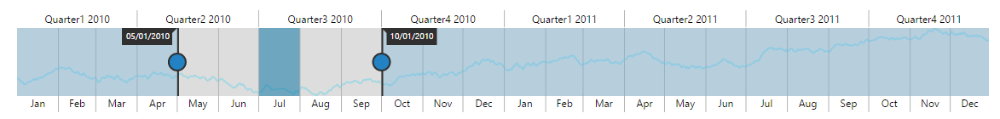

# User Interactions

## Highlight

EjRangeNavigator provides highlighting supports to the intervals on mouse hover. To enable the highlighting option, set the *Enable* property to true in the *HighlightSettings* of NavigatorStyleSettings.



    <ej-range-navigator id="range" load="loadingdata">
        <e-chart-series>
            <e-series name="Product A" type="Line" enable-animation="false" fill="#69D2E7" opacity="0.5">
            </e-series>
        </e-chart-series>
        <e-selected-range-settings start="2010/5/1" end="2010/10/1"></e-selected-range-settings>
        <e-navigator-style-settings><e-highlight-settings enable="true"></e-highlight-settings></e-navigator-style-settings>
    </ej-range-navigator>



 

### Customize the highlight style

To customize the highlighted intervals, use color, border and opacity options in the HighlightSettings.



    <ej-range-navigator id="range" load="loadingdata">
        <e-chart-series>
            <e-series name="Product A" type="Line">
            </e-series>
        </e-chart-series>
        <e-selected-range-settings start="2010/5/1" end="2011/10/1"></e-selected-range-settings>
        <e-navigator-style-settings><e-highlight-settings enable="true" color="#006fa0"><e-border color="red" width="2"></e-border></e-highlight-settings></e-navigator-style-settings>
        </ej-range-navigator>



## Selection

EjRangeNavigator provides selection supports to the intervals by, clicking and dragging the highlighted intervals. To enable the selection option, set the Enable property to true in the SelectionSettings.



<ej-range-navigator id="range" load="loadingdata">
    <e-chart-series>
        <e-series name="Product A" type="Line">
        </e-series>
    </e-chart-series>
    <e-selected-range-settings start="2010/5/1" end="2011/10/1"></e-selected-range-settings>
    <e-navigator-style-settings><e-selection-settings enable="true"></e-selection-settings></e-navigator-style-settings>
    </ej-range-navigator>



 

### Customize the selection style

To customize the selected intervals, use color, border and opacity options in the SelectionSettings.



    <ej-range-navigator id="range" load="loadingdata">
        <e-chart-series>
            <e-series name="Product A" type="Line">
            </e-series>
        </e-chart-series>
        <e-selected-range-settings start="2010/5/1" end="2011/10/1"></e-selected-range-settings>
        <e-navigator-style-settings><e-selection-settings enable="true" color="#27e8e5"><e-border color="red" width="2"></e-border></e-selection-settings></e-navigator-style-settings>
        </ej-range-navigator>



## Scrollbar

* To render the Scrollbar in RangeNavigator, you need to enable **EnableScrollbar** option.
 
* **ScrollRangeSettings** of  RangeNavigator *Start* and *End* value is used to set the minimum and maximum datasource value to be added in the range navigator.
 
* Based on the ScrollRangeSettings *Start, End* value and dataSource *Start, End* value scrollbar will be adjust.

* When you change the scrollbar position, **ScrollEnd** event returns the current position of start and end range value.



<ej-range-navigator id="range" load="loadingdata" enable-scrollbar="true" scroll-end="onScrollbarChange">
    <e-chart-series>
        <e-series name="Product A" type="Line">
        </e-series>
    </e-chart-series>
    <e-selected-range-settings start="2010/5/1" end="2011/10/1"></e-selected-range-settings>
    <e-scroll-range-settings start="2010/1/1" end="2011/11/31"></e-scroll-range-settings>
    </ej-range-navigator>


    
 

      function onScrollbarChange(sender) {
            var start  = sender.data.newRange.start;
            var end  = sender.data.newRange.end;
      }
      


