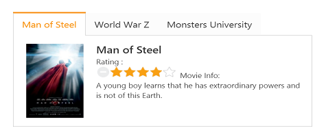
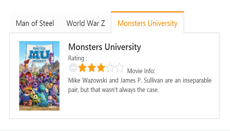

# Getting Started

This section explains briefly how to create a Rating control in the ASP.NET Core.

## Create your first Rating control in ASP.NET Core

Essential Studio ASP.NET CoreRating control provides support to display Rating bar within your web page, and allows you to rate the products. Refer to the following guidelines to customize the Rating control for a real-time movie download application. You can use Rating control to rate a movie. In this real-time application, Essential Studio ASP.NET CoreTab control is used to display the movies information with rating star.To know more about Tab control, refer to the Getting Started of the Tab control.

The following screenshot demonstrates the functionality of a Rating control with a Rating range of 0 to 5. 

In the above screenshot, you can rate the movie by selecting a corresponding movie.

### Create a Rating 

The Essential Studio ASP.NET CoreRating widget renders with built-in features like Precision, Orientation and flexible APIs. You can easily create the Rating widget by using HTML helper class as follows.

You can create a Core Project and add necessary assembly and script with the help of the given [Dotnet Core-Getting Started](https://help.syncfusion.com/aspnet-core/getting-started) Documentation.

Add the following code example to the corresponding view page to render Rating inside the Tab control.	



 /*ej-Tag Helper code to render Rating*/

    <ej-tab id="moviesTab">
        <e-tab-items>
            <e-tab-item id="steelman" text="Man of Steel">
                <e-content-template>
                    

                        <table>
                            <tr>
                                <td class="movies-img" valign="top">
                                    
                                </td>
                                <td valign="top">
                                    

                                        Man of Steel 
                                        Rating :
                                         
                                        <ej-rating id="univRating" value="4" />

                                        Movie Info:
                                        

                                            A young boy learns that he has extraordinary powers and is not of this Earth.
                                        

                                    

                                </td>
                            </tr>
                        </table>
                    

                </e-content-template>
            </e-tab-item>

            <e-tab-item id="woldwar" text="World War Z">
                <e-content-template>
                    

                        <table>
                            <tr>
                                <td class="movies-img" valign="top">
                                    
                                </td>
                                <td valign="top">
                                    

                                        World War Z 
                                        Rating :
                                         

                                        <ej-rating id="wwzRating" value="4">
                                            Movie Info:
                                            

                                                The story revolves around United Nations employee Gerry Lane (Pitt).
                                            

                                    

                                </td>
                            </tr>
                        </table>
                    

                </e-content-template>
            </e-tab-item>
            <e-tab-item id="unive" text="Monsters University">
                <e-content-template>
                    

                        <table>
                            <tr>
                                <td class="movies-img" valign="top">
                                    
                                </td>
                                <td valign="top">
                                    

                                        Monsters University 
                                        Rating :
                                         

                                        <ej-rating id="mosRating" value="3">
                                            Movie Info:
                                            

                                                Mike Wazowski and James P. Sullivan are an inseparable pair, but that wasn't always the case.
                                            

                                    

                                </td>
                            </tr>
                        </table>
                    

                </e-content-template>
            </e-tab-item>
        </e-tab-items>
    </ej-tab> 





 /*Razor code to render Rating*/

 
    @{Html.EJ().Tab("moviesTab").Items(evt=> 
    { 
    evt.Add().ID("steelman").Text("Man of Steel").ContentTemplate( 
    @
 
        <table> 
            <tr> 
                <td class="movies-img" valign="top"> 
                      
                </td> 
                <td valign="top"> 
                    
 
                        Man of Steel  
                        Rating :
                          
                        @Html.EJ().Rating("univRating").Value(4) 
                        Movie Info: 
                        
 
                            A young boy learns that he has extraordinary powers and is not of this Earth. 
                        
 
                    
 
                </td> 
            </tr> 
        </table> 
    
);

    evt.Add().ID("woldwar").Text("World War Z").ContentTemplate( 
    @
 
        <table> 
            <tr> 
                <td class="movies-img" valign="top"> 
                     
                </td> 
                <td valign="top"> 
                    
 
                        World War Z  
                        Rating :
                          
                        @Html.EJ().Rating("wwzRating"). Value(4) 
                        Movie Info: 
                        
 
                            The story revolves around United Nations employee Gerry Lane (Pitt). 
                        
 
                    
 
                </td> 
            </tr> 
        </table> 
    
); 
    evt.Add().ID("unive").Text("Monsters University").ContentTemplate( 
    @
 
        <table> 
            <tr> 
                <td class="movies-img" valign="top"> 
                     
                </td> 
                <td valign="top"> 
                    
 
                        Monsters University  
                        Rating :
                          
                        @Html.EJ().Rating("mosRating").Value(3) 
                        Movie Info: 
                        
 
                            Mike Wazowski and James P. Sullivan are an inseparable pair, but that wasn't always the case. 
                        
 
                    
 
                </td> 
            </tr> 
        </table> 
    
);

    }).Render();
    } 

 

N> To render the Rating Control you can use either Razor or Tag helper code as given in the above code snippet.

Add the following styles to the corresponding view page to show the Rating in a horizontal order.





Execute the above code to render the following output.

