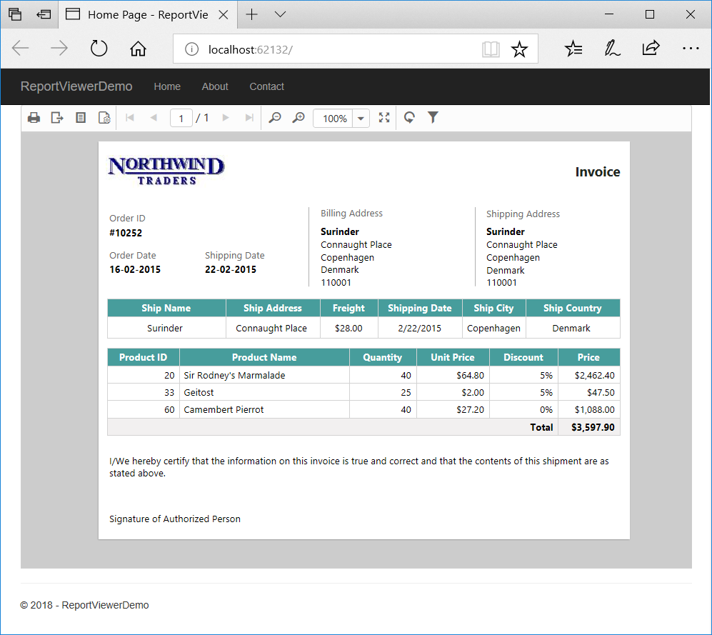

# Overview

The report viewer is a visualization control to view the Microsoft RDL/RDLC format based report on a web page, and it is powered by HTML5/JavaScript. This section explains how to add the report viewer component in the ASP.NET Core MVC application along with simple example of the invoice report.

N> The report viewer control depends on server-side processing for report rendering. So, you should build the WebAPI service that is compatible for report viewer. This getting started will illustrates details of how to create the report viewer compatible Web API service also for your application.

## Environment setup
Refer the [installation](/aspnet-core/configuration-and-installation) page to know more about the basic steps to configure the Syncfusion components to use with ASP.NET Core application. 

N> NuGet package reference will be mostly preferred with ASP.NET Core development to setup the environment without installation, if you missed to explore then refer to the [nuget-package-manager-settings](/aspnet-core/nuget-packages) to configure the Syncfusion NuGet source.

### Styles and scripts

Ensure whether all the necessary dependency scripts and style packages are included within the *bower.json* file as mentioned [here](/aspnet-core/getting-started#configure-syncfusion-components-in-aspnet-core-application), so that the required scripts and CSS will be installed and loaded into the mentioned location (**wwwroot -> lib**) within your project.

Now, refer to the necessary scripts and CSS files in your *_Layout.cshtml* page from the **wwwroot -> lib -> syncfusion-javascript** folder.


<!DOCTYPE html>
<html>
<head>
    <meta charset="utf-8" />
    <meta name="viewport" content="width=device-width, initial-scale=1.0" />
    <title>@ViewData["Title"] - ReportViewerDemo</title>

    <environment include="Development">
        <link rel="stylesheet" href="~/lib/bootstrap/dist/css/bootstrap.css" />
        <link rel="stylesheet" href="~/css/site.css" />

        <link href="~/lib/syncfusion-javascript/Content/ej/web/default-theme/ej.web.all.min.css" rel="stylesheet" />
        <link href="~/lib/syncfusion-javascript/Content/ej/web/responsive-css/ej.responsive.css" rel="stylesheet" />

    </environment>
    <environment exclude="Development">
        <link rel="stylesheet" href="https://ajax.aspnetcdn.com/ajax/bootstrap/3.3.7/css/bootstrap.min.css"
              asp-fallback-href="~/lib/bootstrap/dist/css/bootstrap.min.css"
              asp-fallback-test-class="sr-only" asp-fallback-test-property="position" asp-fallback-test-value="absolute" />
        <link rel="stylesheet" href="~/css/site.min.css" asp-append-version="true" />

        <link href="~/lib/syncfusion-javascript/Content/ej/web/default-theme/ej.web.all.min.css" rel="stylesheet" />
        <link href="~/lib/syncfusion-javascript/Content/ej/web/responsive-css/ej.responsive.css" rel="stylesheet" />

    </environment>
</head>
<body>
    <nav class="navbar navbar-inverse navbar-fixed-top">
        

            

                <button type="button" class="navbar-toggle" data-toggle="collapse" data-target=".navbar-collapse">
                    Toggle navigation
                    
                    
                    
                </button>
                <a asp-area="" asp-controller="Home" asp-action="Index" class="navbar-brand">ReportViewerDemo</a>
            

            

                <ul class="nav navbar-nav">
                    <li><a asp-area="" asp-controller="Home" asp-action="Index">Home</a></li>
                    <li><a asp-area="" asp-controller="Home" asp-action="About">About</a></li>
                    <li><a asp-area="" asp-controller="Home" asp-action="Contact">Contact</a></li>
                </ul>
            

        

    </nav>
    

        @RenderBody()
        

        <footer>
            
&copy; 2018 - ReportViewerDemo

        </footer>
    

    <environment include="Development">
        
        
        

        
        

    </environment>
    <environment exclude="Development">
        
        
        

        
        

    </environment>

    @RenderSection("Scripts", required: false)

    <ej-script-manager/>
</body>
</html>


N> `ej-script-manager` must be defined at the bottom of the *_Layout.cshtml* page.

### References
You should add the following packages for the report viewer:

<table>
<tr>
<th>
Package</th>
<th>
Purpose
</th>
</tr>
<tr>
<td>Syncfusion.EJ</td>
<td>Builds the report viewer controls with the tag helper.</td>
</tr>
<tr>
<td>Syncfusion.EJ.ASPNET.Core</td>
<td>Builds the report viewer controls with the tag helper.</td>
</tr>
<tr>
<td>Syncfusion.EJ.ReportViewer.ASPNET.Core</td>
<td>Builds the server-side implementations.</td>
</tr>
<tr>
<td>Syncfusion.Report.NETStandard</td>
<td>It is a base library for the <b>Syncfusion.EJ.ReportViewer.ASPNET.Core</b> package.</td>
</tr>
<tr>
<td>Syncfusion.Compression.NETStandard</td>
<td>Supports for exporting the report to PDF, Microsoft Word, and Microsoft Excel format. It is a base library for the packages <b>Syncfusion.Pdf.NETStandard</b> , <b>Syncfusion.DocIO.NETStandard</b> and <b>Syncfusion.XlsIO.NETStandard</b>. </td>
</tr>
<tr>
<td>Syncfusion.Pdf.NETStandard</td>
<td>Supports for exporting the report to a PDF.</td>
</tr>
<tr>
<td>Syncfusion.DocIO.NETStandard</td>
<td>Supports for exporting the report to a Word.</td>
</tr>
<tr>
<td>Syncfusion.XlsIO.NETStandard</td>
<td>Supports for exporting the report to an Excel.</td>
</tr>
<tr>
<td>Syncfusion.OfficeChart.NETStandard</td>
<td>It is a base library of the <b>Syncfusion.XlsIO.NETStandard package</b>.</td>
</tr>
<tr>
<td>Newtonsoft.Json</td>
<td>Serialize and deserialize the data for report viewer. It is a mandatory package for the report viewer, and the package version should be higher of 10.0.1 for NET Core 2.0 and others should be higher of 9.0.1.</td>
</tr>
<tr>
<td>System.Data.SqlClient</td>
<td>This is an optional package for the report viewer. It should be referred in project when renders the RDL report and which contains the SQL Server and SQL Azure datasource. Also, the package version should be higher of 4.1.0 . </td>
</tr>
</table>

### Tag helper
It is necessary to define the following namespace within the *_viewImports.cshtml* page to initialize the report viewer component with the tag helper support.



    @addTagHelper *, Microsoft.AspNetCore.Mvc.TagHelpers
    @using Syncfusion.JavaScript
    @addTagHelper "*, Syncfusion.EJ"



## Add control with page

You can use the <ej-report-viewer> tag to add the report viewer control. For an example, the Index.cshtml page can be replaced with the following code by removing the existing codes to add the report viewer.


@{
    ViewData["Title"] = "Home Page";
}

    <ej-report-viewer id="reportviewer1" report-service-url="../Home" />



N> The Web API service should be mapped with the report viewer report-service-url as shown in the above example code.

## Build WebApi service
You should inherit the `IReportController` interface to build the report viewer compatible Web API, and the `ReportHelper` should be used with `IReportController` interface implemented methods. The `ReportHelper` will perform the server-side related process and will return the required data for the report viewer to process the rendering. Here, the sample code is provided with an MVC application to build the Web API service along with the existing controller.



using System.Collections.Generic;
using Microsoft.AspNetCore.Mvc;

namespace ReportViewerDemo.Controllers
{
    public class HomeController : ApiController, Syncfusion.EJ.ReportViewer.IReportController
    {
        // Report viewer requires a memory cache to store the information of consecutive client request and
        // have the rendered report viewer information in server.
        private Microsoft.Extensions.Caching.Memory.IMemoryCache _cache;

        // IHostingEnvironment used with sample to get the application data from wwwroot.
        private Microsoft.AspNetCore.Hosting.IHostingEnvironment _hostingEnvironment;

        // Post action to process the report from server based json parameters and send the result back to the client.
        public HomeController(Microsoft.Extensions.Caching.Memory.IMemoryCache memoryCache, 
            Microsoft.AspNetCore.Hosting.IHostingEnvironment hostingEnvironment)
        {
            _cache = memoryCache;
            _hostingEnvironment = hostingEnvironment;
        }

        public IActionResult Index()
        {
            return View();
        }

        ...
        ...
        ...

        // Post action to process the report from server based json parameters and send the result back to the client.
        public object PostReportAction([FromBody] Dictionary<string, object> jsonArray)
        {
            return Syncfusion.EJ.ReportViewer.ReportHelper.ProcessReport(jsonArray, this, this._cache);
        }

        // Method will be called to initialize the report information to load the report with ReportHelper for processing.
        public void OnInitReportOptions(Syncfusion.EJ.ReportViewer.ReportViewerOptions reportOption)
        {
            string basePath = _hostingEnvironment.WebRootPath;
            // Here, we have loaded the sample report report from application the folder wwwroot. Sample.rdl should be there in wwwroot application folder.
            FileStream reportStream = new FileStream(basePath + @"\invoice.rdl", FileMode.Open, FileAccess.Read);
            reportOption.ReportModel.Stream = reportStream;
        }

        // Method will be called when reported is loaded with internally to start to layout process with ReportHelper.
        public void OnReportLoaded(Syncfusion.EJ.ReportViewer.ReportViewerOptions reportOption)
        {
        }
        
        //Get action for getting resources from the report
        [ActionName("GetResource")]
        [AcceptVerbs("GET")]
        // Method will be called from Report Viewer client to get the image src for Image report item.
        public object GetResource(Syncfusion.EJ.ReportViewer.ReportResource resource)
        {
            return Syncfusion.EJ.ReportViewer.ReportHelper.GetResource(resource, this, _cache);
        }
    }
}



N> You cannot load the application report with path information in ASP.NET Core. So, you should load the report as `Stream` like an example provided above in `OnInitReportOptions`. If you need to get the invoice sample report then you can obtain it from the Syncfusion ASP.NET Core sample browser installed location (wwwroot\reports\invoice.rdl).

## Run the application

Run the sample application, and you can see the report viewer with invoice as shown in the following screenshot:

