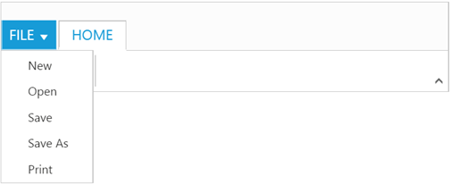
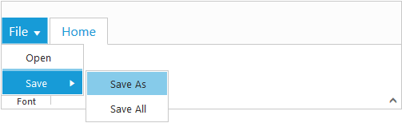
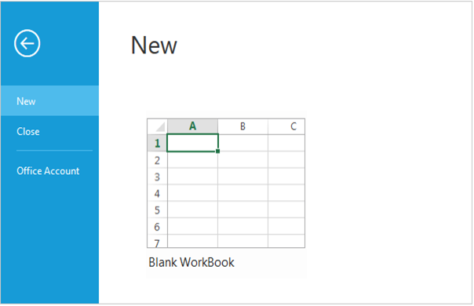

# Application Tab 

The Application Tab is used to represent a `Menu` that do some operations, such as File Menu to create, open, and print documents. Application Tab classified by `Type` property with the following:

*	Menu
*	Backstage

## Application Menu

The Application Menu is similar to traditional file Menu options and Syncfusion `Menu` control is used internally to render this. To show Application Menu in Ribbon, set the `Type` as `Menu` and [`MenuSettings`](https://help.syncfusion.com/aspnet-core/menu/getting-started) to customize properties of `ejMenu`.

### _Create Using Template_

Set the UL element `Id` to `MenuItemID` property to create Application Menu and it will acts as template to render Menu.



   <ul id="ribbonmenu">
        <li>
            <a>FILE</a>
            <ul>
                <li><a>New</a></li>
                <li><a>Open</a></li>
                <li><a>Save</a></li>
                <li><a>Save as</a></li>
                <li><a>Print</a></li>
            </ul>
        </li>
   </ul>





  <ej-ribbon id="defaultRibbon" width="500px">
     <e-application-tab type=Menu menu-item-id="ribbonmenu">
        <e-menu-settings open-on-click="true">
        </e-menu-settings>
     </e-application-tab>
     <e-tabs>
          <e-tab id="home" text="HOME">
            <e-groups>
                <e-group text="New" align-type=Rows content-id="Contents" type="custom">
                    <e-content>
                        <e-contents>
                            <e-content-groups>
                                <e-content-group id="new" text="New">
                                    <e-button-settings image-position="ImageTop" content-type="ImageOnly" prefix-icon="e-icon e-ribbon e-print">
                                    </e-button-settings>
                                </e-content-group>
                            </e-content-groups>
                        </e-contents>
                    </e-content>
                </e-group>
            </e-groups>
        </e-tab> 
     </e-tabs>
  </ej-ribbon>
    


### _Binding Data Source_

Application Menu can be rendered using JSON Data Source. Please refer [`this`](http://help.syncfusion.com/aspnetmvc/menu/data-binding) page to set data source to `ejMenu`.



     <ul id="ribbonmenu1"></ul>
    




  <ej-ribbon id="defaultRibbon" width="500px">
        <e-application-tab type=Menu menu-item-id="ribbonmenu1">
            <e-menu-settings open-on-click="true">
            </e-menu-settings>
        </e-application-tab>
        <e-tabs>
            <e-tab id="home" text="HOME">
                <e-groups>
                    <e-group text="Font">
                        <e-content>
                            <e-contents>
                                <e-content-groups>
                                    <e-content-group id="bold" text="Bold" is-big="true">
                                        <e-button-settings content-type="ImageOnly" prefix-icon="e-icon e-ribbon e-bold">
                                        </e-button-settings>
                                    </e-content-group>
                                </e-content-groups>
                            </e-contents>
                        </e-content>
                    </e-group>
                </e-groups>
            </e-tab>
        </e-tabs>
   </ej-ribbon>

      

 

## Backstage Page

The Backstage page is where documents and related data of those can be managed, such as Create, Save and other information.

The Backstage page has a feature to add custom Control in left side of the page which contains menu items and the right side contains corresponding user controls. 

You can set Application Tab `Type` as `Backstage` and set `Id` , `Text` to Backstage items. Backstage `Pages` can be added with required `ItemType` and `ContentID` as template id to render template into Backstage.
  
Separator between Backstage items can be enabled by setting `EnableSeparator` as true. Width of backstage side header can be customized using `HeaderWidth`, If not set based on content given width will be considered.

To render the Ribbon with the Backstage page, refer to the following code snippet. 



  <ej-ribbon id="defaultRibbon" width="500px">
        <e-application-tab type=Backstage text="FILE">
            <e-backstage-settings text="FILE" height="360" width="600" headerWidth="125">
                <e-pages>
                    <e-page-collection id="new" text="New" content-id="newCon"></e-page-collection>
                    <e-page-collection id="close" text="Close" enable-separator="true" item-type=Button></e-page-collection>
                    <e-page-collection id="account" text="Office Account" content-id="accountCon"></e-page-collection>
                </e-pages>
            </e-backstage-settings>
        </e-application-tab>
        <e-tabs>
            <e-tab id="home" text="HOME">
                <e-groups>
                    <e-group text="New" type="custom" content-id="ribbonContent">
                    </e-group>
                </e-groups>
            </e-tab>
        </e-tabs>
  </ej-ribbon>
    
   

        <table>
            <tr>
                <td>
                    <button id="btn1" class="e-bsnewbtnstyle">Blank WorkBook</button>
                </td>
            </tr>
        </table>
   

   

        

            User Information
            

                

                

                    
user

                    
xy@syncfusion.com

                

            

        

        <a href="#">Sign out</a>
   

   
Home control

        
   @section ScriptSection{
     
   }
    
   @section StyleSection{
     <link href="@Url.Content("~/css/ejthemes/ribbon-css/ej.icons.css")" rel="stylesheet" />
     
     }
    


N> Height & Width of backstage can be set using `Height` and `Width`, if these are not set, Ribbon’s Height & Width will be considered.

You can add/remove/update backStage item to the ribbon control by using [`addBackStageItem`](https://help.syncfusion.com/api/js/ejribbon#methods:addbackstageitem), [`removeBackStageItem`](https://help.syncfusion.com/api/js/ejribbon#methods:removebackstageitem) and [`updateBackStageItem`](https://help.syncfusion.com/api/js/ejribbon#methods:updatebackstageitem) methods. Also you can show/hide the backstage page in ribbon control by using [`showBackstage`](https://help.syncfusion.com/api/js/ejribbon#methods:showbackstage) and [`hideBackstage`](https://help.syncfusion.com/api/js/ejribbon#methods:hidebackstage methods.
