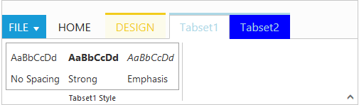

# Contextual Tab And Tab Set

Contextual Tabs are collection of Tabs that extended styling and can be shown based on some criteria. Contextual Tabs can be added like `RibbonTabs` including TabGroup and TabContent section. You can set `BackGroundColor` and `BorderColor` to highlight them as Tab set. Contextual tabs can be added or set dynamically in ribbon control using [`addContextualTabs`](https://help.syncfusion.com/api/js/ejribbon#methods:addcontextualtabs) with it's object and index position.



   <ej-ribbon id="defaultRibbon" width="500px">
        <e-application-tab type=Menu menu-item-id="ribbonmenu">
        </e-application-tab>
        <e-tabs>
            <e-tab id="home" text="HOME">
                <e-groups>
                    <e-group text="CustomControls" type="custom" content-id="Contents">
                    </e-group>
                </e-groups>
            </e-tab>
        </e-tabs>
        <e-contextual-tabs>
            <e-contextual-tab background-color="#FCFBEB" border-color="#F2CC1C">
                <e-tabs>
                    <e-tab id="Design" text="DESIGN">
                        <e-groups>
                            <e-group text="Table Style Options" type="custom" content-id="design">
                            </e-group>
                        </e-groups>
                    </e-tab>
                    </e-tabs>
                </e-contextual-tab>
                 <e-contextual-tab background-color="blue" border-color="lightblue">
                     <e-tabs>
                    <e-tab id="tabset1" text="Tabset1">
                        <e-groups>
                            <e-group text="Tabset1 Style" type="custom" content-id="headings">
                            </e-group>
                        </e-groups>
                    </e-tab>
                    <e-tab id="tabset2" text="Tabset2">
                        <e-groups>
                            <e-group text="Tabset2 Style">
                                <e-content>
                                    <e-contents>
                                        <e-defaults is-big="true" />
                                        <e-content-groups>
                                            <e-content-group id="uppercase" text="Upper Case">
                                                <e-button-settings content-type="ImageOnly" prefix-icon="e-icon e-ribbon e-uppercase">
                                                </e-button-settings>
                                            </e-content-group>
                                            <e-content-group id="lowercase" text="Lower Case">
                                                <e-button-settings content-type="ImageOnly" prefix-icon="e-icon e-ribbon e-lowercase">
                                                </e-button-settings>
                                            </e-content-group>
                                        </e-content-groups>
                                    </e-contents>
                                </e-content>
                            </e-group>
                        </e-groups>
                    </e-tab>
                </e-tabs>
             </e-contextual-tab>
        </e-contextual-tabs>
   </ej-ribbon>





  <ul id="ribbonmenu">
        <li>
            <a>FILE</a>
            <ul>
                <li><a>New</a></li>
                <li><a>Open</a></li>
            </ul>
        </li>
    </ul>
    
Custom Control

    

        

            
Ribbon-Heading

            
No Spacing

        

        

            
Ribbon-Heading

            
Strong

        

        

            
Ribbon-Heading

            
Emphasis

        

    

    <table id="design" class="e-designtablestyle">
        <tr>
            <td>
                <input type="checkbox" id="Check2" />
                <label for="Check2">First Column</label>
            </td>
            <td>
                <input type="checkbox" id="check4" checked="checked" />
                <label for="check4">Total Row</label>
            </td>
        </tr>
    </table>
    


