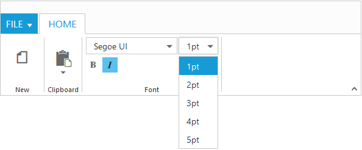
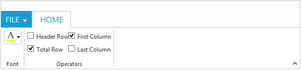

# Controls Support

Button, SplitButton, DropDownList, ToggleButton, Gallery and Custom controls can be added to each groups. You can set `Type` property in group to define the controls. Default `Type` is `Button`. 

## Built in Controls

The following table describes about the built in controls `Type` and their corresponding control settings.

<table class="params">
<thead>
<tr>
<th>Type</th>
<th>Control Settings</th>
<th class="last">Example</th>
</tr>
</thead>                     
<tbody>
<tr>
<td class="type">Button</td>
<td class="control settings">Button - button-settings</td><td class="example last">
	button-settings width="70" content-type= "ImageOnly" prefix-icon="e-icon e-ribbon e-new"
 </td>
</tr>
<tr>
<td class="type">SplitButton</td>
<td class="control settings">SplitButton - split-button-settings</td>
<td class="example last">
	split-button-settings content-type="ImageOnly" target-id="pasteSplit" button-mode="dropdown" arrow-position=Bottom
 </td>
</tr>
<tr>
<td class="type">ToggleButton</td>
<td class="control settings">ToggleButton - toggle-button-settings</td>
<td class="example last">
	toggle-button-settings content-type="ImageOnly" default-text="Italic" active-text="Italic"
 </td>
</tr>
<tr>
<td class="type">DropDownList</td>
<td class="control settings">DropDownList - dropdown-settings</td>
<td class="example last">
	dropdown-settings datasource="ViewBag.datasource" text="1pt" width="65"
 </td>
</tr>
</tbody>
</table>

N> 1. You can specify type either to group’s collection or to each group.
N> 2. For `Type` property you can assign either string value (“SplitButton”) or enum value (RibbonButtonType.SplitButton).




    
   <ej-ribbon id="defaultRibbon" width="100%">
        <e-application-tab type=Menu menu-item-id="ribbonmenu">
            <e-menu-settings open-on-click="false">
            </e-menu-settings>
        </e-application-tab>
        <e-tabs>
            <e-tab id="home" text="HOME">
                <e-groups>
                    <e-group text="New" align-type=Rows>
                        <e-content>
                            <e-contents>
                                <e-defaults width="60" height="70" type=Button></e-defaults>
                                <e-content-groups>
                                    <e-content-group id="new" text="New" tool-tip="New">
                                        <e-button-settings image-position="ImageTop" content-type="ImageOnly" prefix-icon="e-icon e-ribbon e-new">
                                        </e-button-settings>
                                    </e-content-group>
                                </e-content-groups>
                            </e-contents>
                        </e-content>
                    </e-group>
                    <e-group text="Clipboard" align-type=Columns>
                        <e-content>
                            <e-contents>
                                <e-defaults width="50" height="70" type=SplitButton></e-defaults>
                                <e-content-groups>
                                    <e-content-group id="paste" text="Paste" tool-tip="Paste">
                                        <e-split-button-settings button-mode=Dropdown arrow-position="Bottom" target-id="pasteSplit" content-type="ImageOnly" prefix-icon="e-icon e-ribbon e-ribbonpaste">
                                        </e-split-button-settings>
                                    </e-content-group>
                                </e-content-groups>
                            </e-contents>
                        </e-content>
                    </e-group>
                    <e-group text="Font" align-type=Rows>
                        <e-content>
                            <e-contents>
                                <e-defaults height="28" type=DropDownList></e-defaults>
                                <e-content-groups>
                                    <e-content-group id="fontfamily" tool-tip="Font">
                                        <e-dropdown-settings datasource="ViewBag.datasource" text="Segoe UI" width="150">
                                        </e-dropdown-settings>
                                    </e-content-group>
                                    <e-content-group id="fontsize" tool-tip="FontSize">
                                        <e-dropdown-settings datasource="ViewBag.datasource1" text="1pt" width="65">
                                        </e-dropdown-settings>
                                    </e-content-group>
                                </e-content-groups>
                            </e-contents>
                            <e-contents>
                                <e-defaults is-big="false"></e-defaults>
                                <e-content-groups>
                                    <e-content-group id="bold" tool-tip="Bold" type="ToggleButton">
                                        <e-toggle-button-settings default-text="Bold" content-type="ImageOnly" active-text="Bold" default-prefix-icon="e-icon e-ribbon bold" active-prefix-icon="e-icon e-ribbon bold">
                                        </e-toggle-button-settings>
                                    </e-content-group>
                                    <e-content-group id="italic" tool-tip="Italic" type="ToggleButton">
                                        <e-toggle-button-settings default-text="Italic" content-type="ImageOnly" active-text="Italic" default-prefix-icon="e-icon e-ribbonitalic" active-prefix-icon="e-icon e-ribbonitalic">
                                        </e-toggle-button-settings>
                                    </e-content-group>
                                </e-content-groups>
                            </e-contents>
                        </e-content>
                    </e-group>
                </e-groups>
            </e-tab>
        </e-tabs>
   </ej-ribbon>
    
   <ul id="ribbonmenu">
   <li>
        <a>FILE</a>
        <ul>
            <li>
                <a>New</a>
            </li>
        </ul>
   </li>
   </ul>
   <ul id="pasteSplit">
        <li><a>Paste</a></li>
   </ul>
   




   public partial class RibbonController: Controller
     {
	    List<FontFamily> fontFamily1 = new List<FontFamily>();
        List<FontPoint> fontPoint1 = new List<FontPoint>();
        public ActionResult RibbonFeatures()
        {
            fontFamily1.Add(new FontFamily { text = "Segoe UI" });
            fontFamily1.Add(new FontFamily { text = "Arial" });
            fontFamily1.Add(new FontFamily { text = "Times New Roman" });
            fontFamily1.Add(new FontFamily { text = "Tahoma" });
            fontFamily1.Add(new FontFamily { text = "Helvetica" });
            ViewBag.datasource = fontFamily1;
            fontPoint1.Add(new FontPoint { text = "1pt" });
            fontPoint1.Add(new FontPoint { text = "2pt" });
            fontPoint1.Add(new FontPoint { text = "3pt" });
            fontPoint1.Add(new FontPoint { text = "4pt" });
            fontPoint1.Add(new FontPoint { text = "5pt" });
            ViewBag.datasource1 = fontPoint1;
            return View();
         } 
     }
     public class FontFamily
     {
        public string text { get; set; }
     }
     public class FontPoint
     {
        public string text { get; set; }
     }





## Custom

You can set `Type` as `custom` to render custom controls and Custom element id has to be specified as `ContentID`.You can change the element defined in the custom template to appropriate Syncfusion control in the event of Ribbon `Create`.



  <ej-ribbon id="defaultRibbon" width="600" create="createControl">
        <e-application-tab type=Menu menu-item-id="ribbonmenu">
        </e-application-tab>
        <e-tabs>
            <e-tab id="home" text="HOME">
                <e-groups>
                    <e-group text="Font">
                        <e-content>
                            <e-contents>
                                <e-defaults height="30" type=Custom></e-defaults>
                                <e-content-groups>
                                    <e-content-group id="fontColor" tool-tip="Font Color" content-id="fontColor">
                                    </e-content-group>
                                </e-content-groups>
                            </e-contents>
                        </e-content>
                    </e-group>
                    <e-group text="Operators">
                        <e-content>
                            <e-contents>
                                <e-content-groups>
                                    <e-content-group id="design" type="Custom" content-id="design">
                                    </e-content-group>
                                </e-content-groups>
                            </e-contents>
                        </e-content>
                    </e-group>
                </e-groups>
            </e-tab>
        </e-tabs>
   </ej-ribbon>
 
   <ul id="ribbonmenu">
        <li>
            <a>FILE</a>
            <ul>
                <li><a>New</a></li>
                <li><a>Print</a></li>
            </ul>
        </li>
   </ul>
   <input id="fontColor" />
   <table id="design" class="e-designtablestyle">
        <tr>
            <td><input type="checkbox" id="check1" /><label for="check1">Header Row</label></td>
            <td><input type="checkbox" id="Check2" checked="checked" /><label for="Check2">First Column</label></td>
        </tr>
        <tr><td><input type="checkbox" id="check4" checked="checked" /><label for="check4">Total Row</label></td>
            <td><input type="checkbox" id="Check5" /><label for="Check5">Last Column</label></td>
        </tr>
   </table>
   



