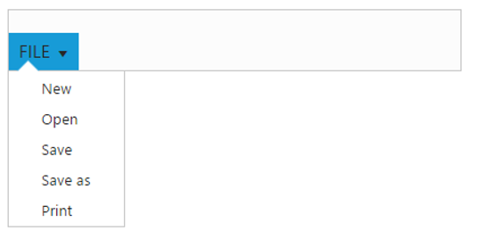
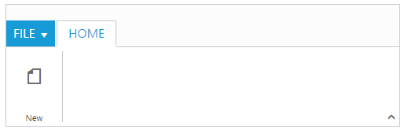
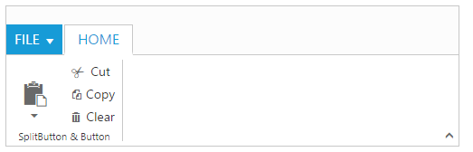

# Getting Started with ASP.NET Core Ribbon

Refer the [Getting Started](https://help.syncfusion.com/aspnet-core/gettingstarted/getting-started-1-1-0) page of the Introduction part to know more about the basic system requirements and the steps to configure the Syncfusion components in an ASP.NET Core application.

Now, refer the necessary scripts and CSS files into your *_Layout.cshtml* page from the **wwwroot -> lib -> syncfusion-javascript** folder.



    <html>
    <head>
        <environment names="Development">
            <link rel="stylesheet" href="~/lib/bootstrap/dist/css/bootstrap.css" />
            <link rel="stylesheet" href="~/css/site.css" />
            <link href="~/lib/syncfusion-javascript/Content/ej/web/default-theme/ej.web.all.min.css" rel="stylesheet" />
            <link href="~/lib/syncfusion-javascript/Content/ej/web/responsive-css/ej.responsive.css" rel="stylesheet" />
        </environment>
    </head>
    <body>
        <environment names="Development">
            
            
                                
            
        </environment>
    </body>
    </html>



It is necessary to define the following namespace within the *_viewImports.cshtml* page in order to make use of the Ribbon component with the tag helper support.
 

 
    @using Syncfusion.JavaScript
    @addTagHelper "*, Syncfusion.EJ"
    


N> Script manager must be defined at the bottom of the *_Layout.cshtml* page.

## Control Initialization

Ribbon can be initialized with `e-application-tab` and UL list is needed for binding Menu to application Menu which can be specified through `menu-item-id` which denotes `id` of UL.

Define the Application Tab with `type` as `Menu` to render simple Ribbon control.



    <ul id="ribbonmenu">
        <li>
            <a>FILE</a>
            <ul>
                <li><a>New</a></li>
                <li><a>Open</a></li>
                <li><a>Save</a></li>
                <li><a>Save as</a></li>
                <li><a>Print</a></li>
            </ul>
        </li>
    </ul>





    <ej-ribbon id="defaultRibbon" width="400px" allow-resizing="true">
    <e-application-tab type=Menu menu-item-id="ribbonmenu">
        <e-menu-settings open-on-click="false">
        </e-menu-settings>
    </e-application-tab>
    </ej-ribbon>



## Adding Tabs

RibbonTab is a set of related groups which are combined into single item. For creating Tab,`id` and `text` properties should be specified.



    <ul id="ribbonmenu">
        <li>
            <a>FILE</a>
            <ul>
                <li><a>New</a></li>
                <li><a>Open</a></li>
                <li><a>Save</a></li>
                <li><a>Save as</a></li>
                <li><a>Print</a></li>
            </ul>
        </li>
    </ul>





    <ej-ribbon id="defaultRibbon" width="500px" allow-resizing="true" >
    <e-application-tab type=Menu menu-item-id="ribbonmenu">
        <e-menu-settings open-on-click="false">
        </e-menu-settings>
    </e-application-tab>
    <e-tabs>
        <e-tab id="home" text="HOME">
        </e-tab> 
    </e-tabs>
    </ej-ribbon>



## Configuring Groups

List of controls are combined as logical `e-content-group` into Ribbon Tabs. `e-group` alignment type as “Rows/Columns”, Default is `Rows`.
Create `e-group` item with `text` specified and add `e-content-group` to `e-content-group` collection with `e-button-settings `.



    <ul id="ribbonmenu">
        <li>
            <a>FILE</a>
            <ul>
                <li><a>New</a></li>
                <li><a>Open</a></li>
                <li><a>Save</a></li>
                <li><a>Save as</a></li>
                <li><a>Print</a></li>
            </ul>
        </li>
    </ul>





    <ej-ribbon id="defaultRibbon" width="500px" allow-resizing="true">
        <e-application-tab type=Menu menu-item-id="ribbonmenu">
            <e-menu-settings open-on-click="false">
            </e-menu-settings>
        </e-application-tab>
        <e-tabs>
            <e-tab id="home" text="HOME">
                <e-groups>
                    <e-group text="New" align-type=Rows>
                        <e-content>
                            <e-contents>
                                <e-content-groups>
                                    <e-content-group id="new" text="New">
                                        <e-button-settings content-type=ImageOnly image-position=ImageTop prefix-icon="e-icon e-ribbon e-new">
                                        </e-button-settings>
                                    </e-content-group>
                                </e-content-groups>
                                <e-defaults type=Button width="60px" height="70px" is-big="false"></e-defaults>
                            </e-contents>
                        </e-content>
                    </e-group>
                </e-groups>
            </e-tab>
        </e-tabs>
    </ej-ribbon>
 




    @*To load Ribbon sample level icons*@

    @section StyleSection{
        <link href="~/lib/syncfusion-javascript/Content/ej/web/ribbon-css/ej.icons.css" rel="stylesheet" />
    }



N> 2. Ribbon’s sample level icons can be loaded using `ej.icons.CSS` from the downloaded packages `/lib/syncfusion-javascript/Content/ej/web/ribbon-css/ej.icons.css`.

## Adding Controls to Group

Syncfusion ASP.NET Core Controls can be added to TabGroup’s content with corresponding `type` specified like Button, SplitButton, ToggleButton, DropDownList, Gallery, Custom, etc. Default type is `Button`.



    <ul id="ribbonmenu">
        <li>
            <a>FILE</a>
            <ul>
                <li><a>New</a></li>
                <li><a>Open</a></li>
                <li><a>Save</a></li>
                <li><a>Save as</a></li>
                <li><a>Print</a></li>
            </ul>
        </li>
    </ul>
    <ul id="pasteul">
         <li><a>Paste</a></li>
    </ul>





    <ej-ribbon id="defaultRibbon" width="500px" allow-resizing="true">
    <e-application-tab type=Menu menu-item-id="ribbonmenu">
        <e-menu-settings open-on-click="false">
        </e-menu-settings>
    </e-application-tab>
    <e-tabs>
        <e-tab id="home" text="HOME">
            <e-groups>
                <e-group text="SplitButton & Button" align-type=Columns>
                    <e-content>
                        <e-contents>
                            <e-defaults width="50" height="75" type=SplitButton></e-defaults>
                            <e-content-groups>
                                <e-content-group id="paste" tool-tip="Paste">
                                    <e-split-button-settings button-mode="Dropdown" arrow-position="Bottom" target-id="pasteul" content-type="TextAndImage" prefix-icon="e-icon e-ribbon e-ribbonpaste">
                                    </e-split-button-settings>
                                </e-content-group>
                            </e-content-groups>
                        </e-contents>
                        <e-contents>
                            <e-defaults width="60" height="25" is-big="false" type=Button />
                            <e-content-groups>
                                <e-content-group id="cut" tool-tip="Cut" text="Cut">
                                    <e-button-settings content-type="TextAndImage" type=Button prefix-icon="e-icon e-ribbon e-ribboncut" />
                                </e-content-group>
                                <e-content-group id="copy" tool-Tip="Copy" text="Copy">
                                    <e-button-settings content-type="TextAndImage" type=Button prefix-icon="e-icon e-ribbon e-ribboncopy" />
                                </e-content-group>
                                <e-content-group id="clear" tool-Tip="Clear All " text="Clear">
                                    <e-button-settings content-type="TextAndImage" Type=Button prefix-icon="e-icon e-ribbon clearAll" />
                                </e-content-group>
                            </e-content-groups>
                        </e-contents>
                    </e-content>
                </e-group>
            </e-groups>
        </e-tab>

    </e-tabs>
</ej-ribbon>
 




    @*To load Ribbon sample level icons*@

    @section StyleSection{
        <link href="~/lib/syncfusion-javascript/Content/ej/web/ribbon-css/ej.icons.css" rel="stylesheet" />
    }



## User Interface

Ribbon component able to integrate any custom components and customized their functionality in application end. Our Ribbon component is similar to Microsoft products(Word). The Ribbon UI consists of several sections like Application Tab, Quick Access Toolbar, Tab, Contextual Tab, Gallery and etc.The following screenshot shows the diagrammatic detail of Ribbon UI:

From above screenshot, you can see Ribbon has several subcomponents for different functionalities. The upcoming sections explains the brief details of each functionalities and their customizations.
