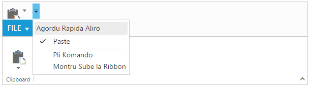
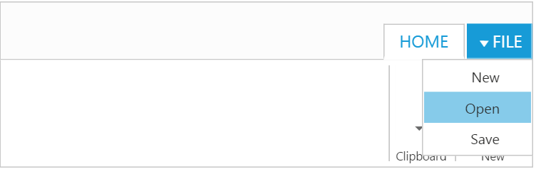

# Globalization and Localization

## Localization

The localization support allows to customize the display of text within the Ribbon in a user-specific culture and locale. The Ribbon control can be localized in specific culture using the common API [`locale`] along with the collection of localized words defined for that culture using the ej.Ribbon.Locale [culture-code].Please find the table with list of properties and its value in locale object.

<table>
<tr>
<th>
Locale key words </th><th>
Text</th></tr>
<tr>
<td>
CustomizeQuickAccess</td><td>
Customize Quick Access Toolbar</td></tr>
<tr>
<td>
RemoveFromQuickAccessToolbar</td><td>
Remove from Quick Access Toolbar</td></tr>
<tr>
<td>
AddToQuickAccessToolbar</td><td>
Add to Quick Access Toolbar</td></tr>
<tr>
<td>
ShowAboveTheRibbon</td><td>
Show Above the Ribbon</td></tr>
<tr>
<td>
ShowBelowTheRibbon</td><td>
Show Below the Ribbon</td></tr>
<tr>
<td>
MoreCommands</td><td>
More Commands...</td></tr>
</table>

N> By default, the Ribbon control is localized in `en-US` culture.

For further information on – how to refer the required culture scripts into your application, refer [`here`](http://help.syncfusion.com/js/localization).



 <ej-ribbon id="defaultRibbon" width="600" locale="es-ES" show-qat="true">
        <e-application-tab type=Menu menu-item-id="ribbonmenu">
            <e-menu-settings open-on-click="false">
            </e-menu-settings>
        </e-application-tab>
        <e-tabs>
            <e-tab id="home" text="HOME">
                <e-groups>
                    <e-group text="Clipboard" align-type=Columns>
                        <e-content>
                            <e-contents>
                                <e-content-groups>
                                    <e-content-group id="paste" text="paste" tool-tip="Paste" quick-access-mode=ToolBar>
                                        <e-split-button-settings content-type=ImageOnly prefix-icon="e-icon e-ribbon e-ribbonpaste" target-id="pasteSplit" button-mode=Dropdown arrow-position="Bottom" click="executeAction">
                                        </e-split-button-settings>
                                    </e-content-group>
                                </e-content-groups>
                                <e-defaults type=SplitButton width="50" height="70"></e-defaults>
                            </e-contents>
                        </e-content>
                    </e-group>
                </e-groups>
            </e-tab>
        </e-tabs>
</ej-ribbon>
<ul id="ribbonmenu">
        <li>
            <a>FILE</a>
            <ul>
                <li><a>New</a></li>
            </ul>
        </li>
</ul>
@section ScriptSection{

}
@section StyleSection{
    <link href="@Url.Content("~/css/ejthemes/ribbon-css/ej.icons.css")" rel="stylesheet" />
    
    
}



## Right to Left - RTL

By default, Ribbon render its content and layout from left to right. To customize Ribbon direction, you can change direction from LTR to RTL by using [`enableRTL`] as true.



<ej-ribbon id="defaultRibbon" width="40%" enable-rtl="true">
        <e-application-tab type=Menu menu-item-id="ribbonmenu">
            <e-menu-settings open-on-click="false">
            </e-menu-settings>
        </e-application-tab>
        <e-tabs>
            <e-tab id="home" text="HOME">
                <e-groups>
                    <e-group text="New" align-type=Rows>
                        <e-content>
                            <e-contents>
                                <e-content-groups>
                                    <e-content-group id="new" text="New" tool-tip="New">
                                        <e-button-settings content-type=ImageOnly image-position=ImageTop prefix-icon="e-icon e-ribbon e-new" click="executeAction">
                                        </e-button-settings>
                                    </e-content-group>
                                </e-content-groups>
                                <e-defaults type=Button width="60" height="70"></e-defaults>
                            </e-contents>
                        </e-content>
                    </e-group>
                    <e-group text="Clipboard" align-type=Columns>
                    <e-content>
                        <e-contents>
                            <e-content-groups>
                                <e-content-group id="paste" text="paste" tool-tip="Paste">
                                    <e-split-button-settings content-type=ImageOnly prefix-icon="e-icon e-ribbon e-ribbonpaste" target-id="pasteSplit" button-mode=Dropdown arrow-position=Bottom click="executeAction">
                                    </e-split-button-settings>
                                </e-content-group>
                            </e-content-groups>
                            <e-defaults type=SplitButton width="50" height="70"></e-defaults>
                        </e-contents>
                    </e-content>
                    </e-group>
                </e-groups>
            </e-tab>
        </e-tabs>
   </ej-ribbon>

  <ul id="ribbonmenu">
        <li>
            <a>FILE</a>
            <ul>
                <li><a>New</a></li>
                <li><a>Open</a></li>
                <li><a>Save</a></li>
            </ul>
        </li>
   </ul> 
    


