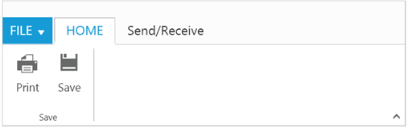

# Tab

RibbonTabs is a collection of control `TabGroup` which enables you to organize related commands into single view. Tabs can be added to Ribbon using `RibbonTabs` property. `Id` & `Text` properties are used to set unique ID and header text to RibbonTabs. The manipulation of given text tab in the ribbon control can be done by using  [`addTab`](https://help.syncfusion.com/api/js/ejribbon#methods:addtab), [`removeTab`](https://help.syncfusion.com/api/js/ejribbon#methods:removetab), [`hideTab`](https://help.syncfusion.com/api/js/ejribbon#methods:hidetab),
[`showTab`](https://help.syncfusion.com/api/js/ejribbon#methods:showtab) methods and [`tabAdd`](https://help.syncfusion.com/api/js/ejribbon#events:tabadd), [`tabCreate`](https://help.syncfusion.com/api/js/ejribbon#events:tabcreate), [`tabRemove`](https://help.syncfusion.com/api/js/ejribbon#events:tabremove), [`tabClick`](https://help.syncfusion.com/api/js/ejribbon#events:tabclick) and [`tabSelect`](https://help.syncfusion.com/api/js/ejribbon#events:tabselect) events.



     <ul id="ribbonmenu">
        <li>
            <a>FILE</a>
            <ul>
                <li><a>New</a></li>
                <li><a>Open</a></li>
                <li><a>Save</a></li>
                <li><a>Save as</a></li>
                <li><a>Print</a></li>
            </ul>
        </li>
     </ul>





  <ej-ribbon id="defaultRibbon" width="500px">
     <e-application-tab type=Menu menu-item-id="ribbonmenu">
        <e-menu-settings open-on-click="false">
        </e-menu-settings>
     </e-application-tab>
     <e-tabs>
          <e-tab id="home" text="HOME">
            <e-groups>
                <e-group text="Save" align-type=Rows>
                    <e-content>
                        <e-contents>
                            <e-defaults width="50" height="70" type=Button></e-defaults>
                            <e-content-groups>
                                <e-content-group id="print" text="Print">
                                    <e-button-settings image-position="ImageTop" content-type="TextAndImage" prefix-icon="e-icon e-ribbon e-print">
                                    </e-button-settings>
                                </e-content-group>
                                <e-content-group id="save" text="Save">
                                    <e-button-settings image-position="ImageTop" content-type="TextAndImage" prefix-icon="e-icon e-ribbon e-save">
                                    </e-button-settings>
                                </e-content-group>
                            </e-content-groups>
                        </e-contents>
                    </e-content>
                </e-group>
            </e-groups>
        </e-tab> 
        <e-tab id="sendrec" text="Send/Receive">
            <e-groups>
                <e-group text="Send/Receive" align-type=Columns type="custom" content-id="sendReceive">
                </e-group>
            </e-groups>
        </e-tab> 
     </e-tabs>
   </ej-ribbon>



