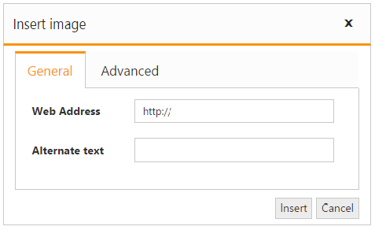

# Image and File browser

The RichTextEditor allows you manage the images and files using **FileExplorer**. The FileExplorer enables you insert images from online source  and computer where you want to insert the image in your content. The image and file browser are used to upload pictures and link file to the editor. Tag helper support is provided for FileExplorer from [15.4.0.17](https://help.syncfusion.com/aspnet-core/release-notes/v15.4.0.17?type=all#fileexplorer-preview) version.

Refer to the following code for inserting images using image browser with online services.



    @{
       List<String> toolsList = new List<string>() { "images" };
       List<String> images = new List<string>() { "image" };
    }
    <ej-rte id="rteSample" width="820px" tools-list="toolsList">
        <e-content-template>
         

            The Rich Text Editor(RTE) control is an easy to render in client side. Customer easy to edit the contents
            and get the HTML content for the displayed content. A rich text editor control provides
            users with a toolbar that helps them to apply rich text formats to the text entered
            in the text area.
         

       </e-content-template>
      <e-image-browser extension-allow="*.png, *.gif, *.jpg, *.jpeg" file-path="http://js.syncfusion.com/demos/ejServices/Content/FileBrowser/"     ajax-action="http://js.syncfusion.com/demos/ejServices/api/FileExplorer/FileOperations/doJSONPAction">  
      </e-image-browser>
      <e-tools images="images"></e-tools>
    </ej-rte>
    


You can also define the ajax action in controller page and map the corresponding method for ajax action. Refer to the following code



    <ej-rte id="rteSample" width="820px" tools-list="toolsList">
     <e-content-template>
        

            The Rich Text Editor(RTE) control is an easy to render in client side. Customer easy to edit the contents
            and get the HTML content for the displayed content. A rich text editor control provides
            users with a toolbar that helps them to apply rich text formats to the text entered
            in the text area.
        

     </e-content-template>
     <e-image-browser extension-allow="*.png, *.gif, *.jpg, *.jpeg" file-path="/images/FileExplorerContent" ajax-action="@Url.Content("FileActionDefault")">
        <e-file-ajax-settings>
            <e-download url="/RichTextEditor/Download{0}"></e-download>
            <e-get-image url="/RichTextEditor/GetImage{0}"></e-get-image>
            <e-upload url="/RichTextEditor/Upload{0}"></e-upload>
        </e-file-ajax-settings>
     </e-image-browser>
     <e-tools images="images"></e-tools>
    </ej-rte>





   public partial class RichTextEditorController : Controller
    {
        
        public FileExplorerOperations operation;

        public ActionResult RichTextEditorFeatures()
        {
            return View();
        }
        public RichTextEditorController(IHostingEnvironment hostingEnvironment)
        {
            this.operation = new FileExplorerOperations(hostingEnvironment.ContentRootPath);
        }

        public ActionResult Upload(FileExplorerParams args)
        {
            operation.Upload(args.FileUpload, "/wwwroot" + args.Path);
            return Json("");
        }
        public ActionResult Download(FileExplorerParams args)
        {
            return operation.Download("/wwwroot" + args.Path, args.Names);
        }
        public ActionResult GetImage(FileExplorerParams args)
        {
            return operation.GetImage("/wwwroot" + args.Path);
        }

        public ActionResult FileActionDefault([FromBody] FileExplorerParams args)
        {
            var Path = "/wwwroot" + args.Path;
            try
            {
                if (args.ActionType != "Paste" && args.ActionType != "GetDetails")
                {
                    var FilePath = operation.GetPhysicalPath(Path);
                    if (!FilePath.ToLower().Contains("fileexplorercontent"))
                        throw new ArgumentException(FilePath + "is not accessible. Access is denied.");
                }

                switch (args.ActionType)
                {
                    case "Read":
                        return Json(operation.Read(Path, args.ExtensionsAllow));
                    case "CreateFolder":
                        return Json(operation.CreateFolder(Path, args.Name));
                    case "Paste":
                        return Json(operation.Paste(args.LocationFrom, args.LocationTo, args.Names, args.Action, args.CommonFiles));
                    case "Remove":
                        return Json(operation.Remove(args.Names, Path, args.SelectedItems));
                    case "Rename":
                        return Json(operation.Rename(Path, args.Name, args.NewName, args.CommonFiles));
                    case "GetDetails":
                        return Json(operation.GetDetails(Path, args.Names));
                    case "Search":
                        return Json(operation.Search(Path, args.ExtensionsAllow, args.SearchString, args.CaseSensitive));

                }
                return Json("");
            }
            catch (Exception e)
            {
                FileExplorerResponse Response = new FileExplorerResponse();
                Response.error = e.GetType().FullName + ", " + e.Message;
                return Json(Response);
            }
        }

    }



Refer [here](http://www.syncfusion.com/downloads/support/forum/144048/ze/RTE_ImageBrowser-1950248249) for sample. 

N> In RTE, image will be inserted based on the file path mentioned in image browser settings. In Asp.Net Core, static files will be present in wwwroot folder and this path cannot be directly accessed in browser while inserting image into RTE. So, include “wwwroot” in Controller page for FileExplorer actions alone. 

## Insert an Image from Online Source

If you want to insert an image from online source like Google, ping, etc., you need to enable images tool on the editor’s toolbar. By default, the images tool is open a simple dialog which allows you to inserting an image from online source.



@{
    List<String> toolsList = new List<string>() { "images" };
    List<String> images = new List<string>() { "image" };
}

<ej-rte id="rteSample" width="820px" tools-list="toolsList">
<e-content-template>
    

        The Rich Text Editor(RTE) control is an easy to render in client side. Customer easy to edit the contents
        and get the HTML content for the displayed content. A rich text editor control provides
        users with a toolbar that helps them to apply rich text formats to the text entered
        in the text area.
    

</e-content-template>
<e-tools images="images"></e-tools>
</ej-rte>



