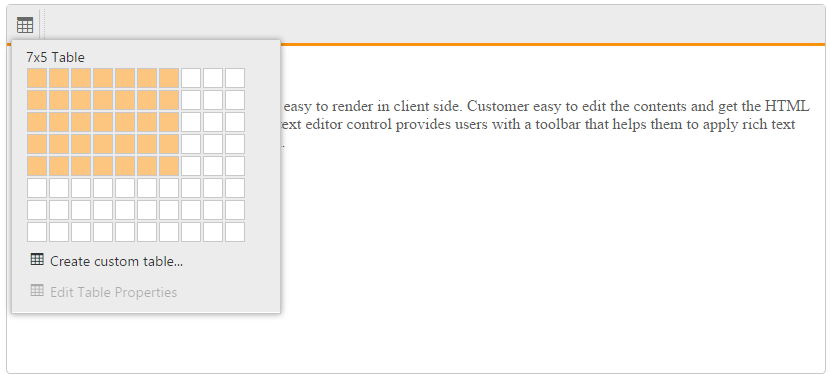
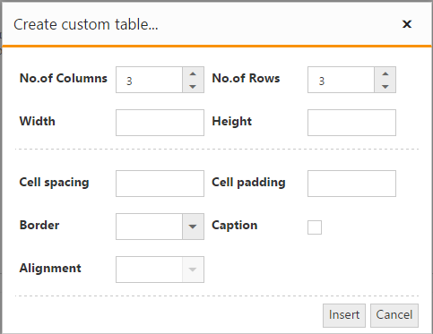
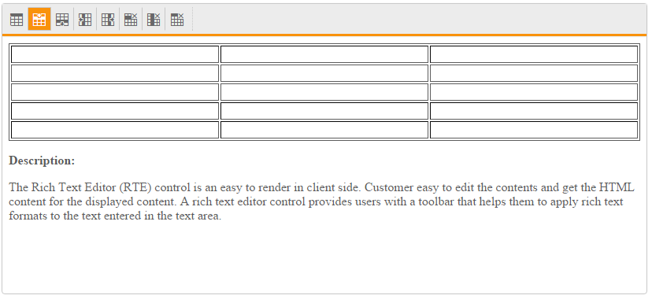
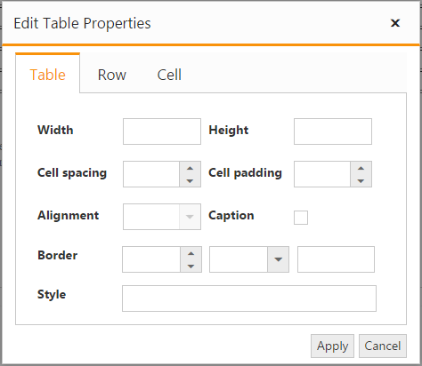
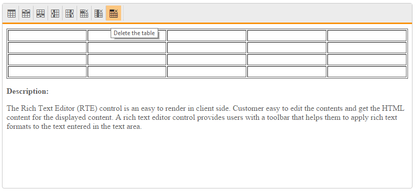

# Working with Tables

The editor provides tools to add tables in your content. You can add, edit, and remove the table as well as perform other table related tasks.

## Create a Table

By default, [Insert Table](http://help.syncfusion.com/js/api/ejrte#members:tools-tables) tool is enabled in the editor’s toolbar. There are two ways to insert a table into the editor’s content.

* [Insert a table](#insert-a-table)
* [Insert a custom table](#custom-table)



@{
List<String> toolsList = new List<string>() { "tables" };
List<String> tables = new List<string>() { "createTable", "addRowAbove", "addRowBelow", "addColumnLeft", "addColumnRight", "deleteRow", "deleteColumn", "deleteTable" };
}
<ej-rte id="rteSample" tools-list="toolsList" width="820px">
    <e-tools tables="tables"></e-tools>
</ej-rte>



## Insert a Table

You can insert a basic table by select the “Insert Table” tool from toolbar and drag the cursor over the grid until you highlight the number of columns and rows you want. A table can be inserted as large as with ten columns and eight rows (10 * 8 cells). When you finish inserting tables, click in a cell and start typing or insert an image.

N> If you want to make any adjustment with drawn table, you can [add/remove rows and columns](#insert-and-delete-a-row-or-column). 

### Custom Table

You can use custom table tools to insert tables with custom behaviors. You can create a table with more than ten columns and eight rows, as well as set the table related attributes (such as width, height, cell spacing/padding, and more) using the custom table dialog.  

## Insert and Delete a Row or Column

You can choose the following options to modify the inserted table from the toolbar, it will be enabled when you’re in table cell.

* Add a row above
* Insert row below
* Insert column left
* Insert column right
* Delete a column
* Delete a row

N> You can also quickly add a new row by clicking on the lower-right cell of the table and pressing the Tab key.

## Format a Table

After you create a table, you can format the entire table by using **Table** **Properties** dialog. In the Table Properties dialog, set or modify each table styles to apply the styles to table elements. 

* Table - width, height, style, border, and alignment.
* Cell - border, spacing, and padding.
* Row - height, border, and text align.

N> When you click in a table cell, the **Table** **Properties** option will be enabled under **Table** tool on the editor’s toolbar.

## Delete a table

To delete a table from your content, focus on the table and select “Delete a Table” tool from toolbar. It will delete the entire table with all formatting content.

N> To delete the table contents alone, select the required content of the table which you want to delete and press Delete key. All the content disappears but the rows and columns remain along with its formatting.