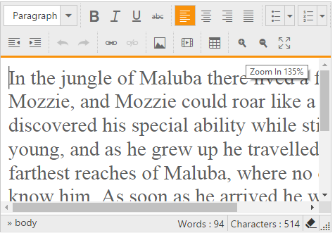

# Zoom

The editor provides zoom tools which enlarges the view of an editor's object enabling you to see more detail. You can continuous zoomIn and zoomOut either using zoom tools or keyboard.

You can assign Increases and decreases of zooming range using [zoomStep](http://help.syncfusion.com/js/api/ejrte#members:zoomStep) property


  
@{
    List<String> toolsList = new List<string>() { "view" };
    List<String> view = new List<string>() { "zoomIn", "zoomOut" };
}
<ej-rte id="rteSample" tools-list="toolsList" width="820px">
    <e-content-template>
        

            The Rich Text Editor(RTE) control is an easy to render in client side. Customer easy to edit the contents
            and get the HTML content for the displayed content. A rich text editor control provides
            users with a toolbar that helps them to apply rich text formats to the text entered
            in the text area.
        

    </e-content-template>
    <e-tools view="view"></e-tools>
</ej-rte>



# Print

The editor provides print tools which use to print the contents of the editor.



@{
List<String> toolsList = new List<string>() { "print" };
List<String> print = new List<string>() { "print" };
}
<ej-rte id="rteSample" tools-list="toolsList" width="820px">
    <e-content-template>
        

            The Rich Text Editor(RTE) control is an easy to render in client side. Customer easy to edit the contents
            and get the HTML content for the displayed content. A rich text editor control provides
            users with a toolbar that helps them to apply rich text formats to the text entered
            in the text area.
        

    </e-content-template>
    <e-tools print="print"></e-tools>
</ej-rte>



