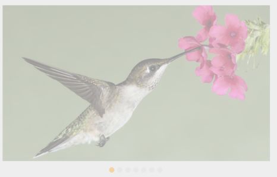
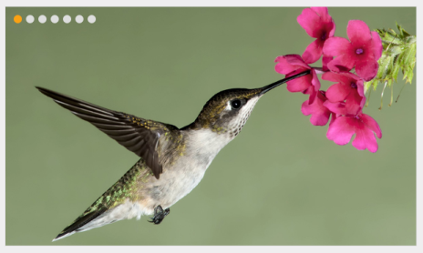
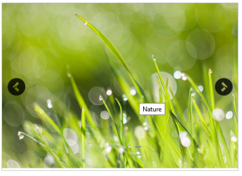
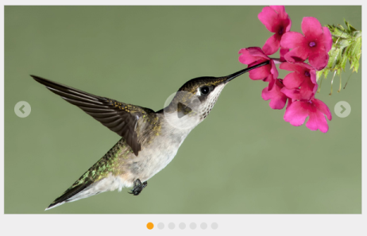
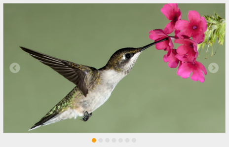
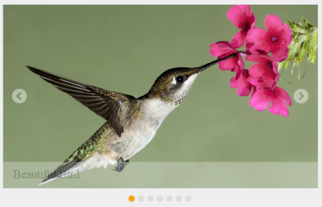

# Behavior settings

## Enabling rotator

enabled property is a Boolean type, which allow us to enables or disable the Rotator control. The default value is ‘true’. You can specify the property enabled in the script as follows.



<ej-rotator id="rot" datasource="ViewBag.datasource" slide-height="350px"  slide-width="600px" is-responsive="true" show-play-button="true" enabled="false">
    <e-rotator-fields text="text" url="url" />
</ej-rotator>



The following banner displaying as output.

## Responsive rotator

### Responsive

is-responsive property is Boolean type, which allow us to resizes the Rotator when the browser window is resized. The default value is ‘false’. You can specify the property is-responsive in the script as follows.



<ej-rotator id="rot" datasource="ViewBag.datasource" slide-height="350px"  slide-width="600px" is-responsive="true" show-play-button="true">
    <e-rotator-fields text="text" url="url" />
</ej-rotator>



## EnableAutoPlay

The Rotator Items continuously rotate without user interference by enable the enable-auto-play property. The default value is ‘false’. The value set to this property is Boolean. You can specify the property enable-auto-play in the script as follows.



<ej-rotator id="rot" datasource="ViewBag.datasource" slide-height="350px"  slide-width="600px" is-responsive="true"  enable-auto-play="true">
    <e-rotator-fields text="text" url="url" />
</ej-rotator>



## Stop on hover

stop-on-hover property is Boolean type, which allow us to pause the auto play while hover on the Rotator content. The default value is ‘false’. You can specify the property stop-on-hover in the script as follows.



/ / Add this code in your CSHTML page and refer local data section for binding Rotator items.

<ej-rotator id="rot" datasource="ViewBag.datasource" slide-height="350px"  slide-width="600px" is-responsive="true" stop-on-hover="true" enable-auto-play="true">
    <e-rotator-fields text="text" url="url" />
</ej-rotator>



## Pager settings

### PagerPosition

This property specifies the position of the Pager in the Rotator Item. The default value is ‘outside’. This property is only applicable when show-pager property is set true. The value set to the  pager-position property is string or enum. 

* Syncfusion.JavaScript.PagerPosition.BottomLeft
* Syncfusion.JavaScript.PagerPosition.BottomRight
* Syncfusion.JavaScript.PagerPosition.Outside
* Syncfusion.JavaScript.PagerPosition.TopCenter
* Syncfusion.JavaScript.PagerPosition.TopLeft
* Syncfusion.JavaScript.PagerPosition.TopRight

You can specify the property  pager-position in the script as follows.



/ / Add this code in your CSHTML page and refer local data section for binding Rotator items.

<ej-rotator id="rot" datasource="ViewBag.datasource" slide-height="350px"  slide-width="600px" is-responsive="true" pager-position="TopLeft">
    <e-rotator-fields text="text" url="url" />
</ej-rotator>



## ShowPager

This property show-pager turns on or off the pager support in the Rotator control. The Pager is used to navigate the Rotator Items. The default value is ‘true’. The value set to this property is Boolean. 



/ / Add this code in your CSHTML page and refer local data section for binding Rotator items.

<ej-rotator id="rot" datasource="ViewBag.datasource" slide-height="350px"  slide-width="600px" is-responsive="true" show-pager="false">
    <e-rotator-fields text="text" url="url" />
</ej-rotator>



## Show options

### ShowPlayButton

show-play-button property is Boolean type which allow us to enable play / pause button on Rotator. The default value of show-play-button is ‘false’. 



/ / Add this code in your CSHTML page and refer local data section for binding Rotator items.

<ej-rotator id="rot" datasource="ViewBag.datasource" slide-height="350px"  slide-width="600px" is-responsive="true" show-play-button="false">
    <e-rotator-fields text="text" url="url" />
</ej-rotator>



## ShowNavigateButton

This property show-navigate-button turns on or off the slide buttons (next and previous) in the Rotator Items. Slide buttons are used to navigate the Rotator Items. The default value is ‘false’. The value set to this property is Boolean. 



/ / Add this code in your CSHTML page and refer local data section for binding Rotator items.

<ej-rotator id="rot" datasource="ViewBag.datasource" slide-height="350px"  slide-width="600px" is-responsive="true" show-navigate-button="true">
    <e-rotator-fields text="text" url="url" />
</ej-rotator>



## ShowCaption

When the Rotator Item is an image, you can specify a caption for the Rotator Item. The caption text for each Rotator Item is shown by using ShowCaption property. This property is Boolean type, which allow us to Show or Hide the Caption about Images on bottom of Image. The caption cannot be displayed when multiple Rotator Items are present. The default value is ‘false’. 



/ / Add this code in your CSHTML page and refer local data section for binding Rotator items.

<ej-rotator id="rot" datasource="ViewBag.datasource" slide-height="350px"  slide-width="600px" is-responsive="true" show-navigate-button="true" show-caption="true">
    <e-rotator-fields text="text" url="url" />
</ej-rotator>



