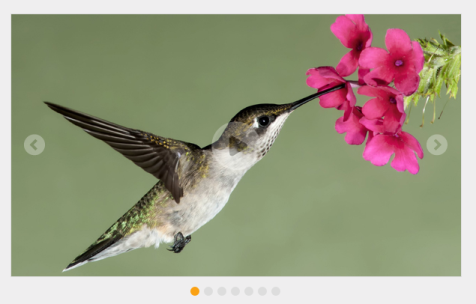

# Data Binding

Rotator provides a flexible approach for binding the data from various data sources. There are various properties in Rotator for Data Binding. The value set to this property is object type.

## Data Fields and Configuration

The following sub-properties provide a way to bind the data either locally/remotely to the Rotator control. 

### DataSource

This property specifies the list of data that contains a set of data fields. Each data value is used to render an item for the Rotator. Datasource receives Essential DataManager object and JSON object. The value set to this property is object type.

### Fields

It defines mapping fields for the data items of the Rotator. The value set to this property is object type.

### Text

It specifies the text content of the Image in Rotator control. The value set to this property is string type.

### Url

This property specifies the URL for an image. The value set to this property is string type.

### Query

This property receives query to retrieve data from the table (query is same as SQL).This property is applicable only when a remote data source is used. Each data value is used to render an item for the Rotator. The value set to this property is object type.

## Local data binding

Rotator provides the data binding support for the Rotator item. So you can bind the data from JSONData. For this behavior, you need to map the corresponding filed with their column names. The data can be bound as a list and it is assigned to Datasource property. You can refer the following code example to bind local data.


 


// Add the following data list to be bind in the controller page and define the corresponding data.

// Define local data source elements with  fields   
         
 public class localdata
    {
        public string url { get; set; }
        public string text { get; set; }
    }
    public partial class RotatorController : Controller
    {
        List<localdata> LocalValues = new List<localdata>();
        public ActionResult Datafields()
        {
            LocalValues.Add(new localdata { text = "Beautiful Bird", url = "../Images/rotator/bird.jpg" });
            LocalValues.Add(new localdata { text = "Colorful Night", url = "../Images/rotator/night.jpg" });
            LocalValues.Add(new localdata { text = "Technology", url = "../Images/rotator/tablet.jpg" });
            LocalValues.Add(new localdata { text = "Nature", url = "../Images/rotator/nature.jpg" });
            LocalValues.Add(new localdata { text = "Snow Fall", url = "../Images/rotator/snowfall.jpg" });
            LocalValues.Add(new localdata { text = "Credit Card", url = "../Images/rotator/card.jpg" });
            LocalValues.Add(new localdata { text = "Amazing Sculptures", url = "../Images/rotator/sculpture.jpg" });
            ViewBag.datasource = LocalValues;
            return View();
        }

    }





<ej-rotator id="rot" datasource="ViewBag.datasource" slide-height="350px"  slide-width="600px" is-responsive="true" show-play-button="true">
    <e-rotator-fields text="text" url="url" />
</ej-rotator>


 

Rotator control with local data binding
{:.caption}