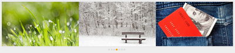
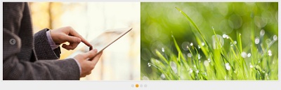
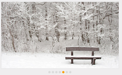
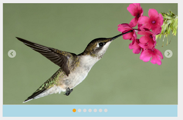

# Image with Contents 

This feature allows you to add text along with the image in Rotator control. This is achieved by splitting the content into two panels. In the following code example, image is given in the left panel and text is given in the right panel.

 
           

<ej-rotator id="sliderContent" show-play-button="true" slide-width="700px" slide-height="300px">
    <e-rotator-items>
        <e-rotator-item>
            <e-content-template>
                

                    

                        
                    

                    

                        
Tablet 

                        <ul>
                            <li>A tablet computer, or simply tablet, is a mobile computer with display, circuitry and battery in a single unit.</li>
                            <li>
                                Tablets are equipped with sensors, including cameras, microphone, accelerometer and touchscreen,
                        </ul>
                    

                

            </e-content-template>
        </e-rotator-item>
        <e-rotator-item>
            <e-content-template>
                

                    

                        
                    

                    

                        
Rose 

                        <ul>
                            <li>A rose is a woody perennial of the genus Rosa, within the family Rosaceae</li>
                            <li>
                                Flowers vary in size and shape and are usually large and showy,
                                There are over 100 species
                            </li>
                        </ul>
                    

                

            </e-content-template>
        </e-rotator-item>
        <e-rotator-item>
            <e-content-template>
                

                    

                        
                    

                    

                        
Snowfall 

                        <ul>
                            <li>Mt. Baker ski area in Washington State has the world record for snowfall at 1,140 inches of snow in the 1998/1999 winter season</li>
                            <li>Mt. Baker ski area is located near but not on the real 10,781’ Mount Baker</li>
                        </ul>
                    

                

            </e-content-template>
        </e-rotator-item>
        <e-rotator-item>
            <e-content-template>
                

                    

                        
                    

                    

                        
Nature 

                        <ul>
                            <li>The health of the natural environment is critical to the long-term future of the planet</li>
                            <li>Nature, in the broadest sense, is equivalent to the natural, physical, or material world or universe.</li>

                        </ul>
                    

                

            </e-content-template>
        </e-rotator-item>
        <e-rotator-item>
            <e-content-template>
                

                    

                        
                    

                    

                        
Credit card 

                        <ul>
                            <li>A credit card is a payment card issued to users as a system of payment</li>
                            <li>It allows the card holder to pay for goods and services based on the holder's promise to pay for them</li>

                        </ul>
                    

                

            </e-content-template>
        </e-rotator-item>
    </e-rotator-items>
</ej-rotator>





 

## Display items

### DisplayItemCount 

This property specifies the number of Rotator Items to be displayed. The default value is ‘1’. The value set to this property is string or number.

 


/ / Add this code in your CSHTML page and refer local data section for binding Rotator items.

<ej-rotator id="rot" datasource="ViewBag.datasource" slide-height="350px"  slide-width="600px" is-responsive="true" display-item-count="3">
    <e-rotator-fields text="text" url="url" />
</ej-rotator>



## NavigateSteps

This property specifies the number of Rotator Items to navigate on a single click (next/previous/play buttons). The navigate-steps property value must be less than or equal to the display-item-count property value. The default value is ‘1’. The value set to this property is string or number.



/ / Add this code in your CSHTML page and refer local data section for binding Rotator items.

<ej-rotator id="rot" datasource="ViewBag.datasource" slide-height="350px"  slide-width="600px" is-responsive="true" navigate-steps="2">
    <e-rotator-fields text="text" url="url" />
</ej-rotator>



## StartIndex

This property sets the index of the slide that is displayed first. The default value is ‘0’. The value set to this property is string or number.



/ / Add this code in your CSHTML page and refer local data section for binding Rotator items.

<ej-rotator id="rot" datasource="ViewBag.datasource" slide-height="350px"  slide-width="600px" is-responsive="true" start-index="4">
    <e-rotator-fields text="text" url="url" />
</ej-rotator>



## FrameSpace

This property sets the space between the Rotator Items.  The value set to this property is string or number.



/ / Add this code in your CSHTML page and refer local data section for binding Rotator items.

<ej-rotator id="rot" datasource="ViewBag.datasource" slide-height="350px"  slide-width="600px" is-responsive="true" frame-space="40px" display-item-count="2">
    <e-rotator-fields text="text" url="url" />
</ej-rotator>



## AnimationType 

animation-type property specifies the Type of Animation for the Rotator Item. AnimationType options include slide, fastSlide, slowSlide, and other custom easing Animation Types. The default value is ‘slide’. The value set to this property is string. 



/ / Add this code in your CSHTML page and refer local data section for binding Rotator items.

<ej-rotator id="rot" datasource="ViewBag.datasource" slide-height="350px"  slide-width="600px" is-responsive="true" animation-tye="fatSlide">
    <e-rotator-fields text="text" url="url" />
</ej-rotator>



## AnimationSpeed

This property sets the speed of slide transition. The default value of animation-speed is ‘600’. The value set to this property is string or number.



/ / Add this code in your CSHTML page and refer local data section for binding Rotator items.

<ej-rotator id="rot" datasource="ViewBag.datasource" slide-height="350px"  slide-width="600px" is-responsive="true" animation-speed="2000">
    <e-rotator-fields text="text" url="url" />
</ej-rotator>



## Delay

This property sets the delay between the Rotator Items to move after the slide transition. The default value is 500. The value set to this property is string or number.



/ / Add this code in your CSHTML page and refer local data section for binding Rotator items.

<ej-rotator id="rot" datasource="ViewBag.datasource" slide-height="350px"  slide-width="600px" is-responsive="true"  delay="2000">
    <e-rotator-fields text="text" url="url" />
</ej-rotator>



## Theme

Rotator control’s style and appearance are controlled based on CSS classes. In order to apply styles to the Rotator control, you can refer 2 files namely, ej.widgets.core.min.css and ej.theme.min.css. When the file ej.widgets.all.min.css is referred, then it is not necessary to include the files ej.widgets.core.min.css and ej.theme.min.css in your project, as ej.widgets.all.min.css is the combination of these both. 

By default, there are 12 themes support available for Rotator control as follows,

* default-theme
* flat-azure-dark
* fat-lime
* flat-lime-dark
* flat-saffron
* flat-saffron-dark
* gradient-azure
* gradient-azure-dark
* gradient-lime
* gradient-lime-dark
* gradient-saffron
* gradient-saffron-dark

## Css Class

The property css-class is used to set root class for Rotator control theme. The value set to this property is string type.



/ / Add this code in your CSHTML page and refer local data section for binding Rotator items.

<ej-rotator id="rot" datasource="ViewBag.datasource" slide-height="350px"  slide-width="600px" is-responsive="true" css-class="mycss">
    <e-rotator-fields text="text" url="url" />
</ej-rotator>



Add the following code in your CSS.



<



