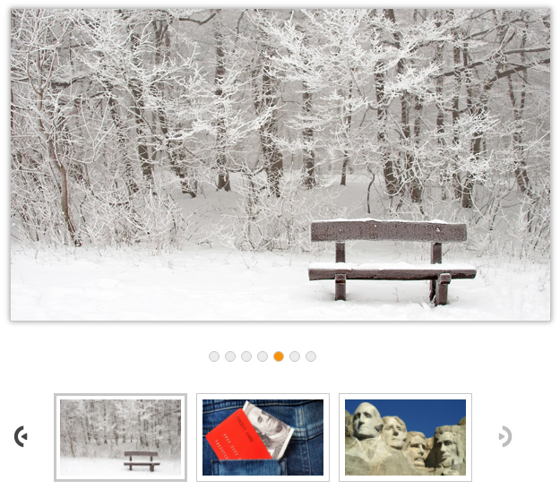

# Thumbnail 

This feature implements Thumbnail in Rotator control. You can view or access any of the Rotator items instantly. All the images are given as Thumb Element to use this feature. 

The property thumbnail-source-id is Boolean type, which allow us to Show or Hide the Thumbnail in Rotator control. Thumbnail is used to navigate between slides. Thumbnail supports only single slide transition. You must specify the source for thumbnail elements through the thumbnail-source-id property. The default value is ‘false’.

The property  thumbnail-source-id specifies the source for thumbnail elements. The default value is null. The value set to this property is object. 

You can refer the following code example of show-thumbnail property in Rotator.


 


// Add the following data list to be bind in the controller page and define the corresponding data.

// Define local data source elements with  fields   
         
 public class localdata
    {
        public string url { get; set; }
        public string text { get; set; }
    }
    public partial class RotatorController : Controller
    {
        List<localdata> LocalValues = new List<localdata>();
        public ActionResult Datafields()
        {
            LocalValues.Add(new localdata { text = "Beautiful Bird", url = "../Images/rotator/bird.jpg" });
            LocalValues.Add(new localdata { text = "Colorful Night", url = "../Images/rotator/night.jpg" });
            LocalValues.Add(new localdata { text = "Technology", url = "../Images/rotator/tablet.jpg" });
            LocalValues.Add(new localdata { text = "Nature", url = "../Images/rotator/nature.jpg" });
            LocalValues.Add(new localdata { text = "Snow Fall", url = "../Images/rotator/snowfall.jpg" });
            LocalValues.Add(new localdata { text = "Credit Card", url = "../Images/rotator/card.jpg" });
            LocalValues.Add(new localdata { text = "Amazing Sculptures", url = "../Images/rotator/sculpture.jpg" });
            ViewBag.datasource = LocalValues;
            return View();
        }

    }





<ej-rotator id="rot" datasource="ViewBag.datasource" slide-height="350px"  slide-width="600px" is-responsive="true" show-thumbnail="true" >
    <e-rotator-fields text="text" url="url" />
</ej-rotator>        


 

