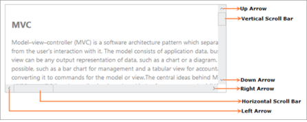

# Overview

The Essential ASP.NET Core Scroller control has a sliding document whose position corresponds to a value. The document has text, HTML content or images. You can also customize the Scroller control by resizing the scrolling bar and changing the theme.

## Key Features

* Height and Width—Set the height and width of the scroll panel.
* Button Size—Customize the width and height of the buttons (UP, DOWN, RIGHT and LEFT).
* Scroller Size—Customize the scrollbar width and height.
* Step Increment—Set the number of pixels to be moved on pressing the ARROW key.
* RTL Support—Sets the alignment of the horizontal Scroller to the right, the reading order to right-to-left and the layout of the control to flow from right to left.
* Theme—Essential ASP.NET Core controls consists of 12 built in themes ( 6 – flat and 6 – gradient effects), and also supports custom skins to set user-defined themes.

## Control Structure

