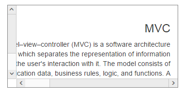

# RTL

enable-rtl API provides right-to-left functionality and features for languages that work in a right-to-left for selecting, editing. Arabic and Hebrew are written from right to left. If you have a working style from right to left, you can use this feature in scroller. You can achieve this in your Scroller by using enable-rtl property. Setting this property to true, the Scroller content text is displayed in the right to left format. The vertical scrollbar move to right to left side.

The following steps explains you the configuration of enable-rtl property in Scroller.

In the View page, add a scroller helper to configure Scroller widget.



// In the CSHTML page, add a 
 element to configure Scroller widget and initialize the control.

 <ej-Scroller id="scrollcontent" height="170" width="350" enable-rtl="true">
        <e-content-template>
            

                @*Wrapper div for Scroller.*@

                

                    @*Content div*@

                    <h3>MVC </h3>

                    

                        Model–view–controller (MVC) is a software architecture pattern which

                        separates the representation of information from the user's interaction

                        with it. The model consists of application data, business rules, logic, and

                        functions. A view can be any output representation of data, such as a chart

                        or a diagram.

                    

                

            

        </e-content-template>
    </ej-Scroller>







The following screenshot displays the Scroller control in RTL direction.

Scroller control in RTL direction
{:.caption}