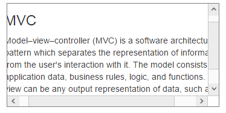

# Thumb Scrolling

Normally the scrollbar position can be changed by dragging the scrollbar handle or clicking the arrows. The Scroller control allows you for panning or dragging the scroll content area to drag by dragging inside the scroll content. To achieve this in your Scroller control, enable the enable-touch-scroll to true. By default the value for enable-touch-scroll is true. When you want to prevent the panning or dragging the scroll content area, set enable-touch-scroll as false.

The following steps explains you the configuration of enable-touch-scroll property in Scroller. 

1. In the View page, add a scroller helper to configure the enable-touch-scroll property.



	// In the CSHTML page, add a 
 element to configure Scroller widget and initialize the control.

    <ej-Scroller id="scrollcontent" height="170" width="350" enable-touch-scroll="false">
        <e-content-template>
            

                @*Wrapper div for Scroller.*@

                

                    @*Content div*@

                    <h3>MVC </h3>

                    

                        Model–view–controller (MVC) is a software architecture pattern which

                        separates the representation of information from the user's interaction

                        with it. The model consists of application data, business rules, logic, and

                        functions. A view can be any output representation of data, such as a chart

                        or a diagram.

                    

                

            

        </e-content-template>
    </ej-Scroller>






   

	The following screenshot displays Scroller control with disabled touch support.

	

	Scroller control with disabled touch support
	{:.caption}