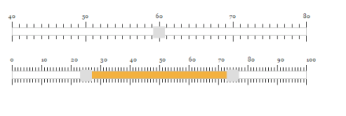
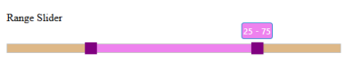
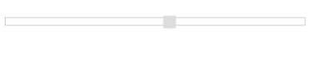
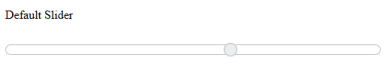

# Appearance and Styling	

Slider widget looks sleek and enriched with good UI appearance. It is included with both metro (flat) theme and gradient theme support. Totally 17 built-in themes are provided including eleven flat themes and six gradient themes.The themes supported by the Slider widgets are as follows,

* default-theme
* flat-azure-dark
* flat-lime
* flat-lime-dark
* flat-saffron
* flat-saffron-dark
* gradient-azure
* gradient-azure-dark
* gradient-lime
* gradient-lime-dark
* gradient-saffron
* gradient-saffron-dark
* bootstrap
* high-contrast-01
* high-contrast-02
* office-365
* material

In order to apply different themes, you can refer the “ej.web.all.min.css” file from the corresponding theme folders. This file is a combination of two style sheets “ej.widgets.core.min.css” and “ej.theme.min.css”. Instead of including “ej.web.all.min.css” file you can also refer the “ej.widgets.core.min.css” and “ej.theme.min.css” files separately. 

The following steps explains you on how to apply “flat-lime-dark” theme to the Slider widget

1. In an view page, specify the desired “ej.web.all.min.css” file to load the corresponding theme.



//In _Layout page, specify the desired
 “ej.web.all.min.css” file to load the corresponding theme.
 <head>
 <title>Slider</title>
 <!--Flat-saffron theme-->
 <link href="http://cdn.syncfusion.com/{{site.releaseversion}}/js/web/flat-saffron-dark/ej.web.all.min.css" rel="stylesheet" />
 </head>
 
 <!--scripts-->
 
 

    @*Add this code in your view page*@

    <ej-slider id="defaultSlider" slider-type="Default" value="60" min-value="40" max-value="80" width="500px" show-scale="true" small-step="5" large-step="20"/>

    <ej-slider id="rangeSlider" slider-type="Range" values="30,60" min-value="10" max-value="90" width="500px" show-scale="true" small-step="5" large-step="20"/>
	


Execute the above code example to render the following output.

## CSS Class

When you want to display the Slider widget in a different style based on the appearance of your application, you can use this CssClass property to apply custom theme for the Slider. Specify a class name as the value for CssClass property. The specified class is added to the wrapper of the Slider widget. Now, you can easily override the styles of the Slider widget by accessing the styles from the root level (using the CssClass specified).

The following steps explains you on how to configure the Slider with custom theme using the CssClass property. Here, a class name “purple” is specified for the CssClass.

1. In an view page, specify the helper elements to render the “Default Slider” and “Range Slider”.

   ~~~ cshtml

    @*Add this code in your view page*@

    <ej-slider id="rangeSlider" slider-type="Range" values="25,75" width="500px" css-class="purple" />

   ~~~
   
2. Include the “CssClass” value before each style of the Slider widget and customize the styles as follows.

   ~~~ css

	.purple.e-slider.e-widget 
	{

	  background-color: burlywood;

	  border-color: #bbbcbb;

	}

	.purple.e-tooltip 
	{

	  background: none repeat scroll 0 0 violet;

	  /* Old browsers */

	  border-color: #1b95cf;

	  color: white;

	}

	.purple.e-slider .e-handle.e-select 
	{

	  background-color: purple;

	  border-color: purple;

	}

	.purple.e-slider .e-handle.e-hover 
	{

	  background-color: purple;

	  border-color: purple;

	}

	.purple.e-slider .e-handle.e-focus 
	{

	  box-shadow: 0 0 2px rgba(0, 0, 0, 0.2);

	}

	.purple.e-slider .e-range 
	{

	  background: none repeat scroll 0 0 violet;

	  /* Old browsers */

	}

	.purple.e-scale .e-tick 
	{

	  background-image: url(images/dot.png);

	}

   ~~~
   
Execute the above code example to render the following output.

### Show Tooltip

Slider displays the tooltip to indicate the current value when you click on the Slider handle. By default, Slider displays the tooltip. Using the ShowTooltip option you can enable or disable the Tooltip. Data type of this property is “boolean”.

The following steps explains you on how to disable the tooltip in Slider.

1. In an view page, specify the Tag helper elements to render the Default Slider.



    @*Add this code in your view page*@

    <ej-slider id="defaultSlider" value="60" width="500px" show-tooltip="false" />



### Show Rounded Corner

This property is used to display the Slider and its handle with rounded corners. By default ShowRoundedCorner is in disabled state. Data type of this property is “Boolean”.

The following steps explains you on how to disable the tooltip in Slider.

1. In an view page, specify the Tag helper elements to render the “Default Slider”.



    @*Add this code in your view page*@

    <ej-slider id="defaultSlider" value="60" width="500px" show-rounded-corner="true" />



Execute the above code example to render the following output.

