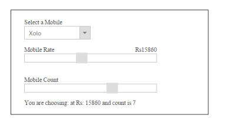
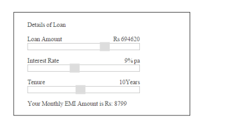

# Getting Started 

This section explains briefly about how to create a Slider in your ASP.NET Core application.

## Create your first Slider in ASP.NET Core

ASP.NET Core Slider provides support to display a Slider within the web page. The following section explains you on how to use Sliders in a real-time application to select a mobile model within specified range in Mobile Purchase.

The following screenshot illustrates the functionality of Slider control. You can select a mobile model in the dropdown to purchase it at any rate specified in the Mobile RateSlider and you can also specify the number of mobiles you need by selecting the Mobile CountSlider. Simultaneously, you can observe the change in mobile rate and count using Sliders.

### Create a Slider

ASP.NET Core Slider control allows you to switch between different ranges of input. The basic Slider is horizontal and has a single handle that can be moved with the mouse or by using the arrow keys. You can easily create the Slider control using Tag helper as follows.

1. Create an ASP.NET Core Project and add Syncfusion assembly packages, scripts, and styles to it.

   Refer [ASP.NET Core-Getting Started](https://help.syncfusion.com/aspnet-core/getting-started)

2. Add the following code example for Slider to the corresponding view page.

   ~~~ cshtml

	    

        

            

                Select a Mobile

            
  

            <ej-drop-down-list id="selectMobile" target-id="mobileList" width="150px" ></ej-drop-down-list>
              
            

                <ul>

                    <li>Moto X</li>

                     <li>Moto g</li>

                     <li>Nexus</li>

                     <li>Lenovo</li>

                     <li>Samsung</li>

                </ul>

            

            

                Mobile Rate

            

            

                Rs 

            

            <ej-slider id="rateSlider" height="20px" value="100" min-value="5000" max-value="30000" increment-step="20" change="onChange" slide="onChange" />       

            

                Mobile Count

             

            <ej-slider id="countSlider" height="20px" value="1" min-value="1" max-value="10" increment-step="1" change="onChange" slide="onChange" />              

            You are choosing:

            

        

    

   ~~~
   

3. Add the following styles for Sliders.

   ~~~ css
   
	

   ~~~
   

4. Add the following script to the Slider.

   ~~~ js

	

   ~~~
   

5. The following screenshot displays the final output in Slider creation.

### EMI Calculator

This section explains how to use the Slider control for EMI Calculation. The final result of EMI amount is calculated automatically based on the loan amount, interest rate and tenure amount based on the amount you choose using Slider.

1. You can create an ASP.NET Core Project and add necessary Syncfusion assembly packages and script to it.
2. Add the following code for Slider to the corresponding view page.

   ~~~ cshtml

    

        

            

                Details of Loan

            

            

                Loan Amount

            

            

                Rs 25000

                
        
            <ej-slider id="loanSlider" height="16px" value="25000" min-value="10000" max-value="1000000" increment-step="10" change="onChange" slide="onChange" />

            

                Interest Rate

            

            

                % pa

                    
        
            <ej-slider id="interestSlider" height="16px" value="4" min-value="1" max-value="20" increment-step="1" change="onChange" slide="onChange" />

            

                Tenure

            

            

                Years

                    
        
            <ej-slider id="tenureSlider" height="16px" value="3" min-value="1" max-value="20" increment-step="1" change="onChange" slide="onChange" />

            Your Monthly EMI Amount is

            

        

    

   ~~~
   

3. Include the following styles for Slider.

   ~~~ css
   
	

   ~~~
   

4. Include the following script to calculate the EMI amount.

   ~~~ cshtml

	
		
   ~~~
   

The following screenshot displays the calculated EMI amount using Slider.

The Slider component lets you to select a value such as number, percentage by moving the slider handle. It also allows you to specify a range of values between its minimum and maximum values. You can use Slider to influence other object. For example, Slider can be associated with a picture so that the picture enlarges or shrinks based upon the value in the slider.

The Slider has horizontal orientation by default. You can also change the orientation as vertical. Also, the Slider contains features like enabling slider of different types, enabling scale in the slider etc.

