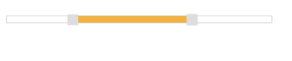

# Keyboard Interaction

You can use Keyboard shortcut keys as an alternative to the mouse for using the Slider widget. All options in the Slider can be accessed using keyboard shortcuts. The following table explains the keyboard shortcut keys and the operations that can be performed using the corresponding keys.

_List of Keyboard shortcuts_

<table>
<tr>
<th>
Shortcut Key</th><th>
Description</th></tr>
<tr>
<td>
Alt + j</td><td>
Focuses into the Slider handle</td></tr>
<tr>
<td>
Up/Right</td><td>
Increments the Slider value</td></tr>
<tr>
<td>
Down/Left</td><td>
Decrements the Slider value</td></tr>
<tr>
<td>
Home</td><td>
Slider handle moves to the start value </td></tr>
<tr>
<td>
End</td><td>
Slider handle moves to the end value</td></tr>
<tr>
<td>
Esc</td><td>
Focuses out from the Slider handle</td></tr>
</table>

## Configure keyboard interaction

The following steps explains you on how to enable keyboard support in Slider.

1. In an view page, specify the helper elements to render the Range Slider.



	 @*Add this code in your view page*@

    <ej-slider id="rangeSlider" slider-type="Range" values="25,75" width="500px" />

// In JavaScript, Focus the Slider control in document key down function


Run the sample and press, Alt + j keys to set focus in the Slider handle and you can handle the Slider operations using the keyboard shortcut keys.

When clicked the Alt + J key, the slider was focused.

Slider with Keyboard Interaction.
{:.caption}