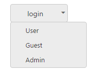

# Dropdown Button

You can change the Split Button as Dropdown Button that consists of a single button that when clicked displays a drop-down list of mutually exclusive items. You can achieve this by using default functionality of Split Button with ButtonMode as ButtonMode.Dropdown. Initially the target-id is a mandatory one.

The following steps explain how to change the Split Button as Dropdown Button.

1. In the VIEW page, add the following button elements to configure Button widget.

 

/*ej-Tag Helper code to render SplitButton*/

	@*Add the code in the CSHTML page to configure and initialize the control*@

                        <ej-split-button id="dropdownbtn" text="login" size="@ButtonSize.Medium" show-rounded-corner="true" content-type="@ContentType.TextOnly" target-id="menu1" button-mode="@ButtonMode.Dropdown"></ej-split-button>

                        <ul id="menu1">

                            <li>User</li>

                            <li>Guest</li>

                            <li>Admin</li>

                        </ul>


  


/*Razor code to render SplitButton*/

    @{Html.EJ().SplitButton("dropdownbtn").Text("login").ShowRoundedCorner(true).Size(ButtonSize.Medium).ContentType(ContentType.TextOnly).TargetID("menu").ButtonMode(ButtonMode.Dropdown).Render();}

<ul id="menu">

    <li>User</li>

    <li>Guest</li>

    <li>Admin</li>

</ul>



N> To render the SplitButton Control you can use either Razor or Tag helper code as given in the above code snippet.

2. Execute the above code to render the following output.

