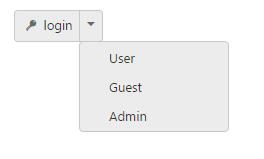
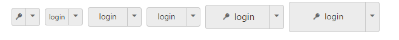
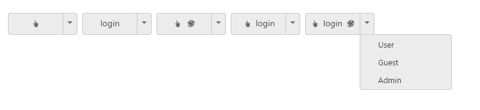
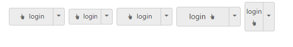

# Easy customization

Split Button is used in many applications. Split Button Size, images and Content are varied according to each application. The following sections describes you some customizable options for Split Button that can perform easily. 

## Content for Split button

The target-id is a mandatory one, without this field it acts as normal button on two sides. This target-id property is used to specify the list of content for Split Button. The list of content is rendered as a vertical menu list. This vertical menu list is open, when you click on the down arrow of the Split Button.

The following script explains you the details about rendering the Split Button with content.

1. In the VIEW page, add the following button elements to configure Split Button widget.



/*ej-Tag Helper code to render SplitButton*/

@*Add the code in the CSHTML page to configure and initialize the control*@

    @*Set the content for split button control as follows. *@	

    <ej-split-button id="spltbutton" text="login" size="@ButtonSize.Small" show-rounded-corner="true" content-type="@ContentType.TextAndImage" prefix-icon="e-icon e-login" image-position="@ImagePosition.ImageLeft" target-id="Ul11"></ej-split-button>
        <ul id="Ul11">
            <li>User</li>
            <li>Guest</li>
            <li>Admin</li>
        </ul>





/*Razor code to render SplitButton*/

    @{Html.EJ().SplitButton("spltbutton").Text("login").Size(ButtonSize.Small).ShowRoundedCorner(true).ContentType(ContentType.TextAndImage).PrefixIcon("e-icon e-login").ImagePosition(ImagePosition.ImageLeft).TargetID("Ul11").Render();}

<ul id="Ul11">

    <li>User</li>

    <li>Guest</li>

    <li>Admin</li>

</ul>



N> To render the SplitButton Control you can use either Razor or Tag helper code as given in the above code snippet.

Execute the above code to render the following output.

## Button Size

You can render the Split Button in different sizes by using size property. The following table contains some predefined size option for rendering a Split Button in easiest way. Each size option has different height and width. Mainly it avoids the complexity in rendering Split Button with complex CSS class. 

_List of Button size_

<table>
<tr>
<td>
Normal</td><td>
Creates split button with content size.</td></tr>
<tr>
<td>
Mini</td><td>
Creates split button with Built-in mini size height, width specified.</td></tr>
<tr>
<td>
Small</td><td>
Creates split button with Built-in small size height, width specified.</td></tr>
<tr>
<td>
Medium</td><td>
Creates split button with Built-in medium size height, width specified.</td></tr>
<tr>
<td>
Large</td><td>
Creates split button with Built-in large size height, width specified.</td></tr>
</table>

Apart from the above mentioned predefined size option, you can set your own width and height for Split Button using Height and Width property.

The following steps explains you the details about rendering the Split Button with above mentioned Size options.

1. In the View page, add the following button elements to configure Split Button widget.



/*ej-Tag Helper code to render SplitButton*/

@*Add the code in the CSHTML page to configure and initialize the control*@

@*Set the different size types for split button control as follows. *@

    

        <table>

            <tr>

                <td class="btnsht" >

                    

                        <ej-split-button id="spltbutton_normal" text="login" size="@ButtonSize.Normal" show-rounded-corner="true" content-type="@ContentType.ImageOnly" prefix-icon="e-icon e-login"  target-id="Ul11"></ej-split-button>

                        <ul id="Ul11">

                            <li>User</li>

                            <li>Guest</li>

                            <li>Admin</li>

                        </ul>

                    

                </td>

                <td>
                    <ej-split-button id="spltbutton_mini" text="login" size="@ButtonSize.Mini" show-rounded-corner="true"  target-id="Ul21"></ej-split-button>
                    <ul id="Ul21">

                        <li>User</li>

                        <li>Guest</li>

                        <li>Admin</li>

                    </ul>

                </td>

                <td class="btnsht">
                    <ej-split-button id="spltbutton_small" text="login" size="@ButtonSize.Small" show-rounded-corner="true" target-id="Ul31"></ej-split-button>

                    <ul id="Ul31">

                        <li>User</li>

                        <li>Guest</li>

                        <li>Admin</li>

                    </ul>

                </td>

                <td class="btnsht">

                    <ej-split-button id="spltbutton_medium" text="login" size="@ButtonSize.Small" show-rounded-corner="true" target-id="Ul41"></ej-split-button>

                    <ul id="Ul41">

                        <li>User</li>

                        <li>Guest</li>

                        <li>Admin</li>

                    </ul>

                </td>

                <td class="btnsht">
                    <ej-split-button id="spltbutton_large" text="login" size="@ButtonSize.Large" show-rounded-corner="true" target-id="Ul51" content-type="@ContentType.TextAndImage" prefix-icon="e-icon e-login"></ej-split-button>

                    <ul id="Ul51">

                        <li>User</li>

                        <li>Guest</li>

                        <li>Admin</li>

                    </ul>

                </td>

                <td class="btnsht">
                    <ej-split-button id="spltbutton_customSize" text="login" show-rounded-corner="true" content-type="@ContentType.TextAndImage" prefix-icon="e-icon e-login" target-id="Ul61" height="50" width="150"></ej-split-button>
                    <ul id="Ul61">

                        <li>User</li>

                        <li>Guest</li>

                        <li>Admin</li>

                    </ul>

                </td>

            </tr>

        </table>

    





/*Razor code to render SplitButton*/

    <table>

        <tr>

            <td class="btnsht">

                

                    @{Html.EJ().SplitButton("splitButton_normal").Text("login").ShowRoundedCorner(true).Size(ButtonSize.Normal).ContentType(ContentType.ImageOnly).PrefixIcon("e-icon e-login").TargetID("Ul11").Render(); }

                    <ul id="Ul11">

                        <li>User</li>

                        <li>Guest</li>

                        <li>Admin</li>

                    </ul>

                

            </td>

            <td>

                @{Html.EJ().SplitButton("splitButton_mini").Text("login").ShowRoundedCorner(true).Size(ButtonSize.Mini).TargetID("Ul21").Render(); }

                <ul id="Ul21">

                    <li>User</li>

                    <li>Guest</li>

                    <li>Admin</li>

                </ul>

            </td>

            <td class="btnsht">

                @{Html.EJ().SplitButton("splitButton_small").Text("login").ShowRoundedCorner(true).Size(ButtonSize.Small).TargetID("Ul31").Render(); }

                <ul id="Ul31">

                    <li>User</li>

                    <li>Guest</li>

                    <li>Admin</li>

                </ul>

            </td>

            <td class="btnsht">

                @{Html.EJ().SplitButton("splitButton_medium").Text("login").ShowRoundedCorner(true).Size(ButtonSize.Medium).TargetID("Ul41").Render(); }

                <ul id="Ul41">

                    <li>User</li>

                    <li>Guest</li>

                    <li>Admin</li>

                </ul>

            </td>

            <td class="btnsht">

                @{Html.EJ().SplitButton("splitButton_large").Text("login").ShowRoundedCorner(true).Size(ButtonSize.Large).ContentType(ContentType.TextAndImage).PrefixIcon("e-icon e-login").TargetID("Ul51").Render(); }

                <ul id="Ul51">

                    <li>User</li>

                    <li>Guest</li>

                    <li>Admin</li>

                </ul>

            </td>

            <td class="btnsht">

                @{Html.EJ().SplitButton("splitButton_customSize").Text("login").ShowRoundedCorner(true).ContentType(ContentType.TextAndImage).PrefixIcon("e-icon e-login").TargetID("Ul61").Height("50").Width("150").Render();}

                <ul id="Ul61">

                    <li>User</li>

                    <li>Guest</li>

                    <li>Admin</li>

                </ul>

            </td>

        </tr>

    </table>







Execute the above code to render the following output.

## ContentType

The content of the Split Button is mainly rendered as text and images. Instead of using complex CSS classes to render Split Button with different content types, you can use some predefined content type options listed in the following table. Using this ContentType property you can easily add different types of content for Split Button. Split Button supports the following content types.

_List of content types_

<table>
<tr>
<td>
TextOnly</td><td>
Supports only for text content only.</td></tr>
<tr>
<td>
ImageOnly</td><td>
Supports only for image content only</td></tr>
<tr>
<td>
ImageBoth</td><td>
Supports image for both ends of the button.</td></tr>
<tr>
<td>
TextAndImage</td><td>
Supports image with the text content.</td></tr>
<tr>
<td>
ImageTextImage</td><td>
Supports image with both ends and middle in text.</td></tr>
</table>

## Prefix and Suffix icons

Icons inside the Split Button is added easily using prefix-icon and suffix-icon property. Location of the icon in Split Button is a necessary thing. You can customize the location of Icon easily using the following mentioned options.

Split Button control also supports the Built-in icon libraries. The ej.widgets.core.min.css contains definitions for important icons that are used in Split Buttons. You can use these Built-in icons by mentioning the icon class name as value in prefix-icon and suffix-icon property. You can use any font icons that is defined in ej.widgets.core.min.css. It avoids the complexity in specifying icon using sprite image and CSS.

For example the following Built-in CSS classes are used to display the font icons that is used by media player.

* e-mediaback
* e-mediaforward
* e-medianext
* e-mediaprev
* e-mediaeject
* e-mediaclose
* e-mediapause
* e-mediaplay

## Prefix Icon

It inserts the icon at the starting position of Split Button. After this prefix icon, you can use text or suffix icon.

## Suffix Icon

It inserts the icon at the ending position of Split Button. Before this suffix-icon, you can use Text or prefix-icon.

The following steps explains you the details on rendering the Split Button with content-type, prefix-icon and suffix-icon options

1. In the VIEW page, add the following button elements to configure Split Button widget.



/*ej-Tag Helper code to render SplitButton*/

//Add the code in the CSHTML page to configure and initialize the control

@*Set the different content types and use the necessary build-in icons for split button control as follows.*@

    <table>

        <tr>

            <td class="btnsht">

                

                    <ej-split-button id="spltbutton_imageOnly" text="login" size="Medium" show-rounded-corner="true" content-type="ImageOnly" prefix-icon="e-icon e-handup" target-id="Ul11"></ej-split-button>
                     <ul id="Ul11">

                        <li>User</li>

                        <li>Guest</li>

                        <li>Admin</li>

                    </ul>

                

            </td>

            <td>
                <ej-split-button id="spltbutton_textOnly" text="login" size="Medium" show-rounded-corner="true" content-type="TextOnly" target-id="Ul21"></ej-split-button>

                   <ul id="Ul21">

                    <li>User</li>

                    <li>Guest</li>

                    <li>Admin</li>

                </ul>

            </td>

            <td class="btnsht">
                <ej-split-button id="spltbutton_imageBoth" text="login" size="Medium" show-rounded-corner="true" content-type="ImageBoth" prefix-icon="e-icon e-handup" suffix-icon="e-icon e-palette" target-id="Ul31"></ej-split-button>

                   <ul id="Ul31">

                    <li>User</li>

                    <li>Guest</li>

                    <li>Admin</li>

                </ul>

            </td>

            <td class="btnsht">

                <ej-split-button id="spltbutton_textAndImage" text="login" size="Medium" show-rounded-corner="true" content-type="TextAndImage" prefix-icon="e-icon e-handup" target-id="Ul41"></ej-split-button>

                <ul id="Ul41">

                    <li>User</li>

                    <li>Guest</li>

                    <li>Admin</li>

                </ul>

            </td>

            <td class="btnsht">
                <ej-split-button id="spltbutton_imageTextImage" text="login" size="Medium" show-rounded-corner="true" content-type="ImageTextImage" prefix-icon="e-icon e-handup" suffix-icon="e-icon e-palette" target-id="Ul51"></ej-split-button>

                <ul id="Ul51">

                    <li>User</li>

                    <li>Guest</li>

                    <li>Admin</li>

                </ul>

            </td>

        </tr>

    </table>





/*Razor code to render SplitButton*/

    <table>

        <tr>

            <td class="btnsht">

                

                    @{Html.EJ().SplitButton("splitButton_imageOnly").Text("login").Size(ButtonSize.Medium).ShowRoundedCorner(true).ContentType(ContentType.ImageOnly).PrefixIcon("e-icon e-handup").TargetID("Ul11").Render(); }

                    <ul id="Ul11">

                        <li>User</li>

                        <li>Guest</li>

                        <li>Admin</li>

                    </ul>

                

            </td>

            <td>

                @{Html.EJ().SplitButton("splitButton_textOnly").Text("login").Size(ButtonSize.Medium).ShowRoundedCorner(true).ContentType(ContentType.TextOnly).TargetID("Ul211").Render(); }

                <ul id="Ul21">

                    <li>User</li>

                    <li>Guest</li>

                    <li>Admin</li>

                </ul>

            </td>

            <td class="btnsht">

                @{Html.EJ().SplitButton("splitButton_imageBoth").Text("login").Size(ButtonSize.Medium).ShowRoundedCorner(true).ContentType(ContentType.ImageBoth).PrefixIcon("e-icon e-handup").SuffixIcon("e-icon e-palette").TargetID("Ul31").Render(); }

                <ul id="Ul31">

                    <li>User</li>

                    <li>Guest</li>

                    <li>Admin</li>

                </ul>

            </td>

            <td class="btnsht">

                @{Html.EJ().SplitButton("splitButton_textAndImage").Text("login").Size(ButtonSize.Medium).ShowRoundedCorner(true).ContentType(ContentType.TextAndImage).PrefixIcon("e-icon e-handup").TargetID("Ul41").Render(); }

                <ul id="Ul41">

                    <li>User</li>

                    <li>Guest</li>

                    <li>Admin</li>

                </ul>

            </td>

            <td class="btnsht">

                @{Html.EJ().SplitButton("splitButton_imageTextImage").Text("login").Size(ButtonSize.Medium).ShowRoundedCorner(true).ContentType(ContentType.ImageTextImage).PrefixIcon("e-icon e-handup").SuffixIcon("e-icon e-palette").TargetID("Ul51").Render(); }

                <ul id="Ul51">

                    <li>User</li>

                    <li>Guest</li>

                    <li>Admin</li>

                </ul>

            </td>

        </tr>

    </table>



Execute the above code to render the following output.

## Image Position

To provide the best look and feel for Split Button, position of images in Split Button is important. Using image-position property, you can easily customize the position of images inside Split Button without using any complex CSS. image-position property is applicable only with the TextAndImage content type property. This property represent the position of images with respect to text.

<table>
<tr>
<td>
ImageLeft</td><td>
Support for aligning text in right and image in left.</td></tr>
<tr>
<td>
ImageRight</td><td>
Support for aligning text in left and image in right.</td></tr>
<tr>
<td>
ImageTop</td><td>
Support for aligning text in bottom and image in top.</td></tr>
<tr>
<td>
ImageBottom</td><td>
Support for aligning text in top and image in bottom.</td></tr>
</table>

The following steps explains you the details on rendering the Split Button with above mentioned ImagePosition property’s options.

1. In the View page, add the following button elements to configure Split Button widget.



/*ej-Tag Helper code to render SplitButton*/

@*Add the code in the CSHTML page to configure and initialize the control*@

        <table>

            <tr>

                <td class="btnsht" >

                    

                        <ej-split-button id="spltbutton_normal_imageLeft" text="login" size="@ButtonSize.Medium" show-rounded-corner="true" content-type="@ContentType.TextAndImage" prefix-icon="e-icon e-handup"  target-id="Ul11" image-position="@ImagePosition.ImageLeft"></ej-split-button>

                        <ul id="Ul11">

                            <li>User</li>

                            <li>Guest</li>

                            <li>Admin</li>

                        </ul>

                    

                </td>

                <td>
                    <ej-split-button id="spltbutton_small_imageLeft" text="login" size="@ButtonSize.Small" show-rounded-corner="true"  target-id="Ul21" content-type="@ContentType.TextAndImage" prefix-icon="e-icon e-handup" image-position="@ImagePosition.ImageLeft"></ej-split-button>
                    <ul id="Ul21">

                        <li>User</li>

                        <li>Guest</li>

                        <li>Admin</li>

                    </ul>

                </td>

                <td class="btnsht">
                    <ej-split-button id="spltbutton_medium_imageLeft" text="login" size="@ButtonSize.Medium" show-rounded-corner="true" target-id="Ul31" content-type="@ContentType.TextAndImage" prefix-icon="e-icon e-handup" image-position="@ImagePosition.ImageLeft"></ej-split-button>

                    <ul id="Ul31">

                        <li>User</li>

                        <li>Guest</li>

                        <li>Admin</li>

                    </ul>

                </td>

                <td class="btnsht">

                    <ej-split-button id="spltbutton_large_imageLeft" text="login" size="@ButtonSize.Large" content-type="@ContentType.TextAndImage" prefix-icon="e-icon e-handup" show-rounded-corner="true" target-id="Ul41" image-position="@ImagePosition.ImageRight"></ej-split-button>

                    <ul id="Ul41">

                        <li>User</li>

                        <li>Guest</li>

                        <li>Admin</li>

                    </ul>

                </td>

                <td class="btnsht">
                    <ej-split-button id="spltbutton_imageBottom" text="login" size="@ButtonSize.Normal" show-rounded-corner="true" target-id="Ul51" content-type="@ContentType.TextAndImage" prefix-icon="e-icon e-handup" image-position="@ImagePosition.ImageBottom" height="60"></ej-split-button>

                    <ul id="Ul51">

                        <li>User</li>

                        <li>Guest</li>

                        <li>Admin</li>

                    </ul>

                </td>
            </tr>

        </table>

    





/*Razor code to render SplitButton*/

    @*Set the different image position for split button control as follows.*@

    <table>

        <tr>

            <td class="btnsht">

                

                    @{Html.EJ().SplitButton("splitButton_normal_imageLeft").Text("login").Size(ButtonSize.Medium).ShowRoundedCorner(true).ContentType(ContentType.TextAndImage).PrefixIcon("e-icon e-handup").ImagePosition(ImagePosition.ImageLeft).TargetID("Ul11").Render(); }

                    <ul id="Ul11">

                        <li>User</li>

                        <li>Guest</li>

                        <li>Admin</li>

                    </ul>

                

            </td>

            <td>

                @{Html.EJ().SplitButton("splitButton_small_imageLeft").Text("login").Size(ButtonSize.Small).ShowRoundedCorner(true).ContentType(ContentType.TextAndImage).PrefixIcon("e-icon e-handup").ImagePosition(ImagePosition.ImageLeft).TargetID("Ul21").Render(); }

                <ul id="Ul21">

                    <li>User</li>

                    <li>Guest</li>

                    <li>Admin</li>

                </ul>

            </td>

            <td class="btnsht">

                @{Html.EJ().SplitButton("splitButton_medium_imageLeft").Text("login").Size(ButtonSize.Medium).ShowRoundedCorner(true).ContentType(ContentType.TextAndImage).PrefixIcon("e-icon e-handup").ImagePosition(ImagePosition.ImageLeft).TargetID("Ul31").Render(); }

                <ul id="Ul31">

                    <li>User</li>

                    <li>Guest</li>

                    <li>Admin</li>

                </ul>

            </td>

            <td class="btnsht">

                @{Html.EJ().SplitButton("splitButton_large_imageLeft").Text("login").Size(ButtonSize.Large).ShowRoundedCorner(true).ContentType(ContentType.TextAndImage).PrefixIcon("e-icon e-handup").ImagePosition(ImagePosition.ImageRight).TargetID("Ul41").Render(); }

                <ul id="Ul41">

                    <li>User</li>

                    <li>Guest</li>

                    <li>Admin</li>

                </ul>

            </td>
            <td>

                @{Html.EJ().SplitButton("splitButton_imageBottom").Text("login").Size(ButtonSize.Normal).ShowRoundedCorner(true).ContentType(ContentType.TextAndImage).PrefixIcon("e-icon e-handup").ImagePosition(ImagePosition.ImageBottom).TargetID("Ul101").Height("60").Render(); }

                <ul id="Ul101">

                    <li>User</li>

                    <li>Guest</li>

                    <li>Admin</li>

                </ul>

            </td>

        </tr>

    </table>



Execute the above code to render the following output.

## Theme support

You can control the style and appearance of Split Button based on CSS classes. In order to apply styles to the Split Button control, you can refer two files namely, ej.widgets.core.min.css and ej.theme.min.css. When you refer the ej.widgets.all.min.css file, then it is not necessary to include the files ej.widgets.core.min.css and ej.theme.min.css in your project, as ej.widgets.all.min.css is the combination of these two. 

By default, there are 12 themes support available for Split Button control namely

* default-theme
* flat-azure-dark
* fat-lime
* flat-lime-dark
* flat-saffron
* flat-saffron-dark
* gradient-azure
* gradient-azure-dark
* gradient-lime
* gradient-lime-dark
* gradient-saffron
* gradient-saffron-dark

## Custom CSS

You can use the CSS class to customize the Split Button control appearance. Define a CSS class as per requirement and assign the class name to css-class property.

The following steps explains you the details about rendering the Split Button with custom CSS.

1. In the VIEW page, add the following button elements to configure Split Button widget.



/*ej-Tag Helper code to render SplitButton*/

	@*Add the code in the CSHTML page to configure and initialize the control*@

 

        <table>

            <tr>

                <td class="btnsht" >

                    

                        <ej-split-button id="spltbutton_normal_imageLeft" text="login" size="@ButtonSize.Medium" show-rounded-corner="true" content-type="@ContentType.TextAndImage" prefix-icon="e-icon e-handup"  target-id="Ul11" image-position="@ImagePosition.ImageLeft" css-class="customCss1"></ej-split-button>

                        <ul id="Ul11">

                            <li>User</li>

                            <li>Guest</li>

                            <li>Admin</li>

                        </ul>

                    

                </td>

                <td>
                    <ej-split-button id="spltbutton_small_imageLeft" text="login" size="@ButtonSize.Small" show-rounded-corner="true"  target-id="Ul21" content-type="@ContentType.TextAndImage" prefix-icon="e-icon e-handup" image-position="@ImagePosition.ImageLeft" css-class="customCss2"></ej-split-button>
                    <ul id="Ul21">

                        <li>User</li>

                        <li>Guest</li>

                        <li>Admin</li>

                    </ul>

                </td>

                <td class="btnsht">
                    <ej-split-button id="spltbutton_medium_imageLeft" text="login" size="@ButtonSize.Medium" show-rounded-corner="true" target-id="Ul31" content-type="@ContentType.TextAndImage" prefix-icon="e-icon e-handup" image-position="@ImagePosition.ImageLeft" css-class="customCss3"></ej-split-button>

                    <ul id="Ul31">

                        <li>User</li>

                        <li>Guest</li>

                        <li>Admin</li>

                    </ul>

                </td>

                <td class="btnsht">

                    <ej-split-button id="spltbutton_large_imageLeft" text="login" size="@ButtonSize.Large" content-type="@ContentType.TextAndImage" prefix-icon="e-icon e-handup" show-rounded-corner="true" target-id="Ul41" image-position="@ImagePosition.ImageRight" css-class="customCss4"></ej-split-button>

                    <ul id="Ul41">

                        <li>User</li>

                        <li>Guest</li>

                        <li>Admin</li>

                    </ul>

                </td>
            </tr>

        </table>

    





/*Razor code to render SplitButton*/

    @*Set Custom CSS class for split button control as follows*@

    <table>

        <tr>

            <td class="btnsht">

                

                    @{Html.EJ().SplitButton("splitButton_customCSS").Text("login").Size(ButtonSize.Medium).ShowRoundedCorner(true).ContentType(ContentType.TextAndImage).PrefixIcon("e-icon e-handup").ImagePosition(ImagePosition.ImageLeft).TargetID("Ul11").CssClass("customCss1").Render(); }

                    <ul id="Ul11">

                        <li>User</li>

                        <li>Guest</li>

                        <li>Admin</li>

                    </ul>

                

            </td>

            <td>

                @{Html.EJ().SplitButton("splitButton_customCSS").Text("login").Size(ButtonSize.Small).ShowRoundedCorner(true).ContentType(ContentType.TextAndImage).PrefixIcon("e-icon e-handup").ImagePosition(ImagePosition.ImageLeft).TargetID("Ul21").CssClass("customCss2").Render(); }

                <ul id="Ul21">

                    <li>User</li>

                    <li>Guest</li>

                    <li>Admin</li>

                </ul>

            </td>

            <td class="btnsht">
                
                @{Html.EJ().SplitButton("splitButton_customCSS").Text("login").Size(ButtonSize.Medium).ShowRoundedCorner(true).ContentType(ContentType.TextAndImage).PrefixIcon("e-icon e-handup").ImagePosition(ImagePosition.ImageLeft).TargetID("Ul31").CssClass("customCss3").Render(); }

                <ul id="Ul31">

                    <li>User</li>

                    <li>Guest</li>

                    <li>Admin</li>

                </ul>

            </td>

            <td class="btnsht">

                @{Html.EJ().SplitButton("splitButton_customCSS").Text("login").Size(ButtonSize.Large).ShowRoundedCorner(true).ContentType(ContentType.TextAndImage).PrefixIcon("e-icon e-handup").ImagePosition(ImagePosition.ImageRight).TargetID("Ul41").CssClass("customCss4").Render();}

                <ul id="Ul41">

                    <li>User</li>

                    <li>Guest</li>

                    <li>Admin</li>

                </ul>

            </td>
        </tr>

    </table>


 

2. Configure the CSS styles to apply on buttons



	


  

Execute the above code to render the following output.

