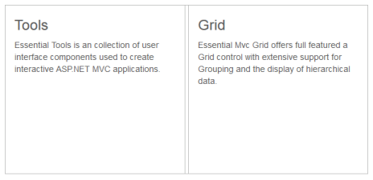

# Enabling Collapsible

The Splitter provides you the option to enable or disable the pane collapse functionality. You can click the icon in Split bar to collapse or expand the corresponding pane element in Splitter. Setting the collapsible property to “false” disables the pane collapse functionality in the Splitter widget.

## Configure Collapsible

The following steps explain the implementation of the Collapsible option in Splitter.

1. In the View page, add the Splitter helper and configure the e-content-template property as shown below. e-content-template property is used to specify the HTML tags within the helper elements. Here we have used the contentTemplate property to specify the contents of the splitter control.



<ej-splitter id="outterSplitter" is-responsive="true" enable-auto-resize="true" height="250" width="485">
    <e-split-panes>
        <e-split-pane collapsible="true">
            <e-content-template>
               
                

                    

                        <h3 class="h3">Tools </h3>

                        Essential Tools is a collection of user interface components used to create interactive ASP.NET MVC applications.

                    

                

            </e-content-template>
        </e-split-pane>
        <e-split-pane collapsible="true">
            <e-content-Template>
                

                    

                        <h3 class="h3">Grid </h3>

                        Essential MVC Grid offers full featured a Grid control with extensive support for Grouping and the display of hierarchical data.

                    

                

            </e-content-Template>
        </e-split-pane>
    </e-split-panes>
</ej-splitter>



The output for Splitter when collapsible is set to “true” is as follows.

The output for Splitter when collapsible is “false”.

