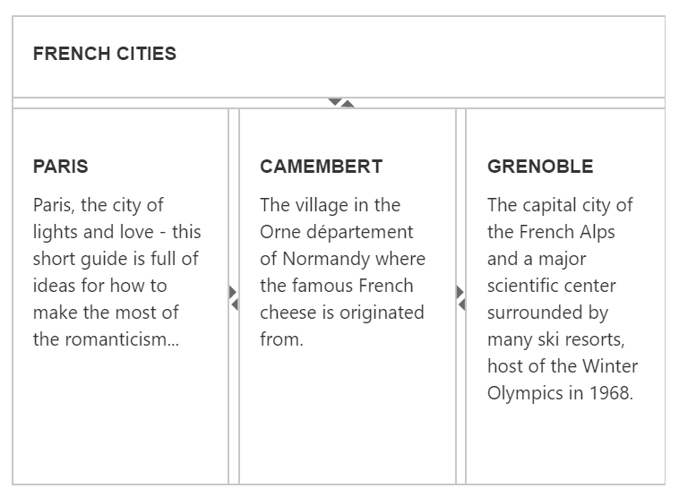

# Nested Splitter Support

The Splitter provides nested pane support that allows you to add a pane between two pane elements.

## Configure Nested Splitter

The following steps explain the implementation of the “Nested Splitter” option.

1. In the View page, add the Splitter helper and configure the outer and inner splitters. As you can see we have specified a helper function to render the inner splitter. A helper is a reusable snippet of Razor syntax exposed as a method, and is intended for rendering HTML to the browse. To use helper within another helper we have specified as a separate function as shown below.





	<ej-splitter id="outterSplitter" is-responsive="true" enable-auto-resize="true" height="350" width="487" orientation="@Orientation.Vertical">
			<e-split-panes>
				<e-split-pane pane-size="60" min-size="30">
					<e-content-template>
						

							

								<h3> FRENCH CITIES
								</h3>
							

						

					</e-content-template>
				</e-split-pane>
				<e-split-pane minSize="30">
					<e-content-template>
						

							<ej-Splitter id="innerSplitter" is-responsive="true" width="485" enable-auto-resize="true" >
								<e-split-panes>
									<e-split-pane pane-size="33%" minSize="30">
										<e-content-template>
											

												

													<h3 class="h3">PARIS</h3>
													Paris, the city of lights and love - this short guide is full of ideas for how to make the most of the romanticism...
												

											
 
										</e-content-template>
									</e-split-pane>
									<e-split-pane pane-size="33%" min-size="30">
										<e-content-template>
											

												

													<h3 class="h3">CAMEMBERT</h3>
													The village in the Orne department of Normandy where the famous French cheese is originated from.
												

											

										</e-content-template>
									</e-split-pane>
									<e-split-pane min-size="30">
										<e-content-template>
											

												

													<h3 class="h3">GRENOBLE</h3>
													The capital city of the French Alps and a major scientific center surrounded by many ski resorts, host of the Winter Olympics in 1968.
												

											

										</e-content-template>
									</e-split-pane>
								</e-split-panes>
							</ej-Splitter>
						

					</e-content-template>
				</e-split-pane>
			</e-split-panes>
		</ej-splitter>





	


 

The output for nested Splitter.

