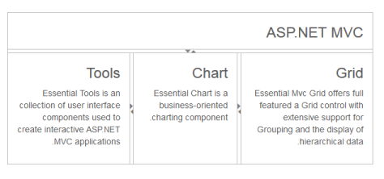

# RTL Support

The Splitter provides you with RTL (Right-To-Left) support. The alignment of Splitter can be changed from Left-To-Right to Right-To-Left.

## Enable RTL

The following steps explain enabling the right-to-left property for Splitter widget.

In the View page add the Splitter helper to enable the RTL functionality. 





<ej-splitter id="splitter" height="300" width="600" orientation="@Orientation.Vertical" enable-rtl="true">
    <e-split-panes>
        <e-split-pane pane-size="60" min-size="30">
            <e-content-template>
                

                    <h3 class="h3">

                        ASP.NET MVC

                    </h3>

                

            </e-content-template>
        </e-split-pane>
        <e-split-pane minSize="30">
            <e-content-template>
                

                    <ej-Splitter id="innerSplitter" is-responsive="true" width="600" enable-auto-resize="true">
                        <e-split-panes>
                            <e-split-pane pane-size="200" minSize="30">
                                <e-content-template>

                                    

                                        <h3 class="h3">

                                            Tools

                                        </h3>

                                        Essential Tools is an collection of user interface components used to create interactive

                                        ASP.NET MVC applications.

                                    

                                </e-content-template>
                            </e-split-pane>
                            <e-split-pane pane-size="33%" min-size="30">
                                <e-content-template>
                                    

                                        <h3 class="h3">

                                            Chart

                                        </h3>

                                        Essential Chart is a business-oriented charting component.

                                    

                                </e-content-template>
                            </e-split-pane>
                            <e-split-pane min-size="200">
                                <e-content-template>
                                    

                                        <h3 class="h3">

                                            Grid

                                        </h3>

                                        Essential MVC Grid offers full featured a Grid control with extensive support for

                                        Grouping and the display of hierarchical data.

                                    

                                </e-content-template>
                            </e-split-pane>
                        </e-split-panes>
                    </ej-Splitter>
                

            </e-content-template>
        </e-split-pane>
    </e-split-panes>
</ej-splitter>







 

The output for Splitter when EnableRTL is “true”.

