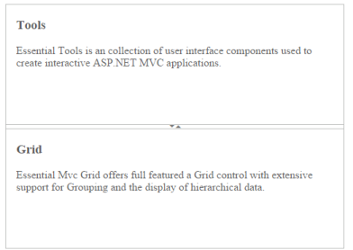
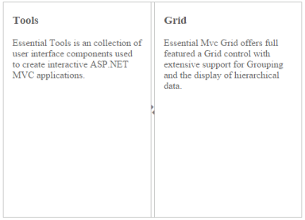

# Splitter Orientation

The Splitter supports both vertical and horizontal orientation of the pane. You can declare the orientation by Vertical  and Horizontal.

## Configure Splitter Orientation

 The following steps explain the implementation of Splitter orientation option.

1. In the View page, add the Splitter helper and configure the ‘orientation’ property as shown below.



<ej-splitter id="outterSplitter" orientation="Vertical" height="250" width="485">
    <e-split-panes>
        <e-split-pane collapsible="true">
            <e-content-template>
               
                

                    

                        <h3 class="h3">Tools </h3>

                        Essential Tools is a collection of user interface components used to create interactive ASP.NET MVC applications.

                    

                

            </e-content-template>
        </e-split-pane>
        <e-split-pane collapsible="true">
            <e-content-Template>
                

                    

                        <h3 class="h3">Grid </h3>

                        Essential MVC Grid offers full featured a Grid control with extensive support for Grouping and the display of hierarchical data.

                    

                

            </e-content-Template>
        </e-split-pane>
    </e-split-panes>
</ej-splitter>



The output for Splitter with Vertical

The output for Splitter with Horizontal.

