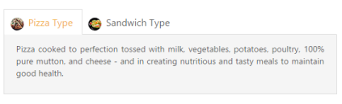
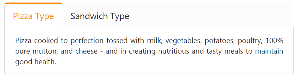
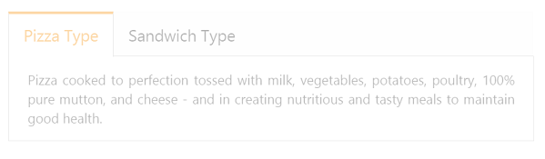
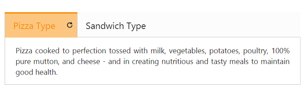
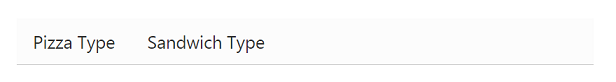
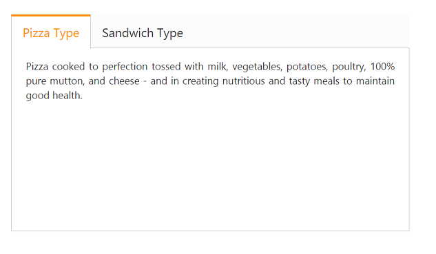
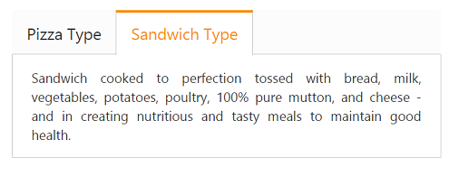

# Appearance and Styling

## Header image customization

To set the tab header image for each tab item, you need to specify the image in **ImageCssClass** property during the TabItem declaration.

The following code example is used to add the header image for the root tab header element.

1. Add the following code in your view page to render the tab with header image.



   

        <ul>

            <li><a href="#pizzatype">Pizza Type</a></li>

            <li><a href="#sandwichtype">Sandwich Type</a></li>

        </ul>

        

            
Pizza cooked to perfection tossed with milk, vegetables, potatoes, poultry, 100% pure mutton, and cheese - and in creating nutritious and tasty meals to maintain good health.

        

        

            
Sandwich cooked to perfection tossed with bread, milk, vegetables, potatoes, poultry, 100% pure mutton, and cheese - and in creating nutritious and tasty meals to maintain good health.

        

        <ej-tab id="dishtab"></ej-tab>

    



2. Add the following CSS for header image customization.



	 


   
3. The following screenshot illustrates the tab with the customized header image.

Header Image Customization
{:.caption}

## Rounded corner

By enabling the **ShowRoundedCorner** property, you can customize the shape of the tab widget from regular rectangular shape to rounded rectangle shape. By default, the property is set to false.

The following code example is used to render the tab widget with rounded corner.

1. Add the following code in your view page to render the tab with rounder corner.



// Add the following code example to the corresponding CSHTML page to render the tab with rounded corner.

	<ej-tab id="tabSample" show-rounded-corner="true">
		<e-tab-items>
			<e-tab-item id="pizzatype" text="Pizza Type">
				<e-content-template>
					

						Pizza cooked to perfection tossed with milk, vegetables, potatoes, poultry, 100% pure mutton, and cheese - and in creating nutritious and tasty meals to maintain good health.
					

				</e-content-template>
			</e-tab-item>
			<e-tab-item id="sandwichtype" text="Sandwich Type">
				<e-content-template>
					

						Sandwich cooked to perfection tossed with bread, milk, vegetables, potatoes, poultry, 100% pure mutton, and cheese - and in creating nutritious and tasty meals to maintain good health.
					

				</e-content-template>
			</e-tab-item>
		</e-tab-items>
	</ej-tab>



2. The following screenshot illustrates the tab with rounded corner.

Tab with rounded corner
{:.caption}

## Enable or disable

You can enable or disable the tab widget by using the **Enabled** property. By default, the property is set to true.

The following code example is used to render the tab widget with enable/disable.

1. Add the following code in your view page to render tab with enable/disable.



// Add the following code example to the corresponding CSHTML page to render the tab with enable/disable format.

<ej-tab id="tabSample" enabled="false">
	<e-tab-items>
		<e-tab-item id="pizzatype" text="Pizza Type">
			<e-content-template>
				

					Pizza cooked to perfection tossed with milk, vegetables, potatoes, poultry, 100% pure mutton, and cheese - and in creating nutritious and tasty meals to maintain good health.
				

			</e-content-template>
		</e-tab-item>
		<e-tab-item id="sandwichtype" text="Sandwich Type">
			<e-content-template>
				

					Sandwich cooked to perfection tossed with bread, milk, vegetables, potatoes, poultry, 100% pure mutton, and cheese - and in creating nutritious and tasty meals to maintain good health.
				

			</e-content-template>
		</e-tab-item>
	</e-tab-items>
</ej-tab>



2. The following screenshot illustrates the tab with disabled format.

Tab with disabled format
{:.caption}

## Enabling reload icon

Without refreshing or reloading the whole page, you can reload a particular tab using the Reload icon. The reload icon is appeared at the right corner of the tab by enabling the property **ShowReloadIcon** to true. When you move cursor over the tab headers, the reload icon is displayed. By default the property value is set to false.

The following code example is used to render the tab widget with reload icon.

1. Add the following code in your view page to render the tab with reload icon.



// Add the following code example to the corresponding CSHTML page to render the tab with reload icon.

<ej-tab id="tabSample" show-reload-icon="true">
	<e-tab-items>
		<e-tab-item id="pizzatype" text="Pizza Type">
			<e-content-template>
				

					Pizza cooked to perfection tossed with milk, vegetables, potatoes, poultry, 100% pure mutton, and cheese - and in creating nutritious and tasty meals to maintain good health.
				

			</e-content-template>
		</e-tab-item>
		<e-tab-item id="sandwichtype" text="Sandwich Type">
			<e-content-template>
				

					Sandwich cooked to perfection tossed with bread, milk, vegetables, potatoes, poultry, 100% pure mutton, and cheese - and in creating nutritious and tasty meals to maintain good health.
				

			</e-content-template>
		</e-tab-item>
	</e-tab-items>
</ej-tab>



2. The following screenshot illustrates the tab with reload icon.

Tab with reload icon

{:.caption}

## Collapsible tabs

Collapse the tab content by enabling the **Collapsible** property to true. When you set the property to true and click the active tab header, the tab contents will be hidden. By default, the property value is set to false.

The following code example is used to render the tab widget with customized collapsible mode.

1. Add the following code in your view page to render the tab with customized collapsible mode.



// Add the following code example to the corresponding CSHTML page to render the tab with collapsible mode.

<ej-tab id="tabSample" collapsible="true">
	<e-tab-items>
		<e-tab-item id="pizzatype" text="Pizza Type">
			<e-content-template>
				

					Pizza cooked to perfection tossed with milk, vegetables, potatoes, poultry, 100% pure mutton, and cheese - and in creating nutritious and tasty meals to maintain good health.
				

			</e-content-template>
		</e-tab-item>
		<e-tab-item id="sandwichtype" text="Sandwich Type">
			<e-content-template>
				

					Sandwich cooked to perfection tossed with bread, milk, vegetables, potatoes, poultry, 100% pure mutton, and cheese - and in creating nutritious and tasty meals to maintain good health.
				

			</e-content-template>
		</e-tab-item>
	</e-tab-items>
</ej-tab>

	


2. The following screenshot illustrates the tab with customized collapsible mode.

Tab with customized collapsible mode
{:.caption}

## Adjusting tab size

### Height adjust mode

The height of the tab widget is customized by the **height** property. The tab widget height depends on the **HeightAdjustMode** property. Using this HeightAdjustMode property, you can adjust the height by Content, Auto, and Fill. By default, the HeightAdjustMode is set as content.

The following code example is used to render the tab widget with customized height and height adjust mode.

1. Add the following code in your view page to render the tab with customized height and height adjust mode.



	// Add the following code example to the corresponding CSHTML page to render Tab with customized height and height adjust mode.
    

        <ej-tab id="tabSample" height="300px" height-adjust-mode="@HeightAdjustMode.Fill">
            <e-tab-items>
                <e-tab-item id="pizzatype" text="Pizza Type">
                    <e-content-template>
                        

                            Pizza cooked to perfection tossed with milk, vegetables, potatoes, poultry, 100% pure mutton, and cheese - and in creating nutritious and tasty meals to maintain good health.
                        

                    </e-content-template>
                </e-tab-item>
                <e-tab-item id="sandwichtype" text="Sandwich Type">
                    <e-content-template>
                        

                            Sandwich cooked to perfection tossed with bread, milk, vegetables, potatoes, poultry, 100% pure mutton, and cheese - and in creating nutritious and tasty meals to maintain good health.
                        

                    </e-content-template>
                </e-tab-item>
            </e-tab-items>
        </ej-tab>

    



2. The following screenshot illustrates the tab with customized height and height adjust mode.

Tab with customized height and height adjust mode
{:.caption}

### Width

The width of the tab widget is customized by using the **Width** property that accepts only the pixel values.

The following code example is used to render the tab widget with customized width.

1. Add the following code in your view page to render the tab with customized width.



// Add the following code example to the corresponding CSHTML page to render the tab with customized width.

<ej-tab id="tabSample" width="450">
	<e-tab-items>
		<e-tab-item id="pizzatype" text="Pizza Type">
			<e-content-template>
				

					Pizza cooked to perfection tossed with milk, vegetables, potatoes, poultry, 100% pure mutton, and cheese - and in creating nutritious and tasty meals to maintain good health.
				

			</e-content-template>
		</e-tab-item>
		<e-tab-item id="sandwichtype" text="Sandwich Type">
			<e-content-template>
				

					Sandwich cooked to perfection tossed with bread, milk, vegetables, potatoes, poultry, 100% pure mutton, and cheese - and in creating nutritious and tasty meals to maintain good health.
				

			</e-content-template>
		</e-tab-item>
	</e-tab-items>
</ej-tab>


   
2. The following screenshot illustrates the tab with customized width.

' 

Tab with customized width
{:.caption}

## Theme

The tab control’s style and appearance are controlled based on the CSS classes. Apply styles to the tab control by referring the two files namely, ej.widgets.core.min.css and ej.theme.min.css. When the file ej.widgets.all.min.css is referred, it is not necessary to include the files ej.widgets.core.min.css and ej.theme.min.css in your project, as ej.widgets.all.min.css is the combination of these two.

By default, there are 13 themes support available for the tab control namely:

* default-theme
* bootstrap-theme
* flat-azure-dark
* fat-lime
* flat-lime-dark
* flat-saffron
* flat-saffron-dark
* gradient-azure
* gradient-azure-dark
* gradient-lime
* gradient-lime-dark
* gradient-saffron
* gradient-saffron-dark

## Custom styles

The style of the tab widget is customized by the **CssClass** property.

The following code example is used to render the tab widget with customized style.

1. Add the following code in your view page to render the tab with customized style.



// Add the following code example to the corresponding CSHTML page to render the tab with customized style.

<ej-tab id="tabSample" css-class="custom">
	<e-tab-items>
		<e-tab-item id="pizzatype" text="Pizza Type">
			<e-content-template>
				

					Pizza cooked to perfection tossed with milk, vegetables, potatoes, poultry, 100% pure mutton, and cheese - and in creating nutritious and tasty meals to maintain good health.
				

			</e-content-template>
		</e-tab-item>
		<e-tab-item id="sandwichtype" text="Sandwich Type">
			<e-content-template>
				

					Sandwich cooked to perfection tossed with bread, milk, vegetables, potatoes, poultry, 100% pure mutton, and cheese - and in creating nutritious and tasty meals to maintain good health.
				

			</e-content-template>
		</e-tab-item>
	</e-tab-items>
</ej-tab>



2. Add the following styles



	

	

3. The following screenshot illustrates the tab with customized style.

Tab with customized style
{:.caption}