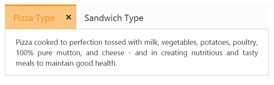
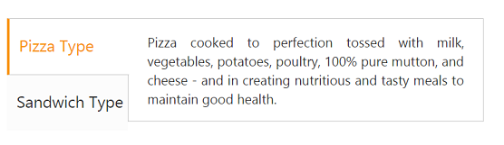
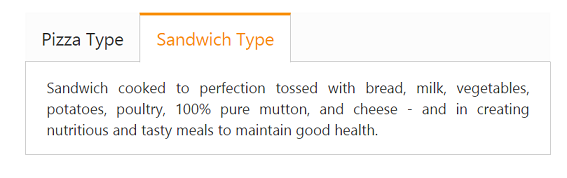

# Behavior Settings

## Close button

By default, the tab contents are rendered without the CloseButton. You can add the CloseButton by setting the **ShowCloseButton** property to true. The CloseButton is displayed when the cursor moves over the tab headers.

The following code example is used to render the tab widget with CloseButton.

1. Add the following code in your view page for simple tab creation with CloseButton.


   
// Add the following code example to the corresponding CSHTML page to render the tab with close button.

    <ej-tab id="tabSample" show-close-button="true">
        <e-tab-items>
            <e-tab-item id="pizzatype" text="Pizza Type">
                <e-content-template>
                    

                        Pizza cooked to perfection tossed with milk, vegetables, potatoes, poultry, 100% pure mutton, and cheese - and in creating nutritious and tasty meals to maintain good health.
                    

                </e-content-template>
            </e-tab-item>
            <e-tab-item id="sandwichtype" text="Sandwich Type">
                <e-content-template>
                    

                        Sandwich cooked to perfection tossed with bread, milk, vegetables, potatoes, poultry, 100% pure mutton, and cheese - and in creating nutritious and tasty meals to maintain good health.
                    

                </e-content-template>
            </e-tab-item>
        </e-tab-items>
    </ej-tab>



2. The following screenshot illustrates the tab with CloseButton.

## Orientation

By default, the tab control is rendered in horizontal orientation. You can change the orientation to vertical by using the **HeaderPosition** property. Use this property to customize the header in Top, Bottom, Left, and Right position.

The following code example is used to render the sub tab widget in the vertical orientation.

1. Add the following code in your view page for tab orientation.


   
// Add the following code example to the corresponding CSHTML page to render the tab with customized orientation.

    <ej-tab id="tabSample" header-position="@HeaderPosition.Left" height="220px">
        <e-tab-items>
            <e-tab-item id="pizzatype" text="Pizza Type">
                <e-content-template>
                    

                        Pizza cooked to perfection tossed with milk, vegetables, potatoes, poultry, 100% pure mutton, and cheese - and in creating nutritious and tasty meals to maintain good health.
                    

                </e-content-template>
            </e-tab-item>
            <e-tab-item id="sandwichtype" text="Sandwich Type">
                <e-content-template>
                    

                        Sandwich cooked to perfection tossed with bread, milk, vegetables, potatoes, poultry, 100% pure mutton, and cheese - and in creating nutritious and tasty meals to maintain good health.
                    

                </e-content-template>
            </e-tab-item>
        </e-tab-items>
    </ej-tab>



2. The following screenshot illustrates the sub tab with vertical orientation.

## State maintenance

When the page gets refreshed or reloaded, the tab state is changed (i.e.) the focus is moved to the start tab. You can maintain the state of the tab by using the **EnablePersistence** property. When this property is set to true, it retains the state.

The following code example is used to render the tab widget with state maintenance.

1. Add the following code in your view page for tab state maintenance.



// Add the following code example to the corresponding CSHTML page to render the tab with state maintenance.

    <ej-tab id="tabSample" enable-persistence="true">
        <e-tab-items>
            <e-tab-item id="pizzatype" text="Pizza Type">
                <e-content-template>
                    

                        Pizza cooked to perfection tossed with milk, vegetables, potatoes, poultry, 100% pure mutton, and cheese - and in creating nutritious and tasty meals to maintain good health.
                    

                </e-content-template>
            </e-tab-item>
            <e-tab-item id="sandwichtype" text="Sandwich Type">
                <e-content-template>
                    

                        Sandwich cooked to perfection tossed with bread, milk, vegetables, potatoes, poultry, 100% pure mutton, and cheese - and in creating nutritious and tasty meals to maintain good health.
                    

                </e-content-template>
            </e-tab-item>
        </e-tab-items>
    </ej-tab>


   
2. The following screenshot illustrates the tab with state maintenance.

State before page refresh

{:.caption}

