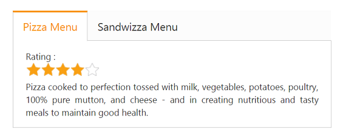

# Integration with other Widgets

You can provide more customization to the tab with rating control as a content in it for describing the item rating value.

The Essential ASP.NET Core rating control provides you an intuitive rating experience that allows you to select the number of stars that represents the rating.

The following code example explains you the rating control creation. The input element is used to create the rating control. Render the input element as rating control using the input element id.

1. Add the following code in your view page to render the tab with other widget (rating).



// Add the following code example to the corresponding CSHTML page to render the tab with other widgets.

<ej-tab id="dishRating">
	<e-tab-items>
		<e-tab-item id="Pizza" text="Pizza Menu">
			<e-content-template>
				

					Rating :
				

				

					<ej-rating id="gradenPizza" read-only="true" value="4" />
				

				

					Pizza cooked to perfection tossed with milk, vegetables, potatoes, poultry, 100% pure mutton, and cheese - and in creating nutritious and tasty meals to maintain good health.
				

			</e-content-template>
		</e-tab-item>
		<e-tab-item id="Sandwizza" text="Sandwizza Menu ">
			<e-content-template>
				

					Rating :
				

				

					<ej-rating id="Sandwich" read-only="true" value="4" />
				

				

					Sandwich cooked to perfection tossed with bread, milk, vegetables, potatoes, poultry, 100% pure mutton, and cheese - and in creating nutritious and tasty meals to maintain good health.
				

			</e-content-template>
		</e-tab-item>
	</e-tab-items>
</ej-tab>



To render the rating controls in the first tab element, refer to the styles mentioned in the following code example.

1. Add the following styles to render the tab.



	



2. The following screenshot illustrates the tab content with rating control.

Tab content section with Rating Control
{:.caption}