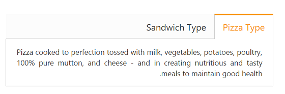

# RTL Support

The tab control provides support for the load contents to display in right-to-left (RTL) format. This is achieved by setting the **EnableRTL** property as true.

The following code example is used to render the tab element in RTL format.

1. Add the following code in your view page to render the tab with RTL format.



// Add the following code example to the corresponding CSHTML page to render the tab in RTL format.

    <ej-tab id="tabSample" enable-rtl="true">
        <e-tab-items>
            <e-tab-item id="pizzatype" text="Pizza Type">
                <e-content-template>
                    

                        Pizza cooked to perfection tossed with milk, vegetables, potatoes, poultry, 100% pure mutton, and cheese - and in creating nutritious and tasty meals to maintain good health.
                    

                </e-content-template>
            </e-tab-item>
            <e-tab-item id="sandwichtype" text="Sandwich Type">
                <e-content-template>
                    

                        Sandwich cooked to perfection tossed with bread, milk, vegetables, potatoes, poultry, 100% pure mutton, and cheese - and in creating nutritious and tasty meals to maintain good health.
                    

                </e-content-template>
            </e-tab-item>
        </e-tab-items>
    </ej-tab>



2. The following screenshot illustrates the tab with RTL format:

