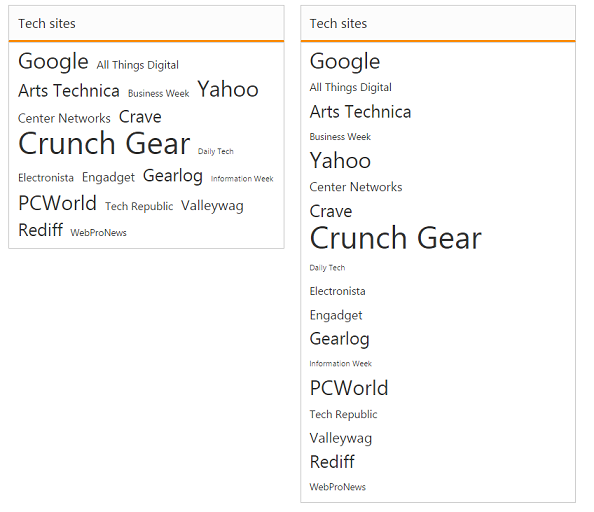
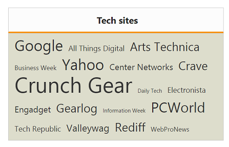

# Appearance and Styling

## Minimum and maximum Font size

The TagCloud content are set to different font sizes from minimum to maximum based on its frequency values. By default, MinFontSize is “10px” and MaxFontSize is “40px”, using these properties you can customize the minimum and maximum font sizes.

### Customizing font sizes of TagCloud

The following steps explains you on how to configure font sizes for a TagCloud.



<ej-tag-cloud id="tagcloud" datasource="ViewBag.datasource" title="Tech sites" min-font-size="20px" max-font-size="50px">
	<e-tag-cloud-fields text="Text" url="Url" frequency="Frequency" />
</ej-tag-cloud>

   

The following screenshot illustrates the TagCloud control with customized font sizes.

## Display Formats

You can set the TagCloud content display format using Format property. The Format has two variant. By default Format is set to Cloud, which displays content in TagCloud. Another one format is as List to display the content in linear format.

### Defining Cloud and List format

The following steps explains you to configure format for a TagCloud.



<%-- Configure datasource referring local data binding section and assign it to datasource property -- %>

<ej-tag-cloud id="tagcloud1" datasource="ViewBag.datasource" title="Tech sites" format="Cloud">
	<e-tag-cloud-fields text="Text" url="Url" frequency="Frequency" />
</ej-tag-cloud>

<ej-tag-cloud id="tagcloud2" datasource="ViewBag.datasource" title="Tech sites" format="List">
	<e-tag-cloud-fields text="Text" url="Url" frequency="Frequency" />
</ej-tag-cloud>

   

The following screenshot illustrates the TagCloud control with customized formats.

## Theme

You can control the style and appearance of TagCloud based on CSS classes. To apply styles to the TagCloud control, you can refer two files, ej.widgets.core.min.css and ej.theme.min.css. When you refer ej.widgets.all.min.css file, it is not necessary to include the files ej.widgets.core.min.css and ej.theme.min.css in your project, as ej.widgets.all.min.css is the combination of these two. 

By default, there are 12 themes support available for TagCloud control namely,

* default-theme
* flat-azure-dark
* fat-lime
* flat-lime-dark
* flat-saffron
* flat-saffron-dark
* gradient-azure
* gradient-azure-dark
* gradient-lime
* gradient-lime-dark
* gradient-saffron
* gradient-saffron-dark

## CssClass

You can use the CssClass to customize the TagCloud appearance. Any of the CssClass properties can be used to modify look and feel of tag cloud based on the requirement. Define a CSS class as per requirement and assign the class name to CssClass property.

### Configure TagCloud using CSS class

The following steps allows you to configure CssClass for TagCloud.

1. In the View page, add the below script to configure TagCloud widget.


   
<%-- Configure datasource referring local data binding section and assign it to datasource property -- %>

<ej-tag-cloud id="tagcloud" datasource="ViewBag.datasource" title="Tech sites" css-class="CustomCss">
	<e-tag-cloud-fields text="Text" url="Url" frequency="Frequency" />
</ej-tag-cloud>
	
 
   
2. Define CSS class for customizing the TagCloud widget.



	

      

The following screenshot illustrates the TagCloud with customized CSS class,

