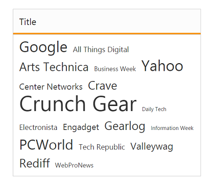
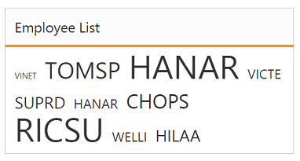

# Data-Binding

To render the TagCloud widget, it is necessary to bind the data to it in a proper way. The following sub-properties provides you a way to bind local or remote data to the TagCloud widget by binding the appropriate data fields to the corresponding options.

## Fields 

### dataSource 

The Datasource property receives Essential DataManager object and JSON object. Then assign the local JSON data or remote (URL binding) data to the TagCloud control.

### Query 

This property receive query to retrieve data from the table (query is same as SQL).This property is applicable only when a remote Datasource is used. Each data value is used to render an item for the TagCloud. The value set to this property is object type.

### Text

It maps the corresponding text field name from the data table or JSON data that is assigned to the Datasource with the Text property of the TagCloud control. The Text value that is fetched from the table renders the value to be displayed in the TagCloud.

### URL

URL field in the data table or JSON data assigned the Datasource is mapped to the URL property of the TagCloud control. The URL property defines the link to be navigated on clicking the corresponding text item.

### Frequency

It maps to the Frequency field name from the data table or JSON data that is assigned to the Datasource. The frequency value that is fetched from the table should be a number to categorize the font size.

## Local Binding

Local data binding allows you to map JSON data to TagCloud, that the corresponding Text, URL, and Frequency fields are assigned with a local JSON data.

### Defining the Local data for TagCloud

The following steps explains you the local data binding to TagCloud widget,





// Add the following data list to be bind in the controller page and define the corresponding data.
// Define local data source elements with  fields                
public class WebsiteCollection        
{          
	//TagCloud data source should have Text and Url as Mandatory            
	public string Text { get; set; }            
	public string Url { get; set; }            
	public int Frequency { get; set; }        
}

 //Refer the Model in the controllerusing <Applicationname>.Models;    
 List<WebsiteCollection> sites = new List<WebsiteCollection>();         
 public ActionResult Index()        
 {           
	sites.Add(new WebsiteCollection 
 { 
	Text = "Google", Url = "http://www.google.com", Frequency = 12 });           
	sites.Add(new WebsiteCollection { Text = "All Things Digital", Url = "http://allthingsd.com/", Frequency = 3 });      
	sites.Add(new WebsiteCollection { Text = "Arts Technica", Url = "http://arstechnica.com/", Frequency = 8 });  
	sites.Add(new WebsiteCollection { Text = "Business Week", Url = "http://www.businessweek.com/", Frequency = 2 });            
	sites.Add(new WebsiteCollection { Text = "Yahoo", Url = "http://in.yahoo.com/", Frequency = 12 });            
	sites.Add(new WebsiteCollection { Text = "Center Networks", Url = "http://www.centernetworks.com/", Frequency = 5 });            sites.Add(new WebsiteCollection { Text = "Crave", Url = "http://news.cnet.com/crave/", Frequency = 8 });            
	sites.Add(new WebsiteCollection { Text = "Crunch Gear", Url = "http://techcrunch.com/gadgets/", Frequency = 20 });            
	sites.Add(new WebsiteCollection { Text = "Daily Tech", Url = "http://www.dailytech.com/", Frequency = 1 });            
	sites.Add(new WebsiteCollection { Text = "Electronista", Url = "http://www.electronista.com/", Frequency = 3 });            
	sites.Add(new WebsiteCollection { Text = "Engadget", Url = "http://www.engadget.com/", Frequency = 5 });            
	sites.Add(new WebsiteCollection { Text = "Gearlog", Url = "http://www.gearlog.com/", Frequency = 9 });            
	sites.Add(new WebsiteCollection { Text = "Information Week", Url = "http://www.informationweek.com/", Frequency = 0 });            sites.Add(new WebsiteCollection { Text = "PCWorld", Url = "http://www.pcworld.com/", Frequency = 11 });            
	sites.Add(new WebsiteCollection { Text = "Tech Republic", Url = "http://techrepublic.com/", Frequency = 3 });            
	sites.Add(new WebsiteCollection { Text = "Valleywag", Url = "http://valleywag.gawker.com/", Frequency = 6 });            
	sites.Add(new WebsiteCollection { Text = "Rediff", Url = "http://in.rediff.com/", Frequency = 9 });            
	sites.Add(new WebsiteCollection { Text = "WebProNews", Url = "http://www.webpronews.com/", Frequency = 2 });            
	ViewBag.datasource = sites;            
	return View();        
 }

 



// Map Local datasource to corresponding fields in TagCloud control.           

<ej-tag-cloud id="tagcloud" datasource="ViewBag.datasource">
	<e-tag-cloud-fields text="Text" url="Url" frequency="Frequency" />
</ej-tag-cloud>



  

The following screenshot displays the TagCloud control with local data binding.

## Remote Binding

TagCloud provides remote data binding support to populate TagCloud items and the values can be mapped to the TagCloud fields from a remote web service by using DataManager and Query. 

DataManager is used to manage relational data in ASP.NET MVC. It supports CRUD (Create, Read, Update, and Destroy) in individual requests and batch. DataManager use two different classes, ej.DataManager for processing, and ej.Query for serving data. ej.DataManager communicates with data source and ej.Query generates data queries that are read by DataManager.

### Configuring Remote data for TagCloud

The following script explains you the Remote data binding to TagCloud widget.



<%-- Configure datasource referring remote data binding section and assign it to datasource property -- %>

<ej-tag-cloud id="customerList" title="Employee List" query="ej.Query().from('Orders').take(10)">
	<e-datamanager url="//mvc.syncfusion.com/Services/Northwnd.svc/" offline="false"></e-datamanager>
	<e-tag-cloud-fields text="CustomerID" frequency="EmployeeID" />
</ej-tag-cloud>



The following screenshot displays a TagCloud control with remote data binding.

